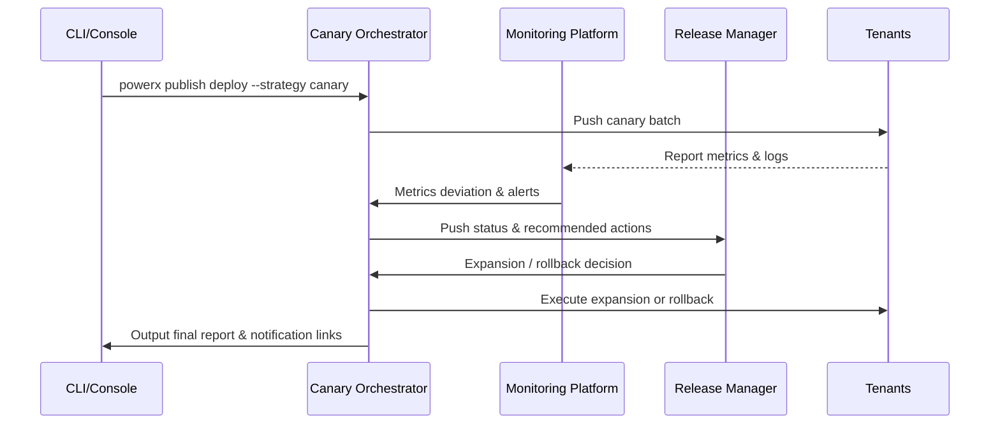

# Usecase Overview

- **Business Goal**: Enable release managers to safely deploy plugins to production tenants using CI/CD pipeline with canary strategy, completing verification and expansion within 30 minutes, with automatic rollback within 5 minutes on anomalies.
- **Success Metrics**: Canary phase core metrics deviation <5%; canary to full deployment duration ≤30 minutes; restore old version within 5 minutes after rollback trigger; deployment success rate ≥98%.
- **Scenario Association**: Supports Main Scenario Stage 3, ensuring post-approval versions can expand to production tenants in an observable and rollback-able manner.

> Through standardized canary orchestration, monitoring and rollback mechanisms, we ensure the impact on tenant business during new version rollout is controllable and measurable.

# Context & Assumptions

- **Prerequisites**
  - Feature Flags `publish-canary-orchestrator`, `plugin-gray-observability`, `rollback-automation` are enabled.
  - Release plan has been generated by approval sub-scenario, including canary tenant list, window, rollback contacts.
  - Monitoring, logging, alert channels configured, able to associate tenants & plugin versions.
  - CLI/Console has permissions to trigger deployment, view status and execute rollback.
- **Input/Output**
  - Input: Release plan ID, target plugin version, canary strategy parameters (ratio, batch, threshold), notification template.
  - Output: Canary/full deployment status, metrics report, rollback execution records, tenant notifications, audit log links.
- **Boundaries**
  - Does not handle offline package import or Marketplace listing.
  - Does not cover plugin internal business validation scripts, only focuses on release orchestration, observation & rollback.

# Solution Blueprint

## Architecture Decomposition

| Layer | Main Components/Modules | Responsibility | Code Entry |
|-------|------------------------|----------------|------------|
| Canary Orchestration Layer | `internal/publish/pipeline/canary_orchestrator.go` | Phase control, batch expansion, failure retry, state persistence | `services/publish/pipeline` |
| Observation & Alert Layer | `internal/publish/telemetry/metrics.go` | Metrics collection, threshold judgment, alert push, report generation | `services/publish/telemetry` |
| Rollback Execution Layer | `internal/publish/rollback/manager.go` | Rollback strategy evaluation, execution scripts, audit trails | `services/publish/rollback` |
| CLI/Console Layer | `packages/cli/src/commands/publish/deploy.ts` | Trigger canary/full, display real-time status, manual intervention | `packages/cli` |
| Notification & Communication Layer | `internal/notify/publish/broadcast.go` | Release notifications, change log push, tenant confirmation | `services/notify/publish` |

## Process & Sequence

1. **Step 1 – Canary Initialization**: Verify release plan, lock target tenants, metrics thresholds & rollback scripts; warm up monitoring dashboards.
2. **Step 2 – Deploy to Canary Group**: CI/CD pushes plugin to first batch tenants, performs health checks and starts metrics collection.
3. **Step 3 – Observation & Decision**: Continuously compare canary vs baseline metrics, proceed to next batch if standards met; trigger automatic rollback or wait for manual commands on anomalies.
4. **Step 4 – Full Expansion & Archive**: After reaching final state, expand to 100%, generate change logs, archive audits & operational reports.

# Contracts & Interfaces

- **Inbound APIs / Events**
  - `powerx publish deploy --strategy canary` — Trigger canary deployment.
  - `POST /internal/publish/phase/{canary,full}` — Pipeline phase advancement.
  - `POST /internal/publish/rollback` — Execute rollback operation.
- **Outbound Calls**
  - `POST /internal/monitoring/query`, `POST /internal/monitoring/alert` — Pull/push monitoring metrics.
  - `POST /internal/notify/publish` — Send tenant notifications & change logs.
  - `POST /internal/compliance/audit` — Record operations & results.
- **Configs & Scripts**
  - `config/publish/canary_strategy.yaml` — Canary batch, threshold, timeout strategies.
  - `config/monitoring/publish_dashboards.json` — Monitoring dashboard & metrics mapping.
  - `scripts/workflows/publish-canary-smoke.mjs` — Quick verification scripts.

# Implementation Checklist

| Item | Description | Status | Owner |
|------|-------------|--------|-------|
| Canary Orchestration | Support multi-batch strategies, failure retry, phase visualization | [ ] | Matrix Ops |
| Metrics Collection | Integrate with monitoring platform, deviation calculation, threshold configuration | [ ] | Alex Wei |
| Automatic Rollback | Support batch rollback, full rollback, audit sync | [ ] | Matrix Ops |
| Notifications & Reports | Canary status notifications, change logs, operational reports | [ ] | Alex Wei |
| CLI/Console | Real-time status display, manual takeover & approval tokens | [ ] | Michael Hu |

# Testing Strategy

- **Unit**: Orchestration state machine, batch scheduling, rollback decision, metrics threshold calculation.
- **Integration**: Run `scripts/workflows/publish-canary-smoke.mjs`, covering success & exception paths.
- **End-to-End**: Reproduce meta document use cases C-1/C-2, verify expansion success & exception rollback.
- **Non-functional**: Concurrent deployment of multiple plugins, long-duration canary monitoring, retry & recovery under network jitter.

# Observability & Ops

- **Metrics**: `publish.gray.duration_minutes`, `publish.gray.error_rate`, `publish.gray.rollback_total`, `publish.full.deployment_minutes`.
- **Logs**: Record batch, tenant, version, metrics deviation, rollback reasons; sensitive information masked before writing audit.
- **Alerts**: Canary error rate >5%, metrics missing >5 minutes, rollback failure, expansion timeout >30 minutes trigger P1.
- **Dashboards**: Publish Canary Dashboard, Rollback Drill Dashboard, `workflow-metrics.mjs`.

# Rollback & Failure Handling

- **Rollback Steps**: Rollback batch by batch; if observed metrics continue abnormal, execute full rollback and restore old version artifacts.
- **Remediation Measures**: Automatically generate post-mortem reports, notify release manager & relevant teams, trigger approval to replan rollout.
- **Data Repair**: Run `scripts/workflows/publish-canary-reconcile.mjs` to align pipeline records, metrics & audit logs.

# Follow-ups & Risks

| Risk/Issue | Impact | Mitigation | Owner | ETA |
|-----------|--------|------------|-------|-----|
| Inconsistent metric naming with third-party monitoring | Canary observation accuracy | Establish metric mapping table and sync configuration templates | Alex Wei | 2025-12-14 |
| Rollback scripts lack multi-tenant concurrency support | Rollback efficiency | Extend scripts, add concurrency control & idempotent checks | Matrix Ops | 2025-12-22 |
| Manual takeover process lacks approval integration | Risk control compliance | Integrate with approval system for multi-factor verification & audit | Grace Lin | 2026-01-05 |

# References & Links

- Scenario Document: `docs/scenarios/plugin-lifecycle/SCN-DEV-PLUGIN-CICD-CANARY-001.md`
- Main Scenario: `docs/scenarios/plugin-lifecycle/SCN-DEV-PLUGIN-PUBLISH-001.md`
- Meta Design: `docs/meta/scenarios/powerx/plugin-ecosystem/plugin-lifecycle/plugin-publish-and-release/primary.md`
- Configuration: `config/publish/canary_strategy.yaml`, `config/monitoring/publish_dashboards.json`
