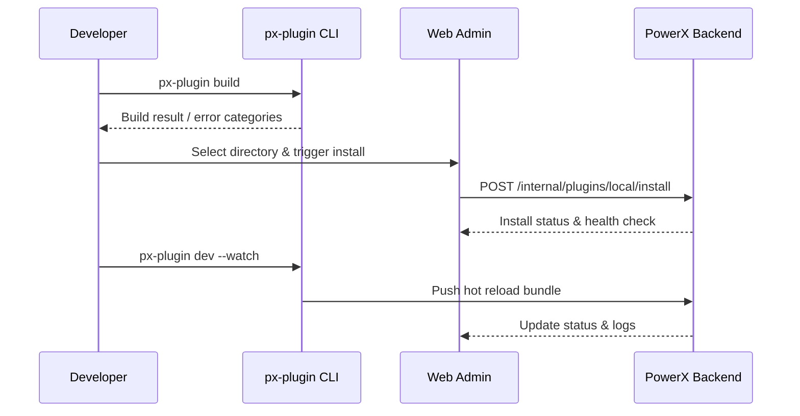

# Usecase Overview

- **Business Goal**: Allow developers to complete build → install → debug loops within minutes before raising a release request, surfacing permission, dependency, and API issues early.
- **Success Metrics**: Build+install+verify ≤15 minutes; local install success ≥97%; debug logs retained 100% with plugin/version filters.
- **Scenario Link**: Feeds the main scenario pre-stage, ensuring stable artifacts before test-tenant validation.

> CLI and Web Admin collaborate to deliver a closed-loop local debugging experience, reducing downstream rework and approval blockers.

# Context & Assumptions

- **Prerequisites**
  - Developer holds valid PowerX CLI credentials and a local PowerX environment or intranet access.
  - Feature flags `px-plugin-local-dev` and `plugin-local-install` are enabled.
  - Plugin follows the PowerXPlugin project layout with a minimum-permission template.
  - Debug log service is available with masking/search capability.
- **Inputs / Outputs**
  - Inputs: Plugin source, build config, local environment settings, permission manifest.
  - Outputs: Build artifacts (`dist/`), install status, debug logs, health-check results, permission recommendations.
- **Boundary**
  - Does not cover remote test tenants, approvals, or business feature testing; commercial pricing is out of scope.

# Solution Blueprint

## Architecture Breakdown

| Layer | Component | Responsibility | Entry |
|-------|-----------|----------------|-------|
| CLI Build | `packages/cli/src/commands/plugin/build.ts` | Artifact build, dependency checks, error classification, cache cleanup | `packages/cli` |
| CLI Debug | `packages/cli/src/commands/plugin/dev.ts` | Hot reload, log streaming, iteration metrics | `packages/cli` |
| Backend Install | `internal/plugin/local/install_handler.go` | Signature validation, permission diff, install/activate, audit hooks | `internal/plugin/local` |
| Admin UI | `apps/admin/src/modules/plugin/local-install.tsx` | Local install wizard, health checks, debug view | `apps/admin` |
| Telemetry | `internal/plugin/telemetry/local_dev.go` | Debug log aggregation, metric publishing, alerting | `services/plugin/telemetry` |

## Flow & Sequence

1. **Step 1 – Build Prep**: CLI validates dependencies/env vars, runs `px-plugin build`, and produces artifact summary.
2. **Step 2 – Local Install**: Web Admin triggers `POST /internal/plugins/local/install`; backend validates signature & permissions, then activates.
3. **Step 3 – Debug & Hot Reload**: `px-plugin dev --watch` streams file changes, pushes hot reloads, updates the debug panel.
4. **Step 4 – Archive & Sync**: Export debug logs, capture version tags and permission diffs, prep assets for test-tenant submission.

# Contracts & Interfaces

- **Inbound**: `px-plugin build`, `px-plugin dev --watch`, `POST /internal/plugins/local/install`, `POST /internal/plugins/local/reload`.
- **Outbound**: `POST /internal/audit/log`, `POST /internal/telemetry/local-dev`.
- **Configs**: `config/plugin/local_dev.yaml`, `config/plugin/permissions_minimal.json`, `scripts/workflows/plugin-local-dev-smoke.mjs`.

# Implementation Checklist

| Item | Description | Status | Owner |
|------|-------------|--------|-------|
| Build cache optimization | Reduce repeat build time, support incremental compile | [ ] | Michael Hu |
| Hot reload stability | Watcher robustness, error rollback, log clarity | [ ] | Lily Zhang |
| Permission guidance | Auto-suggest missing permissions, scaffold template | [ ] | Grace Lin |
| Log sanitization | Mask sensitive fields and persist safely | [ ] | Matrix Ops |
| Telemetry | Capture iteration time, failure count, hot reload success | [ ] | Lily Zhang |

# Testing Strategy

- **Unit**: Build command parsing, error categorization, hot reload queue, permission diff logic.
- **Integration**: `scripts/workflows/plugin-local-dev-smoke.mjs` to validate build/install/hot reload; simulate missing deps, permissions, signature failure.
- **E2E**: Reproduce Meta use cases E (positive/negative) to verify logs, audit, permission hints.
- **Non-Functional**: Parallel plugin debugging, long-running watch, cross-platform compatibility.

# Observability & Ops

- Metrics: `plugin.local.iteration_cycle_time`, `plugin.local.install_success_rate`, `plugin.local.hot_reload_success_rate`.
- Logs: Build output, install results, permission advice, hot reload pushes (stored in `plugin_local_debug` with masking).
- Alerts: Three install failures trigger P1; hot reload failure rate >5%; log write failure above 10 minutes.
- Dashboards: Local Dev Loop dashboard, CLI telemetry, `workflow-metrics.mjs` report.

# Rollback & Failure Handling

- **Rollback**: Retain previous artifacts; restore prior version on install failure with rollback scripts.
- **Remediation**: Provide `px-plugin dev --reset` to clean caches; one-click export of logs & permission advice.
- **Data Repair**: `scripts/workflows/plugin-local-dev-reconcile.mjs` aligns debug history with audit records.

# Follow-ups & Risks

| Risk | Impact | Mitigation | Owner | ETA |
|------|--------|------------|-------|-----|
| No offline dependency mirror | Fails in air-gapped setups | Provide cached dependency mirror scripts | Michael Hu | 2025-12-26 |
| Large log footprint | Local disk pressure | Enable compression & retention policy | Matrix Ops | 2026-01-02 |
| Permission hints differ from prod | Post-release failures | Align template generation with approval flow | Grace Lin | 2025-12-21 |

# References & Links

- Scenario: `docs/scenarios/plugin-lifecycle/SCN-DEV-PLUGIN-LOCAL-DEBUG-001.md`
- Main scenario: `docs/scenarios/plugin-lifecycle/SCN-DEV-PLUGIN-PUBLISH-001.md`
- Meta design: `docs/meta/scenarios/powerx/plugin-ecosystem/plugin-lifecycle/plugin-publish-and-release/primary.md`
- Script: `scripts/workflows/plugin-local-dev-smoke.mjs`
