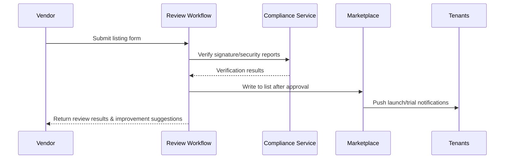

# Usecase Overview

- **Business Goal**: Ensure plugin review, listing and notification processes on Marketplace are trackable and quantifiable, completing review within 3 working days and syncing to Marketplace listing.
- **Success Metrics**: Review SLA ≤72 hours; material deficiency feedback ≤24 hours; signature/security report verification success rate ≥99%; subscription notification delivery rate ≥98%.
- **Scenario Association**: Supports Main Scenario Stage 4, linking with release records to achieve post-launch tenant reach and continuous operations.

> Through structured review and metadata sync mechanisms, we ensure Marketplace display information matches release versions, balancing compliance and operational efficiency.

# Context & Assumptions

- **Prerequisites**
  - Feature Flags `marketplace-review-v2`, `marketplace-metadata-sync` enabled.
  - Release process has generated version info, signature fingerprints & security report links.
  - Marketplace reviewers, Vendor Success teams registered in system with approval permissions.
  - Notification service & operational reporting platform available.
- **Input/Output**
  - Input: Listing application form, signature certificates, compliance/security reports, pricing & trial strategies.
  - Output: Review results, Marketplace listing data, subscription notifications, initial operational reports, audit records.
- **Boundaries**
  - Does not cover Marketplace billing settlement, contract signing or external promotion.
  - Does not handle plugin runtime configuration or upgrade strategies.

# Solution Blueprint

## Architecture Decomposition

| Layer | Main Components/Modules | Responsibility | Code Entry |
|-------|------------------------|----------------|------------|
| Review Workflow Layer | `internal/listing/workflow/review_flow.go` | Accept applications, check materials, advance review, record SLA | `services/listing/workflow` |
| Compliance Verification Layer | `internal/publish/compliance/report_verifier.go` | Verify signatures, validate security reports, sync audits | `services/publish/compliance` |
| Metadata Sync Layer | `internal/listing/metadata/syncer.go` | Write to Marketplace list, configure visibility scope, bind versions | `services/listing/metadata` |
| Notification & Operations Layer | `internal/listing/notification/broadcast.go` | Notify Vendor/tenants, generate initial reports, track conversions | `services/listing/notification` |
| Vendor Support Layer | `internal/listing/support/templates.go` | Maintain templates, prompt material gaps, collect supplementary materials | `services/listing/support` |

## Process & Sequence

1. **Step 1 – Application Acceptance**: Vendor submits materials & signatures, system creates review task and starts SLA timing.
2. **Step 2 – Verification & Supplement**: Automatically verify signatures, compliance reports; generate deficiency checklist and notify Vendor.
3. **Step 3 – Approval & Listing**: Reviewer completes checks and approves/rejects; on approval, write to Marketplace list and configure visibility.
4. **Step 4 – Notification & Operations**: Push launch notifications, enable trial guidance, output initial operational reports and archive audits.

# Contracts & Interfaces

- **Inbound APIs / Events**
  - `POST /marketplace/listing/apply` — Vendor submits listing application.
  - `POST /marketplace/listing/review` — Reviewer approves or rejects.
- **Outbound Calls**
  - `POST /marketplace/listing/publish` — Sync list & visibility scope.
  - `POST /internal/publish/compliance/verify` — Verify signatures & security reports.
  - `POST /internal/notify/publish` — Tenant & Vendor notifications.
- **Configs & Scripts**
  - `config/marketplace/listing_form.yaml` — Material field definitions & validation rules.
  - `config/marketplace/review_checklist.yaml` — Review checklist items, compliance standards.
  - `scripts/workflows/marketplace-review-smoke.mjs` — Review process smoke tests.

# Implementation Checklist

| Item | Description | Status | Owner |
|------|-------------|--------|-------|
| Review Workflow | Multi-stage state machine, SLA timing, rejection reason templates | [ ] | Ivy Chen |
| Compliance Verification | Automatic signature/security report verification, audit trails | [ ] | Grace Lin |
| Metadata Sync | List field mapping, version association, visibility control | [ ] | Ivy Chen |
| Notifications & Reports | Push launch notifications, generate initial download/subscription reports | [ ] | Leo Wang |
| Vendor Support | Material templates, localization support, gap prompt system | [ ] | Leo Wang |

# Testing Strategy

- **Unit**: Review state machine, SLA timers, material verification, notification template rendering.
- **Integration**: Execute `scripts/workflows/marketplace-review-smoke.mjs` to verify approval & rejection paths.
- **End-to-End**: Reproduce meta document use cases D-1/D-2, check review SLA, rejection records & material supplementation process.
- **Non-functional**: High concurrent reviews, large file attachments, cross-language template rendering.

# Observability & Ops

- **Metrics**: `marketplace.listing.sla_hours`, `marketplace.listing.approval_rate`, `marketplace.listing.rejection_total`, `marketplace.listing.notification_success_rate`.
- **Logs**: Record application ID, reviewer, conclusions, signature fingerprints, notification channels; sensitive data masked storage.
- **Alerts**: Review SLA >72 hours, signature verification failure rate >1%, abnormal rejection rate spike, notification failure rate >5%.
- **Dashboards**: Marketplace Review Dashboard, Vendor Response Tracker, `workflow-metrics.mjs`.

# Rollback & Failure Handling

- **Rollback Steps**: On rejection, restore old version display, revoke launch notifications, sync audits; delist new version if necessary.
- **Remediation Measures**: Send improvement checklist, enable manual review fast-track, arrange compliance re-review.
- **Data Repair**: Run `scripts/workflows/marketplace-review-reconcile.mjs` to align review records & Marketplace listings.

# Follow-ups & Risks

| Risk/Issue | Impact | Mitigation | Owner | ETA |
|-----------|--------|------------|-------|-----|
| Missing multilingual material templates causing international Vendor submission blockage | Review efficiency | Provide English/Japanese templates & guidance | Leo Wang | 2025-12-06 |
| Inconsistent security report formats affecting automated verification | Compliance accuracy | Define standard formats and prompt at submission | Grace Lin | 2025-12-15 |
| Review decision data not aligned with release records | Traceability | Establish version association verification & regular reconciliation | Ivy Chen | 2025-12-20 |

# References & Links

- Scenario Document: `docs/scenarios/plugin-lifecycle/SCN-DEV-PLUGIN-MARKETPLACE-LISTING-001.md`
- Main Scenario: `docs/scenarios/plugin-lifecycle/SCN-DEV-PLUGIN-PUBLISH-001.md`
- Meta Design: `docs/meta/scenarios/powerx/plugin-ecosystem/plugin-lifecycle/plugin-publish-and-release/primary.md`
- Configuration: `config/marketplace/listing_form.yaml`, `config/marketplace/review_checklist.yaml`
