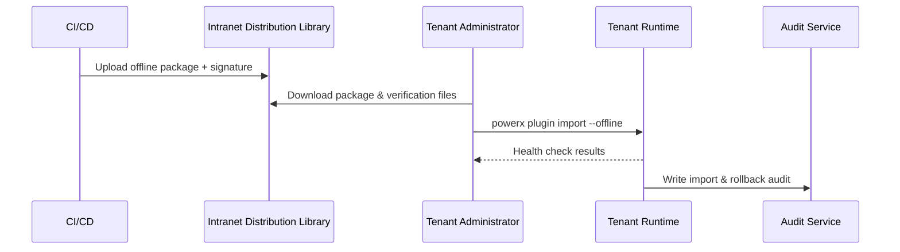

# Usecase Overview

- **Business Goal**: Provide standardized offline package generation, import and audit capabilities for isolated or low-bandwidth tenants, ensuring completion within 10 minutes with automatic rollback capability.
- **Success Metrics**: Import success rate ≥98%; full signature verification pass rate for generated packages & imports ≥99%; health check completion ≤3 minutes; automatic rollback rate 100% for failure scenarios.
- **Scenario Association**: Supports Main Scenario Stage 2, ensuring online release artifacts can be delivered through offline channels with audit capabilities.

> Through trackable offline release processes, we ensure isolated tenants can deploy plugins according to standards even without external network access, meeting compliance requirements.

# Context & Assumptions

- **Prerequisites**
  - Feature Flags `plugin-offline-distribution`, `plugin-signature-guard`, `offline-import-healthcheck` enabled.
  - CI/CD has generated usable build artifacts with version & dependency metadata recorded.
  - Intranet distribution library accessible, administrators have download permissions, tenants have import authorization.
  - Signature certificates valid and not expired, license service can verify internally.
- **Input/Output**
  - Input: Build artifact ID, target tenant, license information, verification strategy, health check scripts.
  - Output: Offline package (artifacts, dependencies, verification files), import status, health check reports, audit logs.
- **Boundaries**
  - Does not cover online push or Marketplace listing processes.
  - Does not handle tenant-custom additional deployment scripts or business data migration.

# Solution Blueprint

## Architecture Decomposition

| Layer | Main Components/Modules | Responsibility | Code Entry |
|-------|------------------------|----------------|------------|
| Artifact Packaging Layer | `internal/publish/offline/package_builder.go` | Aggregate artifacts, dependencies, version metadata and generate signatures | `services/publish/offline` |
| Import Orchestration Layer | `internal/publish/offline/import_controller.go` | Unzip deployment, version compatibility verification, rollback management | `services/publish/offline` |
| Security Verification Layer | `internal/security/cert/signature_validator.go` | Certificate fingerprint verification, license validation, revocation list query | `services/security/cert` |
| Audit Recording Layer | `internal/audit/offline/import_audit.go` | Record importer, time, fingerprint, results, link alerts | `services/audit/offline` |
| CLI/Console Layer | `packages/cli/src/commands/plugin/import.ts` | Trigger import, show progress, collect health check results | `packages/cli` |

## Process & Sequence

1. **Step 1 – Offline Package Generation**: CI/CD calls offline packaging module to generate artifacts, dependencies, verification files & signatures, uploading to intranet distribution library.
2. **Step 2 – Administrator Import Preparation**: Download offline package, verify signature fingerprint, confirm license status & target tenant resources.
3. **Step 3 – Import & Health Check**: Execute `powerx plugin import --offline`, system completes unzip deployment, runs health check scripts, generates results.
4. **Step 4 – Enable & Audit**: On successful import, enable new version and record audit logs; on failure, automatically rollback, send alerts and retain records.

# Contracts & Interfaces

- **Inbound APIs / Events**
  - `powerx publish package --offline` — Generate offline package.
  - `powerx plugin import --offline` — Execute offline import.
- **Outbound Calls**
  - `POST /internal/offline/signature/verify` — Verify signatures & certificate fingerprints.
  - `POST /internal/license/validate` — Verify license status.
  - `POST /internal/audit/offline` — Write audits, trigger alerts.
  - `EVENT plugin.offline.rollback` — Rollback event notifications.
- **Configs & Scripts**
  - `config/publish/offline_package.json` — Packaging configuration, verification rules.
  - `config/plugins/offline/dependencies.yaml` — Dependency清单 & version mapping.
  - `scripts/healthcheck/offline-import.mjs` — Post-import health checks & reports.

# Implementation Checklist

| Item | Description | Status | Owner |
|------|-------------|--------|-------|
| Offline Package Generation | Support incremental packaging, dependency verification, signature file output | [ ] | Matrix Ops |
| Signature & License Verification | Verify fingerprints, revocation lists, license status | [ ] | Grace Lin |
| Import Orchestration | Unzip deployment, version compatibility verification, failure rollback | [ ] | Matrix Ops |
| Health Checks | Standardized script templates, structured report returns | [ ] | Erin Xu |
| Audit & Alerts | Import/rollback audit, alert configuration, report sync | [ ] | Grace Lin |

# Testing Strategy

- **Unit**: Packaging modules, signature verification, license checks, rollback processes.
- **Integration**: Execute `scripts/healthcheck/offline-import.mjs`, covering success, signature failure, dependency missing, health check timeout.
- **End-to-End**: Simulate isolated tenant offline import, verify rollback & audit links; reproduce meta document use cases B-1/B-2.
- **Non-functional**: Large package downloads, resumable downloads, low bandwidth imports, log retention & concurrent imports.

# Observability & Ops

- **Metrics**: `publish.offline.package_generated_total`, `publish.offline.import_success_rate`, `publish.offline.healthcheck_duration_ms`, `publish.offline.rollback_total`.
- **Logs**: Record importer, tenant, version, signature fingerprints, dependency verification & health check results; sensitive fields masked storage.
- **Alerts**: Signature verification failure, license verification failure, health check timeout, rollback triggered consecutively >2 times.
- **Dashboards**: Offline Publish Dashboard, License Validation Monitor, `workflow-metrics.mjs`.

# Rollback & Failure Handling

- **Rollback Steps**: Rollback to previous version, restore old configuration, release temporary resources; record rollback fingerprint & executor.
- **Remediation Measures**: Provide failure report downloads, notify release manager & tenant administrators, enable manual review channel.
- **Data Repair**: Run `scripts/workflows/offline-import-reconcile.mjs` to align import records, audits & license status.

# Follow-ups & Risks

| Risk/Issue | Impact | Mitigation | Owner | ETA |
|-----------|--------|------------|-------|-----|
| Large volume package downloads consume long time | Import efficiency | Introduce resumable downloads, provide incremental package solution | Matrix Ops | 2025-12-18 |
| Inconsistent health check scripts | Enable acceptance | Publish standard script library & verification tools | Erin Xu | 2025-12-08 |
| Certificate & license management lacks rotation reminders | Compliance risk | Establish certificate rotation alerts, automatic renewal process | Grace Lin | 2025-12-20 |

# References & Links

- Scenario Document: `docs/scenarios/plugin-lifecycle/SCN-DEV-PLUGIN-OFFLINE-IMPORT-001.md`
- Main Scenario: `docs/scenarios/plugin-lifecycle/SCN-DEV-PLUGIN-PUBLISH-001.md`
- Meta Design: `docs/meta/scenarios/powerx/plugin-ecosystem/plugin-lifecycle/plugin-publish-and-release/primary.md`
- Configuration: `config/publish/offline_package.json`, `config/plugins/offline/dependencies.yaml`
