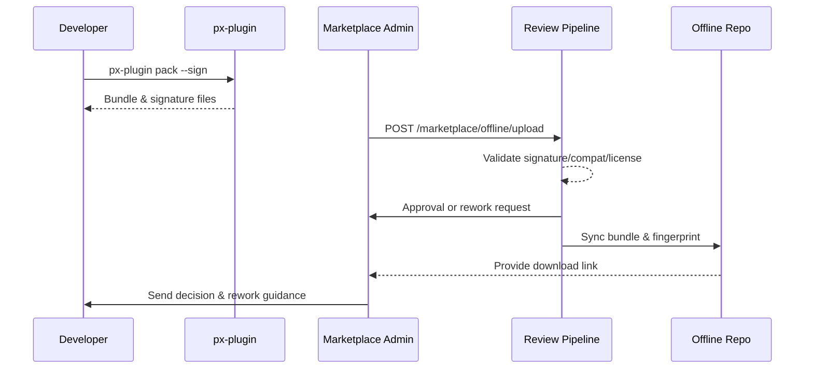

# Usecase Overview

- **Business Goal**: Allow vendors operating without internet access to submit Marketplace reviews through offline bundles, ensuring the package is compliant, signed, and approved within 2 business days.
- **Success Metrics**: Signature pass rate ≥99%; review SLA ≤48 hours; rework rate <5%; offline repo sync latency <30 minutes.
- **Scenario Link**: Supports the main scenario’s Stage 2/4 by keeping offline channels aligned with Marketplace intake.

> A standardized offline upload, review, and sync process keeps isolated environments in lockstep with the ecosystem’s compliance baseline.

# Context & Assumptions

- **Prerequisites**
  - Feature flags `plugin-offline-package` and `marketplace-offline-upload` enabled.
  - Signing & license services reachable by the review system; offline repo configured.
  - Developer provides up-to-date release notes, dependency list, compliance documentation.
  - Review team has offline review permissions and rework communication channels.
- **Inputs / Outputs**
  - Inputs: `.pxp` offline bundle, signature file, dependency/compatibility manifest, license statement, version metadata.
  - Outputs: Review decision, rework notifications, repository records, offline download link and fingerprint.
- **Boundary**
  - Does not cover online publishing, tenant import, or commercial pricing.

# Solution Blueprint

## Architecture Breakdown

| Layer | Component | Responsibility | Entry |
|-------|-----------|----------------|-------|
| Packaging | `packages/cli/src/commands/plugin/pack.ts` | Produce `.pxp` bundle, signature, dependency manifest, checksum | `packages/cli` |
| Upload | `apps/market/src/modules/offline-upload/index.tsx` | Upload UX, metadata validation, rework guidance | `apps/market` |
| Review | `internal/review/offline_pipeline.go` | Signature/license checks, compatibility matrix, SLA tracking | `services/review` |
| Security | `internal/security/signature/validator.go` | Signature parsing, certificate rotation, alerting | `services/security` |
| Repository | `internal/marketplace/repo/offline_sync.go` | Sync bundle to offline repo, generate fingerprints, monitor downloads | `services/marketplace/repo` |

## Flow & Sequence

1. **Step 1 – Package**: Developer runs `px-plugin pack` to create `.pxp` bundle, signature, manifest.
2. **Step 2 – Upload**: Marketplace admin uploads via offline console, fills metadata, binds version.
3. **Step 3 – Review**: Pipeline validates signature, compatibility, license; issues rework tasks when needed.
4. **Step 4 – Sync**: Approved bundles are stored and synced to offline repo; fingerprints returned for auditing.

# Contracts & Interfaces

- **Inbound**: `px-plugin pack`, `POST /marketplace/offline/upload`, `POST /marketplace/review/offline/decision`.
- **Outbound**: `POST /internal/security/signature/verify`, `POST /internal/license/validate`, `POST /internal/marketplace/repo/sync`.
- **Configs**: `config/publish/offline_package.json`, `config/marketplace/offline_upload.yaml`, `scripts/workflows/marketplace-offline-review.mjs`.

# Implementation Checklist

| Item | Description | Status | Owner |
|------|-------------|--------|-------|
| Bundle structure | Standardize `.pxp` layout & checksum file | [ ] | Michael Hu |
| Review pipeline | Parallel checks, rework tasks, SLA metrics | [ ] | Ivy Chen |
| License validation | Multi-region license policies | [ ] | Grace Lin |
| Repo sync | Incremental sync, fingerprint logging, download monitoring | [ ] | Matrix Ops |
| Notification templates | Multilingual rework/approval templates, webhook support | [ ] | Ivy Chen |

# Testing Strategy

- **Unit**: Packaging parameter parsing, signature validation, license parsing, metadata rules.
- **Integration**: Run `scripts/workflows/marketplace-offline-review.mjs` for happy path & rework scenarios.
- **E2E**: Execute Meta use case F to confirm rework flow, repository records, metric capture.
- **Non-Functional**: Large bundles (>500MB), resume uploads, certificate variations, concurrent reviews.

# Observability & Ops

- Metrics: `marketplace.offline.upload_success_rate`, `marketplace.offline.review_sla_hours`, `marketplace.offline.rework_rate`.
- Logs: Review decisions, rework reasons, signature/license validation logs (stored in `marketplace_offline_review` index).
- Alerts: Signature failure >1%, review SLA breach, rework rate >5%, repo sync failure.
- Dashboards: Offline Review dashboard, License Validation monitor, `workflow-metrics.mjs` reports.

# Rollback & Failure Handling

- **Rollback**: Reject keeps previous listing active; repo sync failure retries and falls back to prior fingerprint.
- **Remediation**: Auto-create rework tasks, send email/webhook; CLI `px-plugin pack --fix` assists re-bundling.
- **Data Repair**: `scripts/workflows/marketplace-offline-reconcile.mjs` reconciles repository records & fingerprints.

# Follow-ups & Risks

| Risk | Impact | Mitigation | Owner | ETA |
|------|--------|------------|-------|-----|
| Certificates expiring soon | Review blockage | Implement rotation reminders & auto renewal scripts | Grace Lin | 2025-12-23 |
| Offline repo storage pressure | Download stability | Introduce lifecycle policies & tiered storage | Matrix Ops | 2026-01-08 |
| Rework communication fragmented | Ops workload | Integrate with ops workflow & templates | Ivy Chen | 2025-12-20 |

# References & Links

- Scenario: `docs/scenarios/plugin-lifecycle/SCN-DEV-PLUGIN-OFFLINE-MARKETPLACE-001.md`
- Main scenario: `docs/scenarios/plugin-lifecycle/SCN-DEV-PLUGIN-PUBLISH-001.md`
- Meta design: `docs/meta/scenarios/powerx/plugin-ecosystem/plugin-lifecycle/plugin-publish-and-release/primary.md`
- Script: `scripts/workflows/marketplace-offline-review.mjs`
