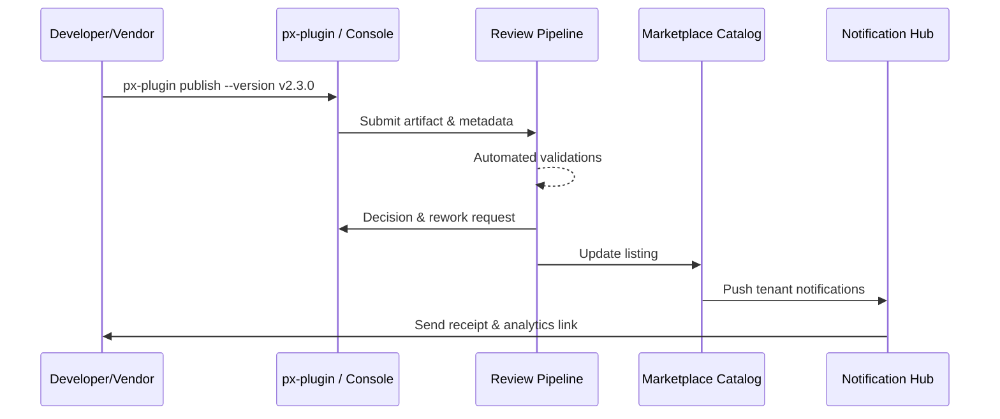

# Usecase Overview

- **Business Goal**: Deliver a seamless online publish flow that validates signatures, compliance, and metadata, then notifies subscribed tenants immediately after approval.
- **Success Metrics**: Publish success ≥99%; review SLA ≤48 hours; notification latency ≤5 minutes; rework rate <8%.
- **Scenario Link**: Covers the main scenario’s Stage 4 for Marketplace review and listing.

> Combining CLI and console tooling with automated review keeps listing, notification, and analytics in a single audited loop.

# Context & Assumptions

- **Prerequisites**
  - Feature flags `plugin-online-publish` and `marketplace-review-v2` enabled.
  - Version already passed testing and approval; signed artifact stored in artifact repository.
  - Developer prepares release notes, pricing, support policy, compliance declaration.
  - Notification center, audit logging, analytics services available.
- **Inputs / Outputs**
  - Inputs: Artifact reference, version metadata, pricing/support info, screenshots, compliance docs.
  - Outputs: Review decisions, rework tasks, listing status, subscriber notifications, initial analytics.
- **Boundary**
  - Excludes offline imports, production canary, billing.

# Solution Blueprint

## Architecture Breakdown

| Layer | Component | Responsibility | Entry |
|-------|-----------|----------------|-------|
| Publish entry | `packages/cli/src/commands/plugin/publish.ts` | Collect metadata, validate, submit, display receipts | `packages/cli` |
| Review pipeline | `internal/review/online_pipeline.go` | Automated checks, manual review, rework management, SLA metrics | `services/review` |
| Marketplace UI | `apps/market/src/modules/online-publish/index.tsx` | Form UX, status tracking, rework guidance | `apps/market` |
| Release records | `internal/publish/records/manager.go` | Version diff, audit linkage, notification triggers, archiving | `services/publish/records` |
| Notifications & analytics | `internal/notify/marketplace/listing.go` | Subscriber notifications, announcements, initial reports | `services/notify/marketplace` |

## Flow & Sequence

1. **Step 1 – Submission**: Developer runs `px-plugin publish` or uses the console to provide metadata, pricing, support info.
2. **Step 2 – Checks & Rework**: Review pipeline performs signature, compatibility, compliance, and security checks; creates rework tasks if needed.
3. **Step 3 – Decision**: Reviewer issues a decision; system returns receipt and logs audit records.
4. **Step 4 – Listing & Notify**: Marketplace lists the plugin, notifies subscribers, posts announcements, and spins up initial analytics.

# Contracts & Interfaces

- **Inbound**: `px-plugin publish`, `POST /marketplace/online/apply`, `POST /marketplace/review/decision`.
- **Outbound**: `POST /internal/security/signature/verify`, `POST /internal/compliance/review`, `POST /internal/notify/marketplace/listing`, `POST /internal/analytics/marketplace/report`.
- **Configs**: `config/marketplace/online_publish.yaml`, `config/publish/metadata_template.json`, `scripts/workflows/marketplace-online-publish.mjs`.

# Implementation Checklist

| Item | Description | Status | Owner |
|------|-------------|--------|-------|
| CLI validation | Required fields, smart defaults, error hints | [ ] | Alex Wei |
| Review pipeline | Signature/compliance automation, rework handling, SLA metrics | [ ] | Ivy Chen |
| Release records | Version diff, audit linkage, receipt archive | [ ] | Matrix Ops |
| Notification templates | Multilingual notices, subscriber segmentation, webhook support | [ ] | Ivy Chen |
| Analytics | Initial download/subscription metrics, dashboards | [ ] | Alex Wei |

# Testing Strategy

- **Unit**: CLI argument parsing, metadata validation, review state machine, notification templates.
- **Integration**: `scripts/workflows/marketplace-online-publish.mjs` for success & rework paths.
- **E2E**: Execute Meta use case G to validate failure, rework, and fast listing scenarios.
- **Non-Functional**: High concurrency submissions, notification bursts, multi-region pricing.

# Observability & Ops

- Metrics: `marketplace.online.publish_success_rate`, `marketplace.online.review_sla_hours`, `marketplace.notification.delivery_latency`.
- Logs: Review decisions, rework details, listing receipts (stored in `marketplace_online_publish` index).
- Alerts: Success <99%, SLA breach, notification latency >5 minutes, rework rate >8%.
- Dashboards: Online Publish dashboard, Listing Notification monitor, `workflow-metrics.mjs` report.

# Rollback & Failure Handling

- **Rollback**: Retain prior listing; provide one-click rollback & notification restore on failure.
- **Remediation**: Auto rework tasks, CLI `px-plugin publish --resume`, retry notifications with escalation.
- **Data Repair**: `scripts/workflows/marketplace-online-reconcile.mjs` reconciles release records with Marketplace state.

# Follow-ups & Risks

| Risk | Impact | Mitigation | Owner | ETA |
|------|--------|------------|-------|-----|
| Regional pricing templates missing | International rollout delay | Provide localized templates & validation | Ivy Chen | 2025-12-27 |
| CLI lacks duplicate submission guard | Data consistency issues | Add anti-duplicate token & optimistic locking | Alex Wei | 2025-12-19 |
| Notification backlog spikes latency | Tenant reachability | Scale queue capacity, add latency alerts | Matrix Ops | 2025-12-24 |

# References & Links

- Scenario: `docs/scenarios/plugin-lifecycle/SCN-DEV-PLUGIN-ONLINE-PUBLISH-001.md`
- Main scenario: `docs/scenarios/plugin-lifecycle/SCN-DEV-PLUGIN-PUBLISH-001.md`
- Meta design: `docs/meta/scenarios/powerx/plugin-ecosystem/plugin-lifecycle/plugin-publish-and-release/primary.md`
- Script: `scripts/workflows/marketplace-online-publish.mjs`
