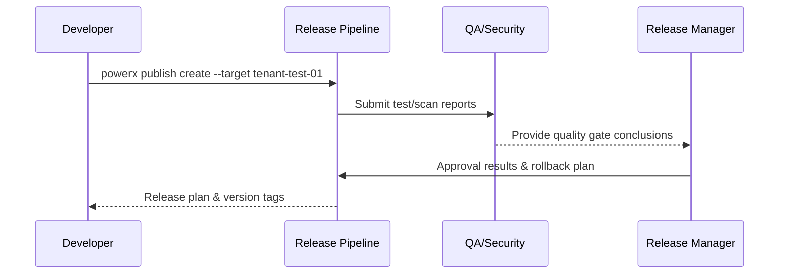

# Usecase Overview

- **Business Goal**: Complete automated verification, quality gates & approval in test tenants before plugins enter production, generating executable production release plans and rollback plans.
- **Success Metrics**: Test coverage ≥90%; approval completion time ≤24 hours; blocking notification response time ≤30 minutes; release plan contains rollback strategy & responsible party coverage 100%.
- **Scenario Association**: Corresponds to Main Scenario Stage 1, providing trusted artifacts & approval basis for subsequent canary, offline import & Marketplace listing.

> Through standardized test tenant & approval processes, we expose risks early and provide complete quality credentials & rollback plans for production releases.

# Context & Assumptions

- **Prerequisites**
  - Feature Flags `plugin-release-pipeline`, `publish-approval-guard`, `security-scan-v2` enabled.
  - Test tenants have key configurations, datasets & monitoring endpoints consistent with production.
  - Release applications submitted artifacts, version descriptions, change impact, rollback contacts & window suggestions.
  - QA, release manager, security compliance heads registered in approval system with approval permissions.
- **Input/Output**
  - Input: Build artifact packages, target test tenants, automated test suites, approver responsibility lists, rollback strategies.
  - Output: Test/scan reports, quality gate results, approval conclusions, production release plans (including rollback plans), audit log links.
- **Boundaries**
  - Does not involve production canary or full deployment.
  - Does not include offline package generation or Marketplace review processes.

# Solution Blueprint

## Architecture Decomposition

| Layer | Main Components/Modules | Responsibility | Code Entry |
|-------|------------------------|----------------|------------|
| Pipeline Orchestration Layer | `internal/publish/pipeline/test_runner.go` | Deploy artifacts to test tenants, run automated tests & quality gates | `services/publish/pipeline` |
| Approval State Layer | `internal/publish/pipeline/approval_flow.go` | Approval state machine, window management, rollback plan & notification generation | `services/publish/pipeline` |
| Security Compliance Layer | `internal/security/scan/report_collector.go` | Aggregate security scans, license verification, signature validation & audit writeback | `services/security/scan` |
| CLI/Console Layer | `packages/cli/src/commands/publish/create.ts` | Release applications, artifact uploads, test tenant selection & status viewing | `packages/cli` |
| Audit Recording Layer | `internal/audit/publish/log_writer.go` | Record submitters, approval chains, test results, blocking reasons | `services/audit/publish` |

## Process & Sequence

1. **Step 1 – Release Application**: Developer uses `powerx publish create` to upload artifacts and specify test tenants & approval windows.
2. **Step 2 – Automated Verification**: Pipeline deploys to test tenants, executes regression tests, coverage statistics & security scans, aggregates quality gate results.
3. **Step 3 – Approval & Rollback Plan**: QA, release manager, security compliance review in sequence, confirm change scope, windows, rollback contacts & drill results.
4. **Step 4 – Plan Implementation & Audit**: After approval, lock version tags, output production release plans, write audit logs and notify relevant responsible parties.

# Contracts & Interfaces

- **Inbound APIs / Events**
  - `powerx publish create` — Submit release applications & artifact metadata.
  - `POST /internal/publish/test-run` — Trigger test tenant deployment & test execution.
  - `POST /internal/publish/approval` — Approval actions, record conclusions & window information.
- **Outbound Calls**
  - `POST /internal/security/scan` — Call security scans, license verification.
  - `POST /internal/notify/publish` — Push blocking or approval notifications, rollback contact reminders.
  - `POST /internal/audit/publish` — Write audit logs, retain test report links.
- **Configs & Scripts**
  - `pipeline/plugin-release.yml` — Release pipeline templates & stage configuration.
  - `config/publish/quality_gates.yaml` — Test coverage, defect thresholds, blocking rules.
  - `config/publish/approval_matrix.yaml` — Approval roles, window strategies, escalation paths.

# Implementation Checklist

| Item | Description | Status | Owner |
|------|-------------|--------|-------|
| Pipeline Templates | Support multi-tenant deployment, concurrent testing & scanning, quality gate aggregation | [ ] | Matrix Ops |
| Quality Gates | Configure coverage, vulnerability thresholds, blocking strategies & retry mechanisms | [ ] | Linda Zhou |
| Approval Workflow | Implement multi-level approval, window management, rollback plan generation & notifications | [ ] | Matrix Ops |
| Notifications & Audit | Blocking/approval result notifications, audit log storage, report archiving | [ ] | Grace Lin |
| CLI/Console | Status visualization, approver management, trigger retry/withdrawal processes | [ ] | Michael Hu |

# Testing Strategy

- **Unit Tests**: Cover test triggers, quality gate judgments, approval state machines, notification modules.
- **Integration Tests**: Run `pipeline/plugin-release.yml` dry-run, covering success & blocking branches; verify interactions with security scans & audit services.
- **End-to-End Verification**: Reproduce meta use cases A-1/A-2, confirm blocking handling, approval SLA, release plan output & audit logs.
- **Non-functional Tests**: Long-running approvals, concurrent release applications, audit log retention & reconciliation.

# Observability & Ops

- **Metrics**: `publish.test.pass_rate`, `publish.coverage.percent`, `publish.approval.lead_time_hours`, `publish.pipeline.block_total`.
- **Logs**: Record artifact versions, submitters, test results, approval chains, blocking reasons; sensitive information masked & retain ≥180 days.
- **Alerts**: Test failure rate >5%, approval timeout >24 hours, consecutive blocks, audit write failures.
- **Dashboards**: Release Quality Gate Dashboard, Approval SLA panel, `workflow-metrics.mjs` data views.

# Rollback & Failure Handling

- **Rollback Steps**: On blocking or rejection, rollback to previous stable versions, revoke version tags, restore old plans and notify relevant teams.
- **Remediation Measures**: Allow re-uploading artifacts, supplementary test reports, adjusting approval windows; provide temporary approval exemption audit records.
- **Data Repair**: Run `scripts/workflows/publish-approval-reconcile.mjs` to align test reports, approval conclusions & audit logs.

# Follow-ups & Risks

| Risk/Issue | Impact | Mitigation | Owner | ETA |
|-----------|--------|------------|-------|-----|
| High maintenance cost for cross-language regression scripts | Automated test efficiency | Establish unified script templates & datasets | Linda Zhou | 2025-12-05 |
| Approval windows not integrated with change calendar | Production change conflicts | Integrate with change management system for window sync | Matrix Ops | 2025-12-12 |
| Blocking notifications lack escalation channels | Response delays | Configure multi-channel alerts & escalation strategies | Grace Lin | 2025-12-08 |

# References & Links

- Scenario Document: `docs/scenarios/plugin-lifecycle/SCN-DEV-PLUGIN-RELEASE-APPROVAL-001.md`
- Main Scenario: `docs/scenarios/plugin-lifecycle/SCN-DEV-PLUGIN-PUBLISH-001.md`
- Meta Design: `docs/meta/scenarios/powerx/plugin-ecosystem/plugin-lifecycle/plugin-publish-and-release/primary.md`
- Configuration: `pipeline/plugin-release.yml`, `config/publish/quality_gates.yaml`, `config/publish/approval_matrix.yaml`
