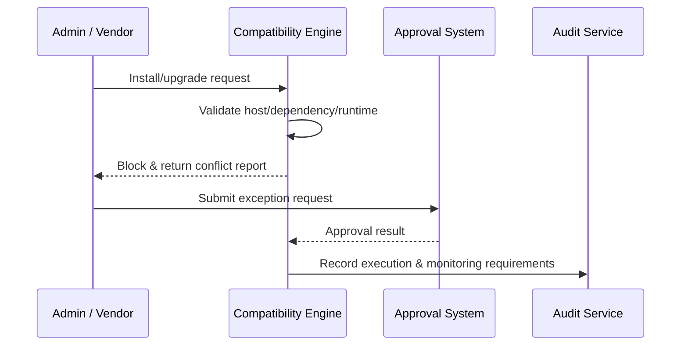

# Executive Summary

This scenario guarantees that every plugin installation or upgrade is screened by the compatibility guard. The system blocks operations that mismatch the host, dependent plugins, or runtime, and it surfaces conflict details, remediation guidance, and a controlled exception workflow so production remains stable and compliant.

# Scope & Guardrails

- **In Scope**: Loading compatibility matrices, manifest validation, dependency conflict detection, report generation, exception approvals, risk auditing.
- **Out of Scope**: Version scanning & recommendations, grey rollout execution, cross-tenant policy enforcement, offline package import.
- **Environment & Flags**: `plugin-compat-guard`, `plugin-compat-exception`; depends on the compatibility matrix repository, approval system, audit database, and notification service.

# Participants & Responsibilities

| Scope | Repository | Layer | Responsibility | Owners |
|-------|------------|-------|----------------|--------|
| security | powerx | security | Compatibility rules, risk scoring, block policies, exception approvals & audit | Grace Lin (Security & Compliance Lead / compliance@artisan-cloud.com) |
| core-platform | powerx | ops | Validation engine, install/upgrade hooks, CLI & console feedback, approval integration | Matrix Ops (Platform Ops Lead / ops@artisan-cloud.com) |
| plugin-ecosystem | powerx-plugin | ops | Manifest/dependency templates, matrix maintenance, validation tooling | Leo Wang (Vendor Success Manager / vendor@artisan-cloud.com) |

# End-to-End Flow

1. **Stage 1 – Load compatibility matrix**: Before an install or upgrade, load matrix data for host versions, dependent plugins, and runtimes.
2. **Stage 2 – Validate & assess risk**: Inspect manifest declarations, API changes, database migrations, and produce a risk report.
3. **Stage 3 – Block & feedback**: When conflicts are found, block the request, return solutions, and offer an exception request entry point.
4. **Stage 4 – Exception approval & controlled execution**: After approval, run the installation under enforced monitoring and write full audit logs.

# Key Interactions & Contracts

- **APIs / Events**: `POST /internal/version/compat/check`, `EVENT plugin.compat.blocked`, `POST /internal/version/compat/exception`, `POST /internal/version/compat/approve`.
- **Configs / Schemas**: `config/version/compat_matrix.yaml`, `config/version/exception_workflow.yaml`, `docs/standards/powerx-plugin/release/Compatibility_Checklist.md`.
- **Security / Compliance**: Block by default when the matrix is missing; exceptions require MFA and risk statements; every exception execution must attach monitoring and keep audit logs for ≥365 days.

# Usecase Links

- `UC-DEV-PLUGIN-VERSION-COMPAT-BLOCK-001` — Compatibility guard & blocking mechanism.

# Acceptance Criteria

1. Compatibility accuracy ≥98%; missing matrices trigger default block with remediation guidance; reports list conflicts, documentation, and alternative versions.
2. Exception approval SLA ≤24 hours; approved cases auto-attach monitoring profiles and record approval IDs.
3. All block/exception events are searchable audit logs by plugin, host version, and approver.

# Telemetry & Ops

- Metrics: `version.compat.check_total`, `version.compat.block_total`, `version.compat.exception_approved_total`, `version.compat.matrix_staleness_hours`.
- Alert thresholds: Matrix staleness, spike in block rate, missing monitoring on exceptions, audit write failures.
- Observability sources: Compatibility engine logs, approval workflow, `workflow-metrics.mjs`, compliance dashboards.

# Open Issues & Follow-ups

| Risk / Item | Impact | Owner | ETA |
|-------------|--------|-------|-----|
| Missing runtime compatibility statements for some plugins | Validation accuracy | Leo Wang | 2025-12-05 |
| Exception workflow needs IAM integration for granular approvals | Compliance | Grace Lin | 2025-12-18 |

# Appendix

- `docs/meta/scenarios/powerx/plugin-ecosystem/plugin-lifecycle/plugin-version-and-compatibility/primary.md#子场景-c`
- `config/version/compat_matrix.yaml`
- `docs/standards/powerx-plugin/release/Compatibility_Checklist.md`
