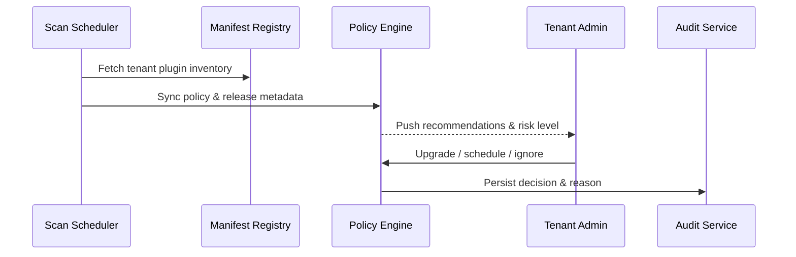

# Executive Summary

This scenario automates tenant-wide plugin version inspections, highlights available patches and risks, and pushes actionable upgrade guidance through the console and notification channels. It correlates manifests, release notes, and policy rules so administrators receive recommendations within five minutes and every decision is audited.

# Scope & Guardrails

- **In Scope**: Scan scheduling, manifest aggregation, policy-based recommendation scoring, risk classification, notification delivery, audit logging.
- **Out of Scope**: Upgrade execution and rollback (handled by the grey rollout scenario), compatibility blocking, cross-tenant enforcement, offline distribution.
- **Environment & Flags**: `plugin-version-governance`, `plugin-upgrade-policy`; depends on the version catalog, manifest registry, notification service, and audit database.

# Participants & Responsibilities

| Scope | Repository | Layer | Responsibility | Owners |
|-------|------------|-------|----------------|--------|
| core-platform | powerx | service | Scan scheduling, recommendation scoring, policy configuration, notifications & audit logging | Matrix Ops (Platform Ops Lead / ops@artisan-cloud.com) |
| plugin-ecosystem | powerx-plugin | ops | Maintain compatibility matrix, changelog templates, CLI query commands, vendor data sync | Leo Wang (Vendor Success Manager / vendor@artisan-cloud.com) |

# End-to-End Flow

1. **Stage 1 – Data collection & scanning**: Scheduled jobs pull tenant manifests, release metadata, and policy rules.
2. **Stage 2 – Risk evaluation & recommendation**: Compute version gaps, prioritise LTS/security patches, and generate upgrade advice.
3. **Stage 3 – Notification & presentation**: Render upgrade cards in the console/notification centre with changelog and impact analysis.
4. **Stage 4 – Decision & audit**: Administrators choose upgrade, schedule, or ignore; the system records the action and rationale.

# Key Interactions & Contracts

- **APIs / Events**: `powerx version scan`, `POST /internal/version/governance/scan`, `EVENT plugin.version.alert`, `POST /internal/version/governance/decision`.
- **Configs / Schemas**: `config/version/governance_rules.yaml`, `config/version/notification_templates.yaml`, `docs/standards/powerx-plugin/release/Versioning_Guidelines.md`.
- **Security / Compliance**: Scan outputs contain tenant plugin data and must respect isolation; administrator actions are audited, and notifications omit sensitive dependency info.

# Usecase Links

- `UC-DEV-PLUGIN-VERSION-DETECT-001` — Version scanning & recommendation generation.

# Acceptance Criteria

1. Scan coverage ≥99%; retry on failure completes within three minutes; critical patch prioritisation accuracy ≥98%.
2. Recommendations are delivered within five minutes of scan completion with changelog and compatibility matrix links.
3. All admin decisions, including ignore reasons and scheduled times, are captured in audit logs.

# Telemetry & Ops

- Metrics: `version.scan.coverage_rate`, `version.scan.failure_total`, `version.recommendation.push_latency_ms`, `version.recommendation.accept_rate`.
- Alert thresholds: Three consecutive scan failures, recommendation latency >5 minutes, SLA breach for critical patch adoption.
- Observability sources: Version governance logs, notification service telemetry, `workflow-metrics.mjs`, audit dashboards.

# Open Issues & Follow-ups

| Risk / Item | Impact | Owner | ETA |
|-------------|--------|-------|-----|
| Manifest data quality fluctuations reduce accuracy | Recommendation precision | Leo Wang | 2025-12-08 |
| Critical patch prioritisation needs CVSS weighting | Risk detection | Matrix Ops | 2025-12-15 |

# Appendix

- `docs/meta/scenarios/powerx/plugin-ecosystem/plugin-lifecycle/plugin-version-and-compatibility/primary.md#子场景-a`
- `config/version/governance_rules.yaml`
- `docs/standards/powerx-plugin/release/Versioning_Guidelines.md`
