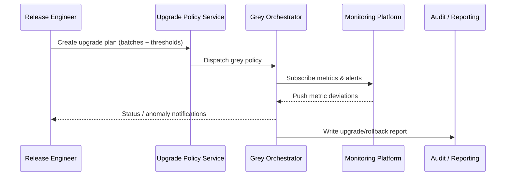

# Executive Summary

This scenario equips release and operations teams with a policy-driven grey rollout and automatic rollback capability. It covers upgrade plan configuration, batch execution, live metric observation, and exception handling so that upgrades succeed reliably and any anomaly is recovered within three minutes.

# Scope & Guardrails

- **In Scope**: Upgrade plan/policy configuration, grey batch orchestration, monitoring thresholds, automatic pause/rollback, post-upgrade reporting.
- **Out of Scope**: Version scanning/recommendations, compatibility blocking, cross-tenant policy execution, offline package import.
- **Environment & Flags**: `plugin-upgrade-policy`, `plugin-gray-orchestrator`, `plugin-upgrade-rollback`; relies on CI/CD pipelines, monitoring platforms, logging systems, and audit services.

# Participants & Responsibilities

| Scope | Repository | Layer | Responsibility | Owners |
|-------|------------|-------|----------------|--------|
| core-platform | powerx | ops | Grey strategy & batch orchestration, monitoring thresholds, automated rollback, upgrade reporting | Matrix Ops (Platform Ops Lead / ops@artisan-cloud.com) |
| ops automation | powerx | ops | Metric mapping, alert configuration, CLI/console operations, post-mortem templates | Alex Wei (Release Automation Engineer / automation@artisan-cloud.com) |

# End-to-End Flow

1. **Stage 1 – Plan design**: Administrators create upgrade plans, configuring batch ratios, maintenance windows, monitoring metrics, and rollback policies.
2. **Stage 2 – Execution & observation**: The system upgrades each batch, streaming KPIs and logs in real time.
3. **Stage 3 – Exception response**: If thresholds are breached or manual pause is requested, the system triggers rollback and alerts owners.
4. **Stage 4 – Closure & archive**: After completion, the system produces an upgrade report capturing metrics, rollback drills, and approvals.

# Key Interactions & Contracts

- **APIs / Events**: `powerx plugin upgrade --strategy policy`, `POST /internal/version/upgrade/plan`, `POST /internal/version/upgrade/rollback`, `EVENT plugin.version.gray.alert`.
- **Configs / Schemas**: `config/version/upgrade_policies.yaml`, `config/monitoring/version_upgrade_dashboards.json`, `docs/standards/powerx-plugin/release/Upgrade_Playbook.md`.
- **Security / Compliance**: Upgrades and rollbacks must be audited; critical actions require approval tokens; artifact signatures are mandatory; batches record tenant, metrics, and owner information.

# Usecase Links

- `UC-DEV-PLUGIN-VERSION-GRAY-001` — Policy-driven grey upgrade & rapid rollback.

# Acceptance Criteria

1. Supports customised batches and thresholds with runtime adjustments; upgrade success rate ≥98%.
2. When metrics breach or manual pause occurs, rollback completes within three minutes with full logging.
3. Upgrade reports are generated automatically, covering batches, metrics, rollback records, and approval trail.

# Telemetry & Ops

- Metrics: `version.upgrade.success_rate`, `version.upgrade.batch_duration_minutes`, `version.rollback.duration_ms`, `version.upgrade.alert_total`.
- Alert thresholds: Grey failure rate >5%, rollback failure, missing monitoring data >5 minutes, batch duration >30 minutes.
- Observability sources: CI/CD telemetry, monitoring dashboards, `workflow-metrics.mjs`, audit reports.

# Open Issues & Follow-ups

| Risk / Item | Impact | Owner | ETA |
|-------------|--------|-------|-----|
| Inconsistent naming in third-party monitoring makes thresholds hard to normalise | Upgrade observability | Alex Wei | 2025-12-14 |
| Rollback scripts lack multi-tenant concurrency support | Rollback efficiency | Matrix Ops | 2025-12-20 |

# Appendix

- `docs/meta/scenarios/powerx/plugin-ecosystem/plugin-lifecycle/plugin-version-and-compatibility/primary.md#子场景-b`
- `config/version/upgrade_policies.yaml`
- `docs/standards/powerx-plugin/release/Upgrade_Playbook.md`
