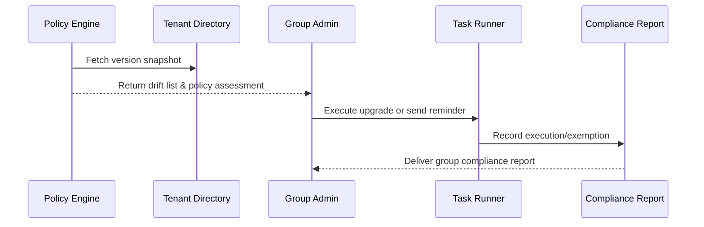

# Executive Summary

This optional scenario serves group or multi-tenant operations. It provides plugin version drift detection, policy-based alignment, and organisation-wide compliance reporting. The system detects deviating tenants within ten minutes, launches automatic or semi-automatic remediation, and retains a full execution and notification trail.

# Scope & Guardrails

- **In Scope**: Cross-tenant version aggregation, policy configuration, drift detection, task orchestration, notifications, and reporting.
- **Out of Scope**: Per-tenant grey rollout details, compatibility exceptions, offline import.
- **Environment & Flags**: `plugin-multi-tenant-sync`, `plugin-version-governance`; relies on the tenant directory, version governance service, notification/audit systems, and group policy configuration.

# Participants & Responsibilities

| Scope | Repository | Layer | Responsibility | Owners |
|-------|------------|-------|----------------|--------|
| core-platform | powerx | ops | Cross-tenant version view, policy enforcer, drift detection, report export | Matrix Ops (Platform Ops Lead / ops@artisan-cloud.com) |
| tenant governance | powerx | ops | Group policy setup, notification templates, upgrade task coordination | Erin Xu (Enterprise Tenant Admin Lead / admin@artisan-cloud.com) |

# End-to-End Flow

1. **Stage 1 – Snapshot & drift detection**: Aggregate plugin versions across group tenants and compare them with policy baselines.
2. **Stage 2 – Policy evaluation & conflict check**: Evaluate conflicts with other policies or exemptions and produce an actionable list.
3. **Stage 3 – Execution & notification**: Launch upgrade tasks or send reminders to deviating tenants and track progress.
4. **Stage 4 – Compliance reporting**: Generate the group-level compliance report capturing policy matches, execution results, and outstanding items.

# Key Interactions & Contracts

- **APIs / Events**: `POST /internal/version/governance/snapshot`, `POST /internal/version/policy/enforce`, `EVENT plugin.version.policy.alert`, `POST /internal/version/policy/report`.
- **Configs / Schemas**: `config/version/policy_profiles.yaml`, `config/version/multi_tenant_baselines.yaml`, `docs/standards/powerx-plugin/release/Group_Governance_Guide.md`.
- **Security / Compliance**: Respect tenant isolation and authorisation; cross-tenant views are only accessible to authorised personnel; retain reports ≥365 days; conflicting policies require human confirmation.

# Usecase Links

- `UC-DEV-PLUGIN-VERSION-MULTI-TENANT-001` — Cross-tenant version governance.

# Acceptance Criteria

1. Drift detection latency <10 minutes, with execution logs covering tenant, plugin, target version, and owner.
2. Policy conflict simulation is supported with manual decision entry; conflict reports achieve ≥98% accuracy.
3. Compliance reports export by plugin, tenant, and policy with outstanding actions and follow-up plans recorded.

# Telemetry & Ops

- Metrics: `version.policy.drift_total`, `version.policy.enforced_total`, `version.policy.conflict_total`, `version.policy.compliance_rate`.
- Alert thresholds: Policy enforcement failures, drifts not closed within SLA, abnormal conflict spikes, report generation errors.
- Observability sources: Version governance logs, policy enforcer telemetry, `workflow-metrics.mjs`, group compliance dashboards.

# Open Issues & Follow-ups

| Risk / Item | Impact | Owner | ETA |
|-------------|--------|-------|-----|
| Policy conflicts need richer simulation & reminders | Execution efficiency | Matrix Ops | 2025-12-22 |
| Group notifications must integrate external collaboration tools | Collaboration efficiency | Erin Xu | 2025-12-18 |

# Appendix

- `docs/meta/scenarios/powerx/plugin-ecosystem/plugin-lifecycle/plugin-version-and-compatibility/primary.md#子场景-d`
- `config/version/multi_tenant_baselines.yaml`
- `docs/standards/powerx-plugin/release/Group_Governance_Guide.md`
