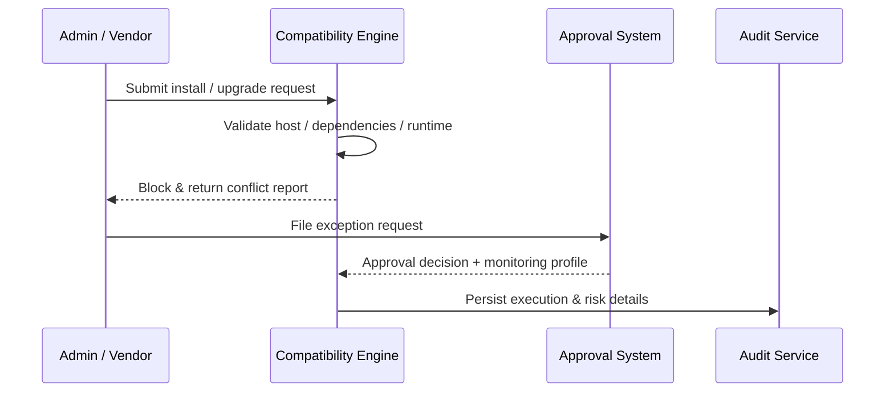

# Usecase Overview

- **Business Goal**: Enforce uniform compatibility checks before plugin installs or upgrades, block mismatches with host/dependency/runtime, and provide exception approvals with full risk traceability.
- **Success Measures**: Compatibility accuracy ≥98%; exception approval SLA ≤24 hours; 100% of block events logged with conflict details; ≥95% of approved exceptions attach the required monitoring strategy.
- **Scenario Alignment**: Supports main scenario Stage 3 and works with detection/upgrade flows to surface risks before release.

> The compatibility guard stops high-risk deployments before they reach production, while the exception workflow keeps controlled execution auditable.

# Context & Assumptions

- **Prerequisites**
  - Feature flags `plugin-compat-guard` and `plugin-compat-exception` are enabled.
  - Compatibility matrices and plugin manifests are current in the governance service and refreshed via CI/CD.
  - The approval system supports MFA, approval IDs, and notification channels.
  - Security teams define risk levels, approval templates, and mandatory monitoring add-ons.
- **Inputs / Outputs**
  - Inputs: Install/upgrade request, plugin manifest, host version, dependency list, approval context.
  - Outputs: Compatibility report, block feedback, exception decision, audit record, required monitoring profile.
- **Boundaries**
  - Upgrade execution/rollback is handled by the grey rollout use case.
  - Excludes offline import, cross-tenant policy governance, and Marketplace review.

# Solution Blueprint

## Architecture Layers

| Layer | Key Module | Responsibility | Entry Point |
|-------|------------|----------------|-------------|
| Compatibility engine | `internal/version/compat/engine.go` | Load matrices, merge policies, compute risk score | `services/version/compat` |
| Validation & blocking | `internal/version/compat/validator.go` | Validate manifests, detect conflicts, return feedback | `services/version/compat` |
| Exception workflow | `internal/version/compat/exception_workflow.go` | Approval steps, MFA enforcement, execution authorisation | `services/version/compat` |
| Audit & compliance | `internal/audit/version/compat_log_writer.go` | Persist block/exception events, risk labels, reports | `services/audit/version` |
| CLI / Console | `packages/cli/src/commands/plugin/install.ts` | Deliver prompts, capture exception requests, sync approval results | `packages/cli` |

## Flow & Sequence

1. **Step 1 – Request intake**: Admins trigger install/upgrade via CLI or console; the system loads plugin and host metadata.
2. **Step 2 – Compatibility check**: Engine loads matrices, evaluates host, dependency, runtime, and migration scripts, and computes risk score.
3. **Step 3 – Block & feedback**: Conflicts trigger an immediate block with detailed report, remediation advice, and exception entry point.
4. **Step 4 – Exception approval & controlled run**: Approved exceptions install under enforced monitoring with full audit logging; rejected requests remain blocked with notifications.

# Contracts & Interfaces

- **Inbound**
  - `POST /internal/version/compat/check` — Validate plugin version against host and dependency list.
  - `POST /internal/version/compat/exception` — Submit exception request with risk explanation.
- **Outbound**
  - `POST /internal/security/scan/context` — Retrieve security policies and sensitive component data.
  - `POST /internal/notify/publish` — Notify admins/approvers of block or approval results.
  - `POST /internal/audit/version` — Persist block, approval, and execution outcomes.
- **Configs & Scripts**
  - `config/version/compat_matrix.yaml` — Matrix content, weighting, expiry.
  - `config/version/exception_workflow.yaml` — Approval chain, SLA, monitoring add-ons.
  - `docs/standards/powerx-plugin/release/Compatibility_Checklist.md` — Validation coverage & exception prerequisites.

# Implementation Checklist

| Item | Description | Status | Owner |
|------|-------------|--------|-------|
| Matrix synchronisation | Integrate vendor repos & CI/CD to keep matrices current | [ ] | Leo Wang |
| Validation engine | Support host, dependency, runtime, and data migration checks | [ ] | Matrix Ops |
| Exception workflow | Integrate approval system, MFA, approval ID tracking | [ ] | Grace Lin |
| Audit reporting | Produce block/exception reports, risk labels, query endpoints | [ ] | Grace Lin |
| CLI / Console UX | Improve conflict messaging, exception entry, help links | [ ] | Leo Wang |

# Testing Strategy

- **Unit**: Validation rules, matrix parsing, exception state machine, audit writers.
- **Integration**: Simulate install requests covering pass/block/exception paths; integrate approval and audit services.
- **E2E**: Reproduce scenario cases C-1/C-2 to verify block reports, exception execution, monitoring add-ons.
- **Non-functional**: Large-scale matrix performance, approval latency, log search load.

# Observability & Ops

- **Metrics**: `version.compat.check_total`, `version.compat.block_total`, `version.compat.exception_request_total`, `version.compat.exception_approved_total`, `version.compat.matrix_staleness_hours`.
- **Logs**: Capture plugin version, host, dependencies, risk level, approval ID, operator; mask sensitive data; retain ≥365 days.
- **Alerts**: Matrix expiry, sudden spikes in block rate, approval SLA breach, missing monitoring on exceptions.
- **Dashboards**: Compatibility Guard Dashboard, Exception Workflow Monitor, `workflow-metrics.mjs`.

# Rollback & Failure Handling

- **Rollback**: Keep previous version active, cancel pending installs, restore approval queue and monitoring plan.
- **Remediation**: Provide conflict report download, allow manual re-check, permit manual approval with risk acknowledgement.
- **Data Repair**: Run `scripts/workflows/version-compat-reconcile.mjs` to reconcile block records, approval states, and audits.

# Follow-ups & Risks

| Risk / Item | Impact | Mitigation | Owner | ETA |
|-------------|--------|------------|-------|-----|
| Missing runtime compatibility statements | Validation accuracy | Enforce templates with vendor and CI checks | Leo Wang | 2025-12-05 |
| Exception approvals lack granular IAM controls | Compliance | Integrate IAM roles & least-privilege approvals | Grace Lin | 2025-12-18 |
| Block reports hard to interpret | Ops efficiency | Improve conflict grouping, link remediation guides | Matrix Ops | 2025-12-12 |

# References & Links

- Scenario: `docs/scenarios/plugin-lifecycle/SCN-DEV-PLUGIN-VERSION-COMPAT-BLOCK-001.md`
- Main scenario: `docs/scenarios/plugin-lifecycle/SCN-DEV-PLUGIN-VERSION-COMPAT-001.md`
- Standards: `docs/standards/powerx-plugin/release/Compatibility_Checklist.md`
- Config: `config/version/compat_matrix.yaml`, `config/version/exception_workflow.yaml`
