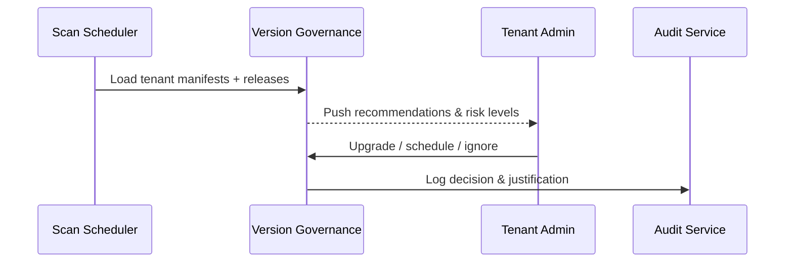

# Usecase Overview

- **Business Goal**: Deliver near real-time plugin version posture for tenant admins, automatically flag actionable patches and risks, and record every decision path (upgrade, schedule, ignore).
- **Success Measures**: Scan coverage ≥99%; recommendation latency ≤5 minutes; critical patch prioritisation accuracy ≥98%; audit coverage for admin decisions 100%.
- **Scenario Alignment**: Implements Stage 1 of the main scenario and feeds reliable inputs into grey rollout and compatibility blocking.

> Automated governance shortens patch response time, keeps admins informed from a single console, and strengthens compliance posture.

# Context & Assumptions

- **Prerequisites**
  - `plugin-version-governance` and `plugin-upgrade-policy` flags are enabled.
  - Tenant manifests, release logs, and compatibility matrices are current within the governance service and support delta updates.
  - Notification service can reach console, email, and IM; audit store can persist admin actions.
  - Vendors provide changelogs, risk metadata, and compatibility matrices through CI/CD.
- **Inputs / Outputs**
  - Inputs: Tenant manifests, latest releases, policy configuration (LTS, security patches, enforcement level).
  - Outputs: Upgrade recommendations, risk levels, changelog links, admin decisions, audit records.
- **Boundaries**
  - Actual upgrades, grey policy execution, and rollbacks are handled elsewhere.
  - Offline packages and Marketplace workflows are out of scope.

# Solution Blueprint

## Architecture Layers

| Layer | Module | Responsibility | Entry Point |
|-------|--------|----------------|-------------|
| Data acquisition | `internal/version/governance/scanner.go` | Fetch tenant inventory, release info, handle retries | `services/version/governance` |
| Policy evaluation | `internal/version/governance/recommender.go` | Compute diffs, apply policies, output risk & priority | `services/version/governance` |
| Presentation & notification | `internal/version/governance/notifier.go` | Console cards, notification fan-out, decision capture | `services/version/governance` |
| Audit layer | `internal/audit/version/governance_log_writer.go` | Persist scan results, admin decisions, ignore reasons | `services/audit/version` |
| CLI / tooling | `packages/cli/src/commands/version/scan.ts` | Manual scan trigger, report export, scripting support | `packages/cli` |

## Flow & Sequence

1. **Step 1 – Scan start**: Scheduler or admin/CLI triggers the scan, loading tenant manifests and release info.
2. **Step 2 – Policy evaluation**: Compare differences, apply LTS/security/exemption policies, compute risk and recommended action.
3. **Step 3 – Notification & display**: Render console cards and push notifications with changelog, compatibility matrix, and impact analysis.
4. **Step 4 – Decision & audit**: Admin chooses upgrade, plan, or ignore; the system records decision, rationale, and follow-up.

# Contracts & Interfaces

- **Inbound**
  - `powerx version scan` — CLI command to trigger a scan and output a report.
  - `POST /internal/version/governance/scan` — Scheduler job invoking the scan.
  - `POST /internal/version/governance/decision` — Persist admin decisions (upgrade, schedule, ignore).
- **Outbound**
  - `POST /internal/notify/version` — Send reminders to console/IM/email.
  - `POST /internal/audit/version` — Record audit trail of decisions and rationale.
  - `POST /internal/version/catalog` — Retrieve release metadata, changelog, compatibility matrix.
- **Configs**
  - `config/version/governance_rules.yaml` — Policy parameters, priority, SLA.
  - `config/version/notification_templates.yaml` — Console card and notification templates.
  - `scripts/workflows/version-scan-smoke.mjs` — Smoke test script for the scan pipeline.

# Implementation Checklist

| Item | Description | Status | Owner |
|------|-------------|--------|-------|
| Manifest aggregation | Integrate tenant directory & plugin registry, ensure data consistency | [ ] | Matrix Ops |
| Policy engine | Support LTS/security/exemption policies with weighting | [ ] | Matrix Ops |
| Notification & UI | Console cards, IM/email alerts, changelog deep links | [ ] | Leo Wang |
| Audit logging | Record scan results, decisions, ignore reasons, SLA breaches | [ ] | Grace Lin |
| CLI / scripts | Provide `powerx version scan`, report export, automation hooks | [ ] | Leo Wang |

# Testing Strategy

- **Unit**: Version diff logic, policy matching, risk scoring, notification rendering.
- **Integration**: Run `scripts/workflows/version-scan-smoke.mjs` to validate success, retries, and critical patch prioritisation.
- **E2E**: Reproduce scenario case A to verify scan results, notification latency, audit entries.
- **Non-functional**: Performance on large tenant sets, notification bursts, audit write load.

# Observability & Ops

- **Metrics**: `version.scan.coverage_rate`, `version.scan.failure_total`, `version.recommendation.push_latency_ms`, `version.recommendation.accept_rate`, `version.recommendation.ignore_total`.
- **Logs**: Tenant, plugin, current/target versions, risk level, decision; mask sensitive fields; retain ≥365 days.
- **Alerts**: Three consecutive scan failures, latency >5 minutes, SLA misses for critical patches.
- **Dashboards**: Version Governance Overview, Recommendation Adoption Charts, `workflow-metrics.mjs`.

# Rollback & Failure Handling

- **Rollback**: Revert governance module, disable new policy, restore legacy behaviour; rerun full scan.
- **Remediation**: Offer compensation scan, manual sync APIs, status updates to admins.
- **Data Repair**: Run `scripts/workflows/version-scan-reconcile.mjs` to align scan results, notifications, audits.

# Follow-ups & Risks

| Risk / Item | Impact | Mitigation | Owner | ETA |
|-------------|--------|------------|-------|-----|
| Manifest data quality fluctuations | Recommendation accuracy | Add validation & fallback mechanisms | Leo Wang | 2025-12-08 |
| Critical patch weighting needs CVSS | Risk detection | Extend policy engine with CVSS weighting | Matrix Ops | 2025-12-15 |
| Notification fatigue for admins | Adoption rate | Support batching and priority filters | Matrix Ops | 2025-12-20 |

# References & Links

- Scenario: `docs/scenarios/plugin-lifecycle/SCN-DEV-PLUGIN-VERSION-DETECT-001.md`
- Main scenario: `docs/scenarios/plugin-lifecycle/SCN-DEV-PLUGIN-VERSION-COMPAT-001.md`
- Standards: `docs/standards/powerx-plugin/release/Versioning_Guidelines.md`
- Config: `config/version/governance_rules.yaml`, `config/version/notification_templates.yaml`
