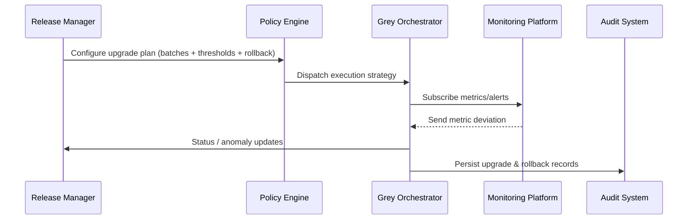

# Usecase Overview

- **Business Goal**: Enable operations teams to run policy-driven grey upgrades, monitor key metrics in real time, and auto-rollback (or one-click rollback) when anomalies arise so production risk remains controlled.
- **Success Measures**: Upgrade success rate ≥98%; rollback completes within three minutes when triggered; grey batch success rate ≥95%; upgrade reports generated within ten minutes.
- **Scenario Alignment**: Implements Stage 2 of the main scenario and consumes outputs from version scanning and compatibility checks to complete the release loop.

> Configurable grey policies and rollback automation let release managers deliver new plugin versions with minimal production exposure.

# Context & Assumptions

- **Prerequisites**
  - Flags `plugin-upgrade-policy`, `plugin-gray-orchestrator`, and `plugin-upgrade-rollback` are active.
  - CI/CD produces signed artifacts; monitoring, logging, and alerting integrations are ready.
  - Governance service provides upgrade recommendations with changelog and compatibility matrix.
  - Operations teams hold upgrade/rollback permissions for target tenants and approvals are in place.
- **Inputs / Outputs**
  - Inputs: Upgrade plan (batches, windows, thresholds, rollback policy), artifacts, monitoring templates.
  - Outputs: Execution status, metrics, rollback records, upgrade report, audit logs.
- **Boundaries**
  - Version scanning, compatibility guard, offline import, and cross-tenant strategy enforcement are handled elsewhere.

# Solution Blueprint

## Architecture Layers

| Layer | Module | Responsibility | Entry Point |
|-------|--------|----------------|-------------|
| Policy engine | `internal/version/upgrade/policy_engine.go` | Parse grey policies, generate batch plans, compute thresholds | `services/version/upgrade` |
| Orchestration | `internal/version/upgrade/orchestrator.go` | Execute batches, bind monitoring, pause/retry on anomalies | `services/version/upgrade` |
| Rollback management | `internal/version/upgrade/rollback_manager.go` | Evaluate rollback strategy, run scripts, sync audits | `services/version/upgrade` |
| Observability & reporting | `internal/version/upgrade/report_builder.go` | Aggregate metrics, create reports, supply post-mortem template | `services/version/upgrade` |
| CLI / Console | `packages/cli/src/commands/version/upgrade.ts` | Trigger upgrade, inspect batch status, manual takeover & rollback | `packages/cli` |

## Flow & Sequence

1. **Step 1 – Plan configuration**: Release manager configures batches, thresholds, rollback policy, and window.
2. **Step 2 – Grey rollout execution**: Orchestrator pushes batches, collecting metrics, logs, and feedback in real time.
3. **Step 3 – Anomaly response**: When thresholds trip or manual pause occurs, the system rolls back automatically and alerts stakeholders.
4. **Step 4 – Closure & archive**: After completion, the report consolidates metrics, rollback practice, and approvals.

# Contracts & Interfaces

- **Inbound**
  - `powerx plugin upgrade --strategy policy` — Trigger upgrade.
  - `POST /internal/version/upgrade/plan` — Create/update plans.
  - `POST /internal/version/upgrade/rollback` — Initiate rollback.
- **Outbound**
  - `POST /internal/monitoring/subscribe` — Bind metrics and thresholds.
  - `POST /internal/notify/version` — Deliver status, anomaly, and rollback alerts.
  - `POST /internal/audit/version` — Persist upgrade and rollback audit logs.
- **Configs & Scripts**
  - `config/version/upgrade_policies.yaml` — Strategy parameters, batch templates, thresholds.
  - `config/monitoring/version_upgrade_dashboards.json` — Metric mappings & dashboards.
  - `scripts/workflows/version-upgrade-smoke.mjs` — Smoke test script for grey rollouts.

# Implementation Checklist

| Item | Description | Status | Owner |
|------|-------------|--------|-------|
| Policy engine | Support multi-batch, ratio, window, and threshold configuration | [ ] | Matrix Ops |
| Grey orchestrator | Implement batch execution, anomaly pause, retry logic | [ ] | Alex Wei |
| Automated rollback | Evaluate strategy, run rollback script, notify & audit | [ ] | Matrix Ops |
| Observability & reporting | Provide dashboards, auto-generated reports, post-mortem kit | [ ] | Alex Wei |
| CLI / Console | Present status, manual takeover, approval token validation | [ ] | Michael Hu |

# Testing Strategy

- **Unit**: Policy parsing, batch scheduling, rollback decisions, report generation.
- **Integration**: Execute `scripts/workflows/version-upgrade-smoke.mjs` covering happy & failure paths, verify monitoring and notifications.
- **E2E**: Replay scenario case B to validate grey expansion, rollback trigger, and reporting.
- **Non-functional**: Multi-tenant concurrency, long-running grey windows, monitoring signal delay.

# Observability & Ops

- **Metrics**: `version.upgrade.success_rate`, `version.upgrade.batch_duration_minutes`, `version.rollback.duration_ms`, `version.upgrade.alert_total`, `version.upgrade.paused_total`.
- **Logs**: Capture batches, tenants, metric deviations, rollback rationale; mask sensitive data; keep ≥365 days.
- **Alerts**: Grey error rate >5%, rollback failure, missing metrics >5 minutes, batch runtime >30 minutes.
- **Dashboards**: Upgrade Strategy Dashboard, Rollback Drill Monitor, `workflow-metrics.mjs`.

# Rollback & Failure Handling

- **Rollback steps**: Auto/manual rollback to prior stable version, restore previous config, free new resources, notify stakeholders.
- **Remediation**: Expose manual rollback entry, export metrics & logs, trigger post-mortem workflow.
- **Data repair**: Run `scripts/workflows/version-upgrade-reconcile.mjs` to align upgrade records, rollback status, and audits.

# Follow-ups & Risks

| Risk / Item | Impact | Mitigation | Owner | ETA |
|-------------|--------|------------|-------|-----|
| Third-party metric naming inconsistencies | Observability quality | Provide mapping and unified templates | Alex Wei | 2025-12-14 |
| Rollback scripts lack multi-tenant concurrency | Rollback efficiency | Extend scripts with concurrency + idempotency | Matrix Ops | 2025-12-20 |
| Manual takeover requires approval tokens | Security & compliance | Integrate approval system with MFA | Grace Lin | 2025-12-18 |

# References & Links

- Scenario: `docs/scenarios/plugin-lifecycle/SCN-DEV-PLUGIN-VERSION-GRAY-001.md`
- Main scenario: `docs/scenarios/plugin-lifecycle/SCN-DEV-PLUGIN-VERSION-COMPAT-001.md`
- Standards: `docs/standards/powerx-plugin/release/Upgrade_Playbook.md`
- Config: `config/version/upgrade_policies.yaml`, `config/monitoring/version_upgrade_dashboards.json`
