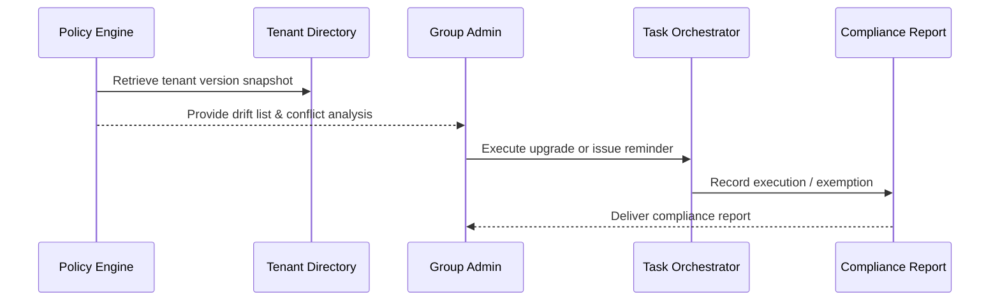

# Usecase Overview

- **Business Goal**: Support group administrators in coordinating plugin versions across tenants, automatically identify drift, trigger alignment or reminders, and generate auditable compliance reports.
- **Success Measures**: Drift detection latency <10 minutes; policy enforcement success ≥95%; conflict simulation accuracy ≥98%; compliance report generation ≤10 minutes covering all tenants.
- **Scenario Alignment**: Implements Stage 4 of the main scenario and works alongside version detection and grey upgrade to complete governance at the organisation level.

> A centralised version policy keeps core plugins aligned across tenants without breaking isolation, reducing collaboration friction and compliance exposure.

# Context & Assumptions

- **Prerequisites**
  - `plugin-multi-tenant-sync` and `plugin-version-governance` flags are active.
  - Group tenant directory can provide tenant roster, permissions, and policy baselines.
  - Governance service stores each tenant’s manifests and recent upgrade history.
  - Notification & audit systems integrate with enterprise address books, IM channels, and report archives.
- **Inputs / Outputs**
  - Inputs: Target plugin list, policy definitions (baseline, exemptions, conflict rules), tenant version snapshot.
  - Outputs: Drift roster, upgrade tasks/reminders, conflict reports, group compliance reports, audit records.
- **Boundaries**
  - Per-tenant grey rollout is covered in the grey use case.
  - Offline package distribution and Marketplace review are out of scope.

# Solution Blueprint

## Architecture Layers

| Layer | Module | Responsibility | Entry Point |
|-------|--------|----------------|-------------|
| Data aggregation | `internal/version/governance/snapshot_aggregator.go` | Aggregate tenant versions, build baseline snapshot, detect drift | `services/version/governance` |
| Policy enforcement | `internal/version/governance/policy_enforcer.go` | Apply policies, simulate conflicts, generate execution plan | `services/version/governance` |
| Task orchestration | `internal/version/governance/tenant_task_runner.go` | Launch upgrade tasks/reminders for drift tenants, track progress | `services/version/governance` |
| Reporting & audit | `internal/audit/version/policy_reporter.go` | Produce compliance reports, log exemptions & outcomes | `services/audit/version` |
| Tooling | `packages/cli/src/commands/version/policy.ts` | CLI/console policy management, simulation, execution monitoring | `packages/cli` |

## Flow & Sequence

1. **Step 1 – Snapshot & drift detection**: Scheduled or manual trigger aggregates tenant plugin versions and compares against baseline.
2. **Step 2 – Policy evaluation & simulation**: Assess drift against policies, resolve exemptions/conflicts, and propose actions.
3. **Step 3 – Execution & notification**: Auto-trigger upgrade tasks or send reminders; surface items needing manual action.
4. **Step 4 – Reporting & follow-up**: Generate compliance reports with completed, outstanding, and planned actions, and store in audit.

# Contracts & Interfaces

- **Inbound**
  - `POST /internal/version/governance/snapshot` — Generate group version snapshot.
  - `POST /internal/version/policy/enforce` — Execute policy and return the plan.
- **Outbound**
  - `POST /internal/notify/version` — Notify drift tenant admins and group owners.
  - `POST /internal/version/upgrade/plan` — Create upgrade plans for drift tenants.
  - `POST /internal/audit/version` — Persist policy execution, exemptions, conflicts.
- **Configs & Scripts**
  - `config/version/multi_tenant_baselines.yaml` — Policy baselines, exemptions, SLA.
  - `config/version/policy_profiles.yaml` — Policy templates, weightings, notification setup.
  - `scripts/workflows/version-policy-sync.mjs` — Synchronisation script for multi-tenant policies.

# Implementation Checklist

| Item | Description | Status | Owner |
|------|-------------|--------|-------|
| Version snapshot | Build snapshot & drift detection with incremental updates | [ ] | Matrix Ops |
| Policy engine | Support conflict simulation, exemptions, priority queue | [ ] | Matrix Ops |
| Upgrade tasks | Integrate with upgrade orchestrator, track status, write back results | [ ] | Alex Wei |
| Notifications & reporting | Group templates, compliance exports, exemption ledger | [ ] | Erin Xu |
| CLI / Console | Policy management UI, simulation, execution monitoring | [ ] | Michael Hu |

# Testing Strategy

- **Unit**: Snapshot generation, conflict simulation, task runner state machine, report builder.
- **Integration**: Run `scripts/workflows/version-policy-sync.mjs` to validate drift detection, conflict handling, upgrade task & notification flows.
- **E2E**: Replay scenario cases D-1/D-2 to confirm drift remediation, conflict reporting, and exemption processing.
- **Non-functional**: Large tenant dataset performance, concurrent policy enforcement, notification flood control.

# Observability & Ops

- **Metrics**: `version.policy.drift_total`, `version.policy.enforced_total`, `version.policy.conflict_total`, `version.policy.compliance_rate`.
- **Logs**: Tenant, policy, target version, decision, exemption reason; mask sensitive data; retain ≥365 days.
- **Alerts**: Drift unresolved past SLA, policy enforcement failures, conflict spike, report generation errors.
- **Dashboards**: Group Version Compliance Dashboard, Policy Conflict Monitor, `workflow-metrics.mjs`.

# Rollback & Failure Handling

- **Rollback**: Pause policy execution, cancel pending tasks, restore previous snapshot, notify group admins to reassess.
- **Remediation**: Offer manual correction path, regenerate drift list, capture manual conflict resolutions.
- **Data Repair**: Run `scripts/workflows/version-policy-reconcile.mjs` to align snapshots, enforcement status, and audits.

# Follow-ups & Risks

| Risk / Item | Impact | Mitigation | Owner | ETA |
|-------------|--------|------------|-------|-----|
| Complex policy conflict handling | Execution efficiency | Provide simulation tools & priority scheduling | Matrix Ops | 2025-12-22 |
| Diverse notification channels | Collaboration efficiency | Integrate enterprise directory and IM for batch reminders | Erin Xu | 2025-12-18 |
| Tenant privacy & isolation | Compliance | Restrict visibility, apply masking or aggregated views | Grace Lin | 2025-12-15 |

# References & Links

- Scenario: `docs/scenarios/plugin-lifecycle/SCN-DEV-PLUGIN-VERSION-MULTI-TENANT-001.md`
- Main scenario: `docs/scenarios/plugin-lifecycle/SCN-DEV-PLUGIN-VERSION-COMPAT-001.md`
- Standards: `docs/standards/powerx-plugin/release/Group_Governance_Guide.md`
- Config: `config/version/multi_tenant_baselines.yaml`, `config/version/policy_profiles.yaml`
