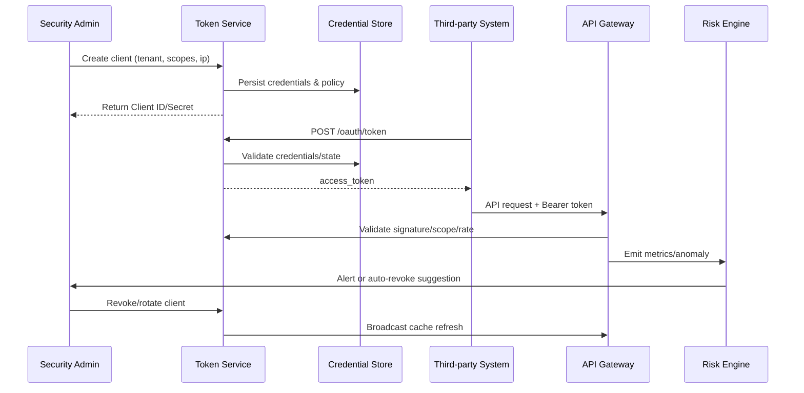

# Third-Party API Token Access

## Executive Summary

This child scenario defines how third-party systems access PowerX APIs through the OAuth2 Client Credentials flow. It spans credential provisioning, token exchange, enforcement at the API gateway, and abnormal revocation. The goal is to keep trusted calls returning 2xx responses while blocking over-privileged or anomalous requests within one minute and retaining full audit/alert evidence.

## Scope & Guardrails

- **In Scope**: Client credential lifecycle management, token exchange, scope/IP whitelist validation, rate limiting, and abnormal revocation workflows.
- **Out of Scope**: End-user session management, plugin-level authorization, asynchronous callback signatures.
- **Environment & Flags**: Requires `iam-api-token`, `gateway-rate-limit`, `iam-token-auto-rotate`, and `audit-streaming`. The API gateway must terminate TLS/mTLS and the risk engine must subscribe to anomaly events.

## Participants & Responsibilities

| Scope | Repository | Layer | Deliverables | Owners |
|-------|------------|-------|--------------|--------|
| core-platform | powerx | service | Client credential APIs, token issuance/renewal/revocation, audit logging | Li Wei (IAM Product Lead / iam@artisan-cloud.com) |
| edge | powerx-gateway | service | Bearer token validation, scope/IP enforcement, rate limiting, request logging | Matrix Ops (Platform Ops Lead / ops@artisan-cloud.com) |
| governance | powerx-risk | service | Anomaly detection, alerting, automated revocation recommendations | Matrix Ops (Platform Ops Lead / ops@artisan-cloud.com) |

## End-to-End Flow

1. **Client registration** – Security admins create a client profile, specifying tenant, scopes, IP whitelist, and expiry.
2. **Token exchange** – Third-party systems call the Client Credentials endpoint; the service validates credentials, IP, and tenant status before issuing tokens.
3. **Gateway authorization** – API calls present a Bearer token; the gateway checks signature, expiry, scope, and rate limits before forwarding traffic.
4. **Audit & monitoring** – Successful and failed calls are logged; over-privileged, rate-limited, or blacklisted requests emit anomaly events.
5. **Revocation & rotation** – Admins or automated rules revoke access, refresh gateway caches, and scheduled tasks rotate secrets while notifying integrators.

## Key Interactions & Contracts

- `POST /internal/auth/clients` — Create a client using `name`, `tenant_id`, `scopes[]`, `ip_whitelist[]`, `expires_in_hours`.
- `POST /oauth/token` — Client Credentials exchange returning `access_token`, `token_type`, `expires_in`, `scope`.
- `DELETE /internal/auth/clients/{id}` — Revoke the client and broadcast cache invalidation.
- `POST /internal/auth/clients/{id}/rotate` — Rotate secrets with a grace window for the previous credentials.
- `EVENT security.token.anomaly` — Flags over-privileged access, blacklist hits, or rate anomalies with `client_id`, `tenant_id`, `error_code`, and `count`.

## Usecase Links

- `SCN-IAM-LOGIN-AUTH-001` — Stage 2 of the master login scenario, sharing audit context with SSO and MFA.
- QA guidance references B-series cases in `docs/meta/scenarios/powerx/core-platform/iam-rbac/login-and-auth/primary.md`.

## Acceptance Criteria

1. **Case B-1 (Happy path)**: With valid scope and IP whitelist, `GET /api/contacts` returns 200, the call is audited, and the token TTL is visible in the console.
2. **Case B-2 (Scope violation)**: A write request with insufficient scope returns 403 `insufficient_scope`, and the anomaly surfaces in the alert center.
3. Secret rotation must update the gateway within five minutes and notify integration contacts to avoid stale credentials.

## Telemetry & Ops

- Metrics: `auth.token.issued_total`, `auth.token.revoked_total`, `gateway.api.success_total`, `gateway.api.forbidden_total`, `gateway.api.rate_limit_reject_total`.
- Alerts: ≥10 over-privileged requests in five minutes trigger PagerDuty; token renewal failure rate >5% prompts Slack; rate-limit spikes at 2× baseline open an ops ticket.
- Dashboards: Grafana “API Gateway / Auth”, Datadog `gateway.auth-*`, `reports/iam/auth-security-dashboard`.

## Open Issues & Follow-ups

| Risk / Item | Impact | Owner | ETA |
|-------------|--------|-------|-----|
| IP whitelist maintenance lacks automation and can fall out of sync | Access control accuracy | Li Wei | 2025-11-08 |
| Gateway cache refresh latency slows revocation | Security response | Matrix Ops | 2025-11-15 |

## Appendix

- “PowerX API Integration Guide” – client credential chapter.
- Operations scripts: `scripts/ops/token-rotation.sh`, `scripts/ops/revoke-token.sh`.
- Incident playbook: `ops/runbooks/api-token-incident.md`.
