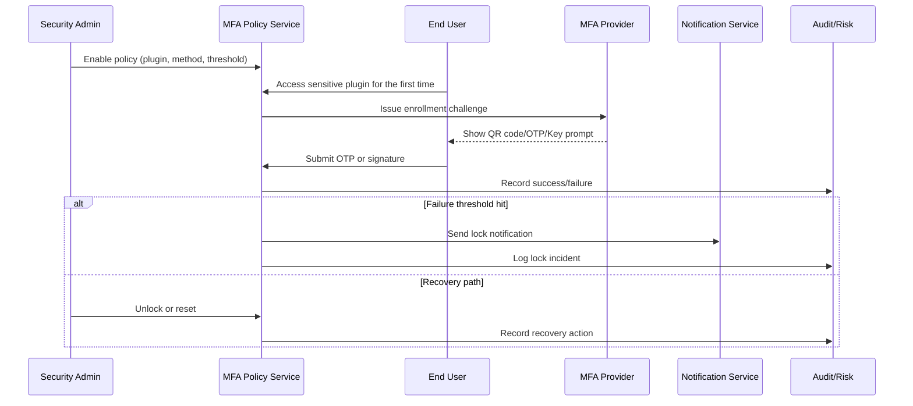

# MFA Safeguards for Sensitive Plugins

## Executive Summary

This child scenario secures access to financial and security-sensitive plugins by enforcing multi-factor authentication. It covers policy enablement, user enrollment, verification, lock alerts, and recovery paths. The objective is to achieve ≥97% verification success before sensitive actions, while ensuring lock events are auditable, quickly reversible, and backed by fallback options.

## Scope & Guardrails

- **In Scope**: Tenant/plugin/action-level MFA policies, enrollment, verification flows, lock and recovery strategies, notifications, and audit trails.
- **Out of Scope**: Endpoint management (e.g., MDM), advisory MFA prompts for non-sensitive actions, and hardware key procurement and distribution.
- **Environment & Flags**: Requires `iam-mfa-policy`, `iam-mfa-recovery`, `notify-transactional`, and `audit-streaming`. Notification channels (SMS/email/push) and the audit event bus must be available.

## Participants & Responsibilities

| Scope | Repository | Layer | Deliverables | Owners |
|-------|------------|-------|--------------|--------|
| core-platform | powerx | service | MFA policy CRUD, enrollment flow, verification APIs, recovery code management | Li Wei (IAM Product Lead / iam@artisan-cloud.com) |
| governance | powerx-risk | service | Lock thresholds, false-positive rollback, risk auditing | Matrix Ops (Platform Ops Lead / ops@artisan-cloud.com) |
| notifications | powerx-notify | service | OTP delivery, lock/unlock notifications, approval reminders | Matrix Ops (Platform Ops Lead / ops@artisan-cloud.com) |

## End-to-End Flow

1. **Policy enablement** – Security admins activate MFA for sensitive plugins, selecting verification methods, failure thresholds, and backup options.
2. **First-time enrollment** – Users bind devices (TOTP/SMS/WebAuthn) during the first access and receive recovery codes.
3. **Secondary verification** – Subsequent sensitive actions trigger MFA checks; success allows continuation while failures increment counters.
4. **Lock & alert** – Hitting the failure threshold locks access, notifies the user and admins, and creates a risk incident.
5. **Recovery & audit** – Users apply recovery codes or admins approve resets; audit events capture timestamps and actors.

## Key Interactions & Contracts

- `POST /internal/security/mfa/policies` — Configure policies with `plugin`, `operations[]`, `methods[]`, `fail_threshold`, `grace_period_minutes`, `backup_methods[]`.
- `POST /auth/mfa/enroll` — Generate enrollment challenges and return QR codes, secrets, WebAuthn challenges, and recovery codes.
- `POST /auth/mfa/verify` — Submit OTP/signatures, returning `verification_id` and status (`LOCKED`, `INVALID_CODE`, `EXPIRED`, etc.) on error.
- `POST /internal/security/mfa/lock` / `unlock` — Lock or unlock access for sensitive plugins.
- `EVENT security.mfa.assigned/verified/locked/recovered` — Audit events with tenant, user, method, plugin, status, and trace metadata.

## Usecase Links

- `SCN-IAM-LOGIN-AUTH-001` — Bolsters Stage 3 of the master login scenario.
- QA follows C-series cases in `docs/meta/scenarios/powerx/core-platform/iam-rbac/login-and-auth/primary.md`.

## Acceptance Criteria

1. **Case C-1 (Happy path)**: Users bind TOTP within one minute during first access, proceed after successful verification, and the audit log contains the event.
2. **Case C-2 (Lock)**: Three failed attempts within five minutes lock access for ten minutes, surface a portal message, and notify both user and security admin.
3. Recovery via admin reset or recovery code immediately clears the lock and records operator/timestamps in audit logs.

## Telemetry & Ops

- Metrics: `auth.mfa.enroll_success_total`, `auth.mfa.verify_success_total`, `auth.mfa.verify_fail_total`, `auth.mfa.locked_total`, `auth.mfa.reset_total`.
- Alerts: Verification failure rate >5% over five minutes triggers PagerDuty; >5 lock events per tenant in ten minutes posts to Slack; binding P95 latency > 60 seconds opens an ops ticket.
- Dashboards: Grafana “IAM / MFA Overview”, Datadog `auth-mfa-*`, `reports/iam/auth-security-dashboard`, plus audit aggregations.

## Open Issues & Follow-ups

| Risk / Item | Impact | Owner | ETA |
|-------------|--------|-------|-----|
| Overseas SMS latency may cause verification timeouts | Verification success rate | Matrix Ops | 2025-11-20 |
| Hardware key rollout still in gray mode, testing matrix unfinished | Enrollment coverage | Li Wei | 2025-11-12 |

## Appendix

- Policy guide: `docs/standards/security/mfa-policy-guide.md` (hardware key section pending update).
- Operations runbook: `ops/runbooks/mfa-lock-reset.md`.
- Monitoring script: `scripts/qa/workflow-metrics.mjs --module mfa`.
