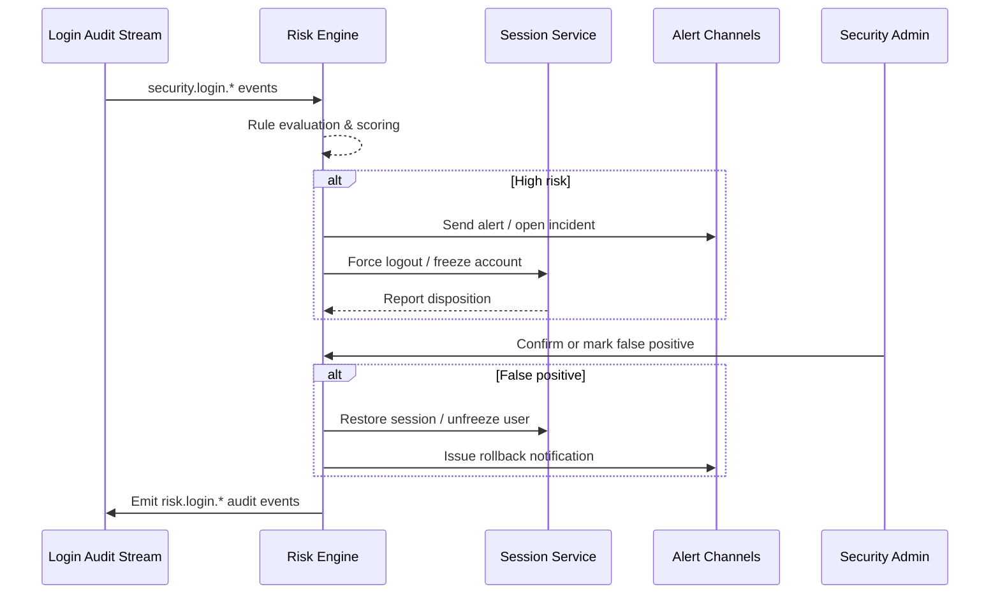

# Anomalous Login Detection & Response

## Executive Summary

This scenario covers login risk detection, alerting, forced session termination, and false-positive rollback. By analysing login audit events, device fingerprints, and geo context in real time, the risk engine executes response actions within 60 seconds, while retaining audit trails and supporting policy adjustments. The aim is to maintain rapid recovery when facing brute-force attacks, impossible travel, or suspicious IP activity.

## Scope & Guardrails

- **In Scope**: Risk rule configuration, event scoring, alert and incident creation, forced logout/freezing, false-positive rollback, and policy tuning.
- **Out of Scope**: Root-cause investigation, third-party threat intel ingestion, and account lifecycle management (handled by IAM user scenarios).
- **Environment & Flags**: Requires `iam-risk-engine`, `auth-session-hardening`, `notify-transactional`, and `audit-streaming`. The risk engine must read login audit streams and blacklist datasets.

## Participants & Responsibilities

| Scope | Repository | Layer | Deliverables | Owners |
|-------|------------|-------|--------------|--------|
| core-platform | powerx | service | Login audit events, forced logout/freeze APIs, rollback interfaces | Li Wei (IAM Product Lead / iam@artisan-cloud.com) |
| governance | powerx-risk | service | Risk rule execution, alert/incident orchestration, rollback strategy, metrics | Matrix Ops (Platform Ops Lead / ops@artisan-cloud.com) |
| notifications | powerx-notify | service | PagerDuty/Slack/email alerts, ticket automation | Matrix Ops (Platform Ops Lead / ops@artisan-cloud.com) |

## End-to-End Flow

1. **Data ingestion** – The risk engine consumes `security.login.*` events, augmenting geo, device, and failure counts.
2. **Risk scoring** – Rules for impossible travel, brute force, blacklisted IP, and abnormal velocity compute scores and recommended actions.
3. **Alert & action** – High-risk events trigger PagerDuty/Slack notifications while the session service enforces logout or account freeze.
4. **Review & rollback** – Security admins confirm incidents or mark false positives; rollbacks restore sessions and adjust thresholds.
5. **Reporting & metrics** – Incident reports and trend metrics feed compliance reviews and operational tuning.

## Key Interactions & Contracts

- `EVENT security.login.detected` — Input payload with `tenant_id`, `user_id`, `session_id`, `ip`, `geo`, `device`, `result`, `latency_ms`.
- `POST /internal/risk/login/incidents` — Manually create or replay incidents for testing.
- `POST /internal/risk/login/incidents/{id}/ack` — Confirm incidents (`confirmed`/`false_positive`).
- `POST /internal/risk/login/incidents/{id}/rollback` — Restore sessions, unfreeze accounts, or adjust thresholds.
- `POST /internal/sessions/force-logout`, `POST /internal/users/{id}/freeze` — Enforcement APIs for logout and account freeze/unfreeze.
- `EVENT security.login.blocked` / `security.login.rollback` — Audit/SIEM events capturing actions, trace IDs, and latency.

## Usecase Links

- `SCN-IAM-LOGIN-AUTH-001` — Stage 4 of the master login scenario, leveraging SSO and MFA audit context.
- QA follows D-series cases in `docs/meta/scenarios/powerx/core-platform/iam-rbac/login-and-auth/primary.md`.

## Acceptance Criteria

1. **Case D-1 (Happy path)**: Detect a cross-region login within five minutes, trigger a high-risk alert in ≤60 seconds, force logout affected sessions, and freeze the account for 30 minutes.
2. **Case D-2 (False positive)**: Marking an incident as false restores the account immediately, stops forced logout, shifts the rule into observation mode, and records rollback details.
3. Each incident must preserve a full TraceID and metadata traceable in SIEM across tenants and actors.

## Telemetry & Ops

- Metrics: `risk.login.high_risk_total`, `risk.login.false_positive_total`, `risk.login.response_latency_p95`, `risk.login.forced_logout_total`, `risk.login.rollback_total`.
- Alerts: Incident backlog >100 or response latency >60 s triggers PagerDuty; false-positive rate >5% prompts security review; freeze failure rate >1% posts to Slack.
- Dashboards: Grafana “IAM / Risk Login”, Datadog `risk-login-*`, `reports/iam/auth-security-dashboard`, plus SIEM dashboards.

## Open Issues & Follow-ups

| Risk / Item | Impact | Owner | ETA |
|-------------|--------|-------|-----|
| SIEM field mapping misalignment hampers cross-system tracing | Compliance auditing | Matrix Ops | 2025-11-18 |
| Rules lack gradual rollout & auto-tuning, creating alert noise | Operational efficiency | Li Wei | 2025-11-25 |

## Appendix

- Risk rule configuration: `docs/standards/security/login-risk-rules.md`.
- Rollback runbook: `ops/runbooks/login-risk-rollback.md`.
- Telemetry script: `scripts/qa/workflow-metrics.mjs --module risk`.
