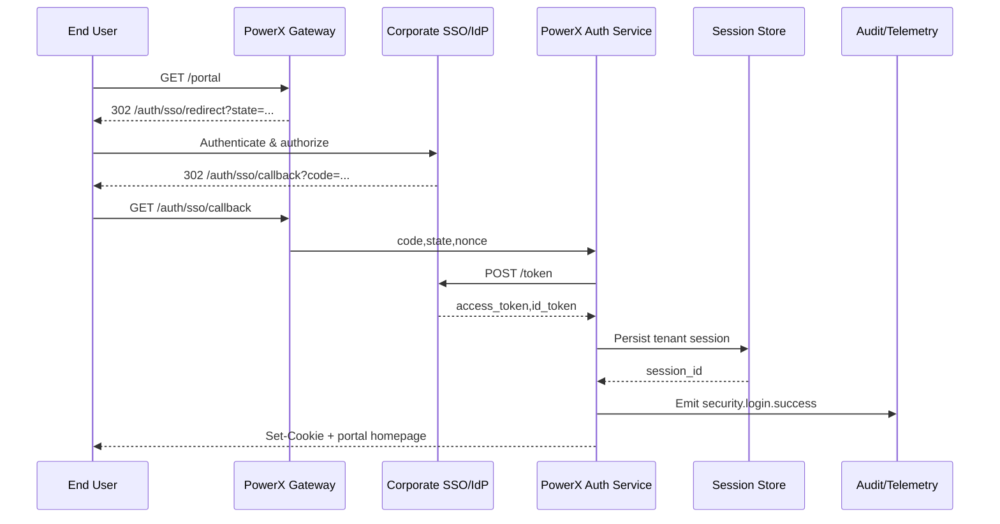

# Enterprise SSO Login Portal

## Executive Summary

This child scenario focuses on the end-to-end login journey when enterprise users access the unified PowerX portal via their corporate SSO/OIDC provider. It covers redirect, authorization-code exchange, session establishment, and audit logging. The goal is to complete the entire flow within three seconds without compromising security, while capturing tenant, device, and geo information for downstream risk analysis and operations.

## Scope & Guardrails

- **In Scope**: Portal entry routing, authorization-code/SAML assertion validation, session creation, tenant isolation, auditing, monitoring, and failure fallback pages.
- **Out of Scope**: Local account login, self-service sign-up, plugin-level authorization, and advanced risk response (handled by the login risk scenario).
- **Environment & Flags**: `iam-login-sso-v2`, `auth-session-hardening`, and `audit-streaming` must be enabled. Corporate IdPs are expected to whitelist the callback domain and keep certificates up to date. Redis/SessionStore must be highly available.

## Participants & Responsibilities

| Scope | Repository | Layer | Deliverables | Owners |
|-------|------------|-------|--------------|--------|
| core-platform | powerx | service | OIDC/SAML handling, token validation, session and audit integration | Li Wei (IAM Product Lead / iam@artisan-cloud.com) |
| edge | powerx-gateway | service | Portal routing, redirect/callback handling, rate limiting | Matrix Ops (Platform Ops Lead / ops@artisan-cloud.com) |
| integrations | powerx | service | IdP client configuration, certificate rotation, tenant trust management | Li Wei (IAM Product Lead / iam@artisan-cloud.com) |

## End-to-End Flow

1. **Portal access** – The user visits `https://portal.powerx.com`; the gateway determines the tenant, minting `state` and `nonce` before redirecting to the corporate IdP.
2. **IdP authorization** – The user completes authentication at the IdP and is redirected back to `auth/sso/callback` with an authorization code or SAML assertion.
3. **Token exchange & validation** – PowerX Auth exchanges the code with the IdP token endpoint, validating signatures, tenant binding, expiry, and the original `nonce`.
4. **Session & portal bootstrap** – The session service persists the session, associates tenant and device fingerprint information, and returns the portal configuration.
5. **Failure fallback & alerts** – Tenant freezes, disabled users, or token validation failures surface an informative fallback page and trigger alerts while logging the attempt.

## Key Interactions & Contracts

- `GET /auth/sso/redirect` — Accepts `tenant_id` and optional `return_to`, generates `state`/`nonce`, and caches them.
- `GET /auth/sso/callback` — Validates `state`/`nonce`, handles IdP error codes such as `access_denied` and `interaction_required`.
- `POST /idp/token` — Exchanges the authorization code for Access/ID Tokens, 3-second timeout with one retry.
- `POST /internal/sessions` — Creates the PowerX session, binding `tenant_id`, `user_id`, device fingerprint, and IP.
- `EVENT security.login.success/failure` — Audit events capturing success or categorized failure reasons, latency, device, and IP information.

## Usecase Links

- `SCN-IAM-LOGIN-AUTH-001` — Stage 1 baseline for the Login & Authentication master scenario.
- Test coverage references the A-series cases from `docs/meta/scenarios/powerx/core-platform/iam-rbac/login-and-auth/primary.md`.

## Acceptance Criteria

1. **Case A-1 (Happy path)**: With a healthy IdP trust relationship, P95 end-to-end login latency ≤ 3 seconds, portal loads successfully, and audit records are complete.
2. **Case A-2 (Tenant frozen)**: Frozen tenant attempts return a “tenant frozen” page within one second, avoid issuing a valid session, and raise alerts.
3. Failure reasons must be classified into token validation, tenant state, user state, and system errors to aid troubleshooting.

## Telemetry & Ops

- Metrics: `auth.sso.success_rate`, `auth.sso.latency_p95`, `auth.sso.failure_total` (by reason), `auth.session.creation_success_total`.
- Alerts: Five consecutive failures per tenant or success rate < 97% over five minutes triggers PagerDuty; authorization-code exchange timeout rate > 3% triggers Slack `#auth-alerts`.
- Dashboards: Grafana “IAM / Login Overview”, Splunk login failure panels, and the `reports/iam/auth-security-dashboard`.

## Open Issues & Follow-ups

| Risk / Item | Impact | Owner | ETA |
|-------------|--------|-------|-----|
| Certificate rotation schedules differ across tenants, risking login outages | IdP integration stability | Li Wei | 2025-11-05 |
| Portal geo-routing not aligned with latest CDN rollout, increasing cross-region latency | Login latency | Matrix Ops | 2025-11-12 |

## Appendix

- Enterprise SSO Integration Blueprint (IAM-Login-SSO-Blueprint).
- Operations runbook: `ops/runbooks/auth-sso-troubleshoot.md`.
- Telemetry script: `scripts/qa/workflow-metrics.mjs` (SSO module).
