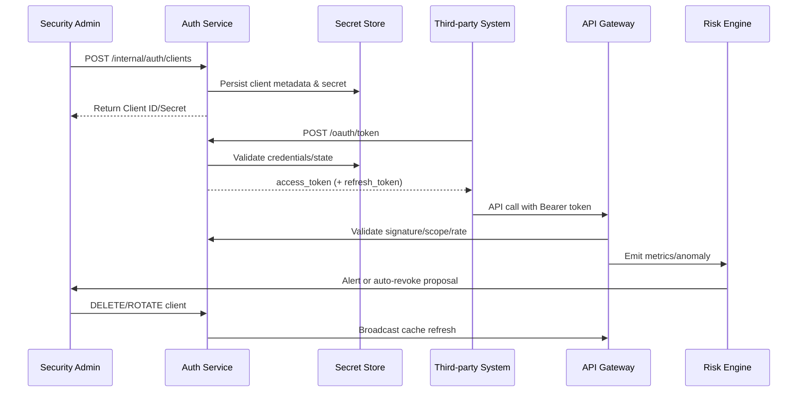

# Usecase Overview

- **Business Goal**: Provide a secure and controllable API entry point for third-party and internal automation systems by delivering credential issuance, token exchange, authorization checks, and anomaly-driven revocation in a single loop while upholding tenant isolation and least-privilege principles.
- **Success Metrics**: Token issuance success rate ≥ 99%; ≥ 98% of trusted calls return 2xx responses; over-privileged or rate anomalies mitigated within 60 seconds; secret rotation propagated to enforcement nodes within five minutes.
- **Scenario Links**: Supports the Stage 2 flow of `SCN-IAM-LOGIN-AUTH-001`, sharing login context, audit trails, and alert channels with the SSO, MFA, and login-risk scenarios.

> Summary: Implement the end-to-end chain from credential creation through gateway validation and risk feedback so that partner integrations remain both highly available and fully traceable.

# Context & Assumptions

- **Prerequisites**
  - Feature flags `iam-api-token`, `gateway-rate-limit`, `iam-token-auto-rotate`, and `audit-streaming` are enabled for the tenant.
  - The PowerX gateway terminates TLS/mTLS and is configured with scope/IP whitelist policies and rate limits.
  - The risk engine subscribes to `security.token.*` events and routes alerts; the audit pipeline is operational.
  - Tenant admins hold `api_token.manage` permissions; gateway caches and the key vault (KMS/Secrets Manager) are reachable.
- **Inputs / Outputs**
  - Inputs: Admin client provisioning requests, third-party `POST /oauth/token` calls, API requests that include Bearer tokens, risk feedback.
  - Outputs: Access/refresh tokens, credential metadata, audit and metric records, anomaly alerts (PagerDuty/Slack), revocation and rotation jobs.
- **Boundaries**
  - Excludes end-user session handling and plugin-level authorization, as well as callback-signature management.
  - Key escrow and distribution logistics are owned by the security team; this usecase only consumes their interfaces.

# Solution Blueprint

## System Decomposition

| Layer | Component | Responsibility | Entry Point |
|-------|-----------|----------------|-------------|
| Control plane | `internal/service/auth/client_credentials_service.go` | Client provisioning, scope/IP validation, secret lifecycle | `services/auth` |
| Exchange layer | `internal/service/auth/token_exchange_handler.go` | Handle `POST /oauth/token`, validate state, issue tokens | `services/auth` |
| Gateway layer | `pkg/gateway/middleware/authz.go` | Verify signature, expiry, scope, and rate; enrich audit context | `pkg/gateway/middleware` |
| Security layer | `pkg/core/security/token_signer.go` | Manage signing keys, encryption, automated rotation | `pkg/core/security` |
| Audit & risk | `pkg/audit/api_token_logger.go`, `pkg/risk/analyzers/token_anomaly.go` | Record successes/failures, detect anomalies, trigger alerts | `pkg/audit`, `pkg/risk/analyzers` |

## Flow & Timing

1. **Client registration** – Admins create clients via console/API, validating tenant status, scopes, and IP whitelist; secrets are generated and encrypted.
2. **Token exchange** – Third-party systems call `POST /oauth/token`; credentials, IP, and tenant posture are validated before issuing short-lived access tokens (and optional refresh tokens) while logging the transaction.
3. **Gateway authorization** – API requests present Bearer tokens; the gateway validates signature, expiry, scope, and rate limits, then records invocation metrics.
4. **Risk integration** – `security.token.anomaly` is emitted for over-privileged access, blacklist hits, or rate abuse so the risk engine can recommend revocation or freeze actions.
5. **Revocation & rotation** – Admins or automation invoke revoke/rotate APIs, propagate cache refreshes to the gateway, notify stakeholders, and capture audit timestamps.

# Contracts & Interfaces

- `POST /internal/auth/clients` — Provision clients; returns `INVALID_SCOPE`, `DUPLICATE_NAME`, `TENANT_FROZEN`, etc. on failure.
- `POST /oauth/token` — Client Credentials exchange supporting HTTP Basic or body secrets; default TTL 60 minutes; 3-second timeout with one retry.
- `DELETE /internal/auth/clients/{id}` — Revoke credentials; persists audit entries and invalidates gateway caches.
- `POST /internal/auth/clients/{id}/rotate` — Rotate secrets, providing new and old secret metadata during a grace period.
- `EVENT security.token.anomaly` — Publishes anomalies with `client_id`, `tenant_id`, `error_code`, and occurrence counts.

# Implementation Checklist

| Item | Description | Status | Owner |
|------|-------------|--------|-------|
| Data model | Design `auth_client`/`auth_client_secret` tables, indices, encryption fields | [ ] | Li Wei |
| Business logic | Implement client CRUD, secret vaulting, token exchange, revoke/rotate flows | [ ] | Li Wei |
| Cache & gateway | Coordinate cache refresh, rate limiting, and hot reload with gateway owners | [ ] | Matrix Ops |
| Risk integration | Wire `security.token.anomaly` alerts and automated revocation workflows | [ ] | Matrix Ops |
| Config & docs | Publish default scopes/IP templates, rotation cron jobs, runbook updates | [ ] | Matrix Ops |
| Documentation | Update `docs/standards/security/api-token-governance.md`, portal guides | [ ] | Li Wei |

# Testing Strategy

- **Unit**: Client creation/update, secret encryption/decryption, token exchange success/failure, rate-limit rules.
- **Integration**: Sandbox gateway to validate `POST /oauth/token`, legitimate vs. over-privileged requests, IP whitelist enforcement, audit/alert pipelines.
- **End-to-end**: Execute B-1/B-2 cases to confirm positive flow, insufficient scope handling, immediate revocation effects, and dashboard metrics.
- **Non-functional**: Load-test token exchange (≥2k RPS), gateway validation latency (P95 < 30 ms), Chaos tests for cache delays or key rotation failures.

# Observability & Ops

- **Metrics**: `auth.token.issued_total`, `auth.token.revoked_total`, `gateway.api.success_total`, `gateway.api.forbidden_total`, `gateway.api.rate_limit_reject_total`, `security.token.anomaly_total`.
- **Logs**: Capture `client_id`, `tenant_id`, `scope`, `ip`, `user_agent`, `error_code`, `trace_id`; mask or encrypt sensitive data; split business vs. audit logs.
- **Alerts**: ≥10 over-privileged requests/5 min → PagerDuty; rotation failures or cache refresh timeouts → Slack `#iam-alerts`; token renewal failure rate >5% → incident ticket.
- **Dashboards**: Grafana “API Gateway / Auth”, Datadog `gateway.auth*`, `reports/iam/auth-security-dashboard`.

# Rollback & Failure Handling

- **Rollback**: Revert Auth/gateway deployments, disable `iam-api-token`, restore previous key state, purge problematic tokens/secrets.
- **Mitigations**: Use `scripts/ops/revoke-token.sh --client <id>` for suspicious clients; `token-rotation.sh --force` to reissue secrets; optionally switch tenants to read-only.
- **Data repair**: Replay audits (`scripts/audit/replay-token-events.mjs`), refresh caches (`scripts/gateway/reset-auth-cache.sh`), correct IP whitelist entries.

# Follow-ups & Risks

| Risk / Item | Impact | Mitigation | Owner | ETA |
|-------------|--------|-----------|-------|-----|
| IP whitelist maintenance lacks automation | Access control accuracy | Add automated checks and console reminders | Li Wei | 2025-11-08 |
| Gateway cache refresh latency delays revocation | Security response | Shorten cache TTL, add push channels and health probes | Matrix Ops | 2025-11-15 |

# References & Links

- Scenario: `docs/scenarios/iam/SCN-IAM-LOGIN-API-TOKEN-001.md`
- Master scenario: `docs/scenarios/iam/SCN-IAM-LOGIN-AUTH-001.md`
- Ops scripts: `scripts/ops/token-rotation.sh`, `scripts/ops/revoke-token.sh`
- Standard: `docs/standards/security/api-token-governance.md`

> After completing this seed, run `npm run publish:usecases -- --scn-id SCN-IAM-LOGIN-AUTH-001 --validate-only` before distributing to downstream repositories.
