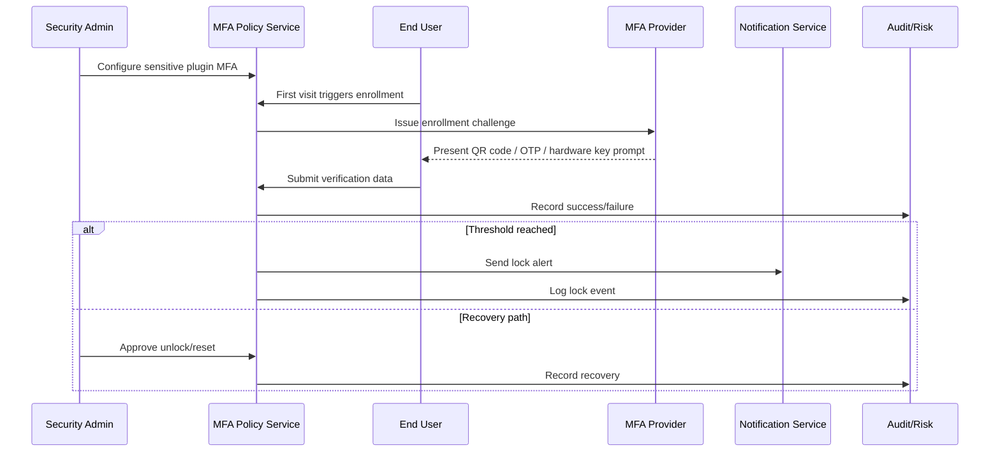

# Usecase Overview

- **Business Goal**: Enforce multi-factor checks before high-risk plugin operations so only enrolled users proceed, while providing rapid lock, recovery, and audit capabilities.
- **Success Metrics**: MFA enrollment success ≥ 95%; verification success ≥ 97%; lock false-positive rate ≤ 0.5%; recovery handling SLA ≤ 15 minutes.
- **Scenario Links**: Implements Stage 3 of `SCN-IAM-LOGIN-AUTH-001`, sharing login context with the SSO, API Token, and login-risk flows.

> Summary: Deliver policy, enrollment, verification, lock, and recovery workflows that keep sensitive actions secure yet auditable and reversible.

# Context & Assumptions

- **Prerequisites**
  - Feature flags `iam-mfa-policy`, `iam-mfa-recovery`, `notify-transactional`, and `audit-streaming` enabled.
  - Notification channels (SMS/email/push) are available; WebAuthn infrastructure supports hardware keys.
  - Security admins can configure policies; users hold access rights to designated sensitive plugins.
  - The risk engine consumes `security.mfa.*` events for monitoring and false-positive analysis.
- **Inputs / Outputs**
  - Inputs: Policy configurations (plugins, operations, methods, thresholds), user enrollment requests, OTP/signatures, recovery codes, admin resets.
  - Outputs: MFA enrollment status, verification tokens, lock and recovery events, alerts, and audit records.
- **Boundaries**
  - Excludes endpoint management (MDM) and non-sensitive advisory prompts; hardware key procurement handled separately.
  - Account lifecycle and role governance belong to other IAM scenarios.

# Solution Blueprint

## System Decomposition

| Layer | Component | Responsibility | Entry Point |
|-------|-----------|----------------|-------------|
| Policy | `internal/service/auth/mfa_policy_service.go` | Policy CRUD, tenant/plugin/action evaluation, threshold logic | `services/auth` |
| Enrollment | `internal/service/auth/mfa_enrollment_service.go` | Enrollment flow, recovery code creation, duplicate detection | `services/auth` |
| Verification | `pkg/mfa/providers/{totp,webauthn,sms}.go` | Provide OTP/WebAuthn/SMS verification with tolerance and retry rules | `pkg/mfa/providers` |
| Notification | `pkg/notify/dispatchers/mfa.js` | Lock notifications, approval reminders, escalation routing | `pkg/notify` |
| Audit & risk | `pkg/audit/mfa_logger.go`, `pkg/risk/analyzers/mfa_anomaly.go` | Audit logging, lock monitoring, false-positive rollback | `pkg/audit`, `pkg/risk/analyzers` |

## Flow & Timing

1. **Policy enablement** – Admins enable MFA for target plugins/operations, selecting methods, thresholds, and backup options.
2. **Enrollment** – The first visit to a protected plugin triggers enrollment, binding TOTP/SMS/WebAuthn devices and issuing recovery codes.
3. **Verification** – Subsequent access requires successful MFA; failures increment counters scoped to the tenant.
4. **Lock & alert** – Meeting the failure threshold locks access, sends notifications, and raises a risk incident.
5. **Recovery & audit** – Recovery codes or admin approvals clear locks; audit logs capture actors, timestamps, and actions.

# Contracts & Interfaces

- `POST /internal/security/mfa/policies` — Configure policies (`plugin`, `operations[]`, `methods[]`, `fail_threshold`, `grace_period_minutes`, `backup_methods[]`).
- `POST /auth/mfa/enroll` — Issue enrollment challenges, QR codes, secrets, WebAuthn data, and recovery codes.
- `POST /auth/mfa/verify` — Submit OTP/signatures; returns `verification_id` or errors (`LOCKED`, `INVALID_CODE`, `EXPIRED`).
- `POST /internal/security/mfa/lock` / `unlock` — Programmatic lock/unlock operations for sensitive plugins.
- `EVENT security.mfa.assigned/verified/locked/recovered` — Audit stream carrying tenant/user/method/plugin/status metadata.

# Implementation Checklist

| Item | Description | Status | Owner |
|------|-------------|--------|-------|
| Policy model | Table design, tenant isolation, indexing | [ ] | Li Wei |
| Enrollment UX | Enrollment wizard, recovery code management, duplicate binding checks | [ ] | Li Wei |
| Notification flows | Lock alerts, approval reminders, alert thresholds | [ ] | Matrix Ops |
| Audit & rollback | Integrate audit stream, false-positive rollback workflow | [ ] | Matrix Ops |
| Documentation | Update `docs/standards/security/mfa-policy-guide.md`, ops runbooks | [ ] | Li Wei |

# Testing Strategy

- **Unit**: Policy evaluation, failure counters, lock logic, recovery validation, WebAuthn security checks.
- **Integration**: Simulate TOTP/SMS/WebAuthn binding and verification; trigger lock/unlock paths; confirm audit and notification outputs.
- **End-to-end**: Execute C-1/C-2 cases covering positive path, lock behavior, admin unlock, backup verification.
- **Non-functional**: Measure verification throughput and notification latency; run Chaos tests for provider outages to validate fallback plans.

# Observability & Ops

- **Metrics**: `auth.mfa.enroll_success_total`, `auth.mfa.verify_success_total`, `auth.mfa.verify_fail_total`, `auth.mfa.locked_total`, `auth.mfa.reset_total`.
- **Logs**: Record `tenant_id`, `user_id`, `plugin`, `method`, `status`, `error_code`, `trace_id` (mask sensitive data).
- **Alerts**: Failure rate >5%/5 min → PagerDuty; lock events >5 per tenant/10 min → Slack; recovery failures escalate to incident tickets.
- **Dashboards**: Grafana “IAM / MFA Overview”, Datadog `auth-mfa-*`, `reports/iam/auth-security-dashboard`.

# Rollback & Failure Handling

- **Rollback**: Revert MFA deployment, disable `iam-mfa-policy`, undo policy changes, clear residual locks.
- **Mitigations**: Use `scripts/mfa/unlock-users.sh --tenant <id>` for bulk unlocks; `scripts/mfa/generate-recovery-codes.sh` to reissue codes; notify admins for manual approval workflows.
- **Data repair**: Replay audit events for lock history, clean up orphan bindings, align notification and risk records.

# Follow-ups & Risks

| Risk / Item | Impact | Mitigation | Owner | ETA |
|-------------|--------|-----------|-------|-----|
| Overseas SMS latency may cause verification timeouts | Verification success | Add alternate channels/nearby PoPs | Matrix Ops | 2025-11-20 |
| Hardware key rollout still in pilot, testing incomplete | Enrollment coverage | Expand test matrix and procurement coordination | Li Wei | 2025-11-12 |

# References & Links

- Scenario: `docs/scenarios/iam/SCN-IAM-LOGIN-MFA-001.md`
- Master scenario: `docs/scenarios/iam/SCN-IAM-LOGIN-AUTH-001.md`
- Runbook: `ops/runbooks/mfa-lock-reset.md`
- Monitoring script: `scripts/qa/workflow-metrics.mjs --module mfa`

> Run `npm run publish:usecases -- --scn-id SCN-IAM-LOGIN-AUTH-001 --validate-only` before distributing downstream.
