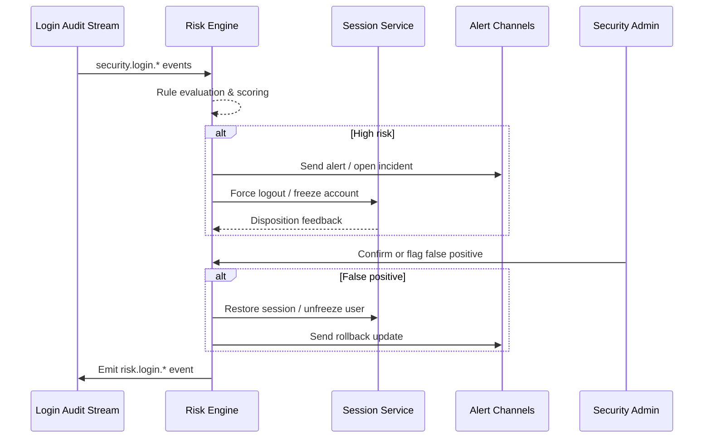

# Usecase Overview

- **Business Goal**: Detect high-risk login behavior in real time, escalate alerts, enforce forced logout/freeze actions, and recover from false positives within five minutes to curb brute force and impossible-travel attacks.
- **Success Metrics**: Detection accuracy ≥ 95%; false-positive rate ≤ 2%; response latency ≤ 60 seconds; rollback SLA ≤ 5 minutes; alert delivery rate 100%.
- **Scenario Links**: Delivers Stage 4 of `SCN-IAM-LOGIN-AUTH-001`, leveraging shared audit data, session interfaces, and alert channels provided by SSO, API Token, and MFA flows.

> Summary: Build the “detect → alert → enforce → rollback” loop so that login incidents remain fast to detect, fast to resolve, traceable, and recoverable.

# Context & Assumptions

- **Prerequisites**
  - Feature flags `iam-risk-engine`, `auth-session-hardening`, `notify-transactional`, and `audit-streaming` enabled.
  - Login events `security.login.*` include tenant, user, device, IP, geo; the risk engine consumes the stream.
  - Session services expose forced logout and freeze/unfreeze APIs; notification channels (PagerDuty/Slack/email) are operational.
  - Blacklist, geo databases, and external intelligence feeds are refreshed on schedule.
- **Inputs / Outputs**
  - Inputs: Login audit events, risk rule configurations, blacklist entries, admin feedback (confirm/false-positive), rollback commands.
  - Outputs: Risk scores, alerts, forced logout/freeze tasks, rollback records, metrics, and reports.
- **Boundaries**
  - Excludes root-cause investigations and external intel synchronization; account lifecycle is covered elsewhere.
  - Does not manage password reset or trusted device preferences.

# Solution Blueprint

## System Decomposition

| Layer | Component | Responsibility | Entry Point |
|-------|-----------|----------------|-------------|
| Ingestion | `internal/service/risk/login_ingestor.go` | Consume login events, enrich context, dispatch to rules | `services/risk` |
| Rules | `pkg/risk/rules/*` | Evaluate geo velocity, failure velocity, blacklist, anomaly rules | `pkg/risk/rules` |
| Orchestration | `internal/service/risk/login_risk_service.go` | Scoring, alerting, forced logout/freeze, rollback | `services/risk` |
| Session/account | `internal/service/session/session_service.go` | Perform forced logout, freeze/unfreeze, session restoration | `services/session` |
| Audit & metrics | `pkg/audit/risk_logger.go`, `pkg/metrics/risk_login_metrics.go` | Emit `security.login.*`/`risk.login.*` events, collect metrics | `pkg/audit`, `pkg/metrics` |
| Notification | `pkg/notify/incident_notifier.go` | PagerDuty/Slack/email alerts, ticket automation | `pkg/notify` |

## Flow & Timing

1. **Event ingestion** – Risk engine continuously consumes `security.login.*` events, correlating session, device, IP, and geo.
2. **Risk evaluation** – Rules flag impossible travel, brute force, blacklist hits, abnormal velocity, and produce scores/actions.
3. **Alert & enforcement** – High-risk incidents trigger alerts and call session APIs to force logout/freeze accounts while logging outcomes.
4. **Review & rollback** – Security admins confirm true positives or mark false positives; rollbacks restore sessions and adjust thresholds.
5. **Reporting & metrics** – Incident reports and trend metrics inform compliance reviews and rule tuning.

# Contracts & Interfaces

- `EVENT security.login.detected` (plus success/failure variants) — Primary inputs carrying tenant/user/session metadata.
- `POST /internal/risk/login/incidents` — Create or replay incidents for drills and testing.
- `POST /internal/risk/login/incidents/{id}/ack` — Confirm incidents (`confirmed` / `false_positive`).
- `POST /internal/risk/login/incidents/{id}/rollback` — Restore sessions, unfreeze accounts, tune thresholds.
- `POST /internal/sessions/force-logout`, `POST /internal/users/{id}/freeze` — Enforcement APIs.
- `EVENT security.login.blocked` / `security.login.rollback` — Downstream audit/SIEM events with action, trace ID, latency.

# Implementation Checklist

| Item | Description | Status | Owner |
|------|-------------|--------|-------|
| Rule configuration | Implement geo, velocity, blacklist, device fingerprint rules and unit tests | [ ] | Li Wei |
| Alert orchestration | Integrate PagerDuty/Slack/ticketing, templates, and escalation paths | [ ] | Matrix Ops |
| Enforcement flows | Wire forced logout/freeze/unfreeze and rollback APIs | [ ] | Li Wei |
| Audit & reports | Deliver audit trail, dashboards, and periodic incident reports | [ ] | Matrix Ops |
| Runbooks | Update incident response, false-positive rollback, risk tuning guides | [ ] | Matrix Ops |

# Testing Strategy

- **Unit**: Rule evaluation, threshold tuning, deduplication, rollback logic.
- **Integration**: Replay login logs to validate alerts, enforcement actions, cache refresh, SIEM sync.
- **End-to-end**: Run D-1/D-2 cases simulating impossible travel, brute force, and false-positive rollback; confirm alert timeline and recovery SLA.
- **Non-functional**: Stress ≥50k events/min, measure response latency, run Chaos drills for notification/queue failures to confirm graceful degradation.

# Observability & Ops

- **Metrics**: `risk.login.high_risk_total`, `risk.login.false_positive_total`, `risk.login.response_latency_p95`, `risk.login.forced_logout_total`, `risk.login.rollback_total`.
- **Logs**: Capture `incident_id`, `tenant_id`, `user_id`, `rule_id`, `score`, `action`, `trace_id`; mask sensitive fields.
- **Alerts**: Incident backlog >100 or latency >60s → PagerDuty; false-positive rate >5% → security review; freeze failure rate >1% → Slack alert.
- **Dashboards**: Grafana “IAM / Risk Login”, Datadog `risk-login-*`, `reports/iam/auth-security-dashboard`, SIEM dashboards.

# Rollback & Failure Handling

- **Rollback**: Disable `iam-risk-engine`, fall back to manual approvals, revert latest rule configuration, restore affected sessions.
- **Mitigations**: Use `scripts/risk/requeue-events.sh` to replay events, `scripts/sessions/force-logout-by-tenant.sh` for batch enforcement, `scripts/risk/fix-incident-state.sh` to repair incident states.
- **Data repair**: Run `scripts/audit/replay-risk-events.mjs` to restore audit trails, align SIEM field mappings, recalibrate blacklists/thresholds.

# Follow-ups & Risks

| Risk / Item | Impact | Mitigation | Owner | ETA |
|-------------|--------|-----------|-------|-----|
| SIEM field mappings inconsistent, hindering traceability | Compliance auditing | Standardise mappings, update docs, refresh parsers | Matrix Ops | 2025-11-18 |
| Lack of rule gray release and auto-tuning increases noise | Operational efficiency | Introduce phased rollout, data replay, adaptive thresholds | Li Wei | 2025-11-25 |

# References & Links

- Scenario: `docs/scenarios/iam/SCN-IAM-LOGIN-RISK-001.md`
- Master scenario: `docs/scenarios/iam/SCN-IAM-LOGIN-AUTH-001.md`
- Runbook: `ops/runbooks/login-risk-rollback.md`
- Metrics script: `scripts/qa/workflow-metrics.mjs --module risk`

> Validate with `npm run publish:usecases -- --scn-id SCN-IAM-LOGIN-AUTH-001 --validate-only` before downstream distribution.
