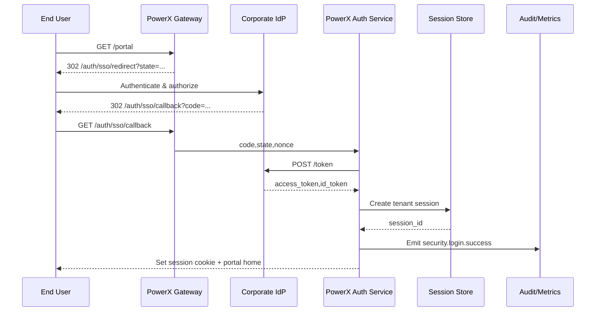

# Usecase Overview

- **Business Goal**: Complete the corporate SSO/OIDC authorization-code flow within three seconds while preserving tenant isolation, audit coverage, and clear fallback interactions.
- **Success Metrics**: SSO success rate ≥ 99%; end-to-end P95 latency ≤ 3 seconds; failure reasons accurately categorised; audit persistence 100%.
- **Scenario Links**: Forms the Stage 1 baseline for `SCN-IAM-LOGIN-AUTH-001`, providing shared session context to the API Token, MFA, and login-risk usecases.

> Summary: Provide a unified SSO entry encompassing redirect, token exchange, session creation, and failure alerting so that enterprise logins remain seamless yet traceable.

# Context & Assumptions

- **Prerequisites**
  - Feature flags `iam-login-sso-v2`, `auth-session-hardening`, and `audit-streaming` enabled.
  - Corporate IdPs configure redirect URIs, certificates, and client credentials correctly; portal domains are whitelisted.
  - Session stores (Redis/DB) and the audit pipeline are healthy.
  - Tenant/user states are synchronised between IdP and PowerX.
- **Inputs / Outputs**
  - Inputs: Portal entry requests, authorization codes/SAML assertions, IdP token responses, tenant and user context.
  - Outputs: PowerX sessions, portal configuration, audit logs, alerts, telemetry.
- **Boundaries**
  - Excludes local login, self-registration, plugin-level authorization, and anomaly remediation (covered by login-risk usecase).

# Solution Blueprint

## System Decomposition

| Layer | Component | Responsibility | Entry Point |
|-------|-----------|----------------|-------------|
| Gateway | `internal/transport/http/auth/sso_handler.go` | Redirect/callback handling, state/nonce validation, fallback pages | `services/auth` |
| Integration | `pkg/auth/idp/client.go` | OIDC/SAML client, JWKS cache, token verification, tenant binding | `pkg/auth/idp` |
| Session | `internal/service/session/session_service.go` | Session persistence, tenant isolation, device fingerprint logging | `services/session` |
| Audit | `pkg/audit/login_logger.go`, `pkg/metrics/auth_login_metrics.go` | Audit events, metrics, failure categorisation, alert hooks | `pkg/audit`, `pkg/metrics` |
| Notification | `pkg/notify/templates/auth_sso_error.html` | Frozen-tenant/user-disabled notifications and templates | `pkg/notify/templates` |

## Flow & Timing

1. **Portal access** – Gateway resolves tenant, issues `state`/`nonce`, and redirects to the corporate IdP.
2. **IdP authorization** – User authenticates at the IdP and returns with an authorization code or assertion.
3. **Token exchange** – Auth service calls the IdP token endpoint, validating signature, tenant binding, expiry, and `nonce`.
4. **Session creation** – Session service stores the session, binds tenant/device data, and returns portal bootstrap info.
5. **Alert & fallback** – Failures present fallback messaging, trigger alerts, and log structured audit events.

# Contracts & Interfaces

- `GET /auth/sso/redirect` — Accepts `tenant_id`, optional `return_to`; generates and caches `state`/`nonce`.
- `GET /auth/sso/callback` — Validates `state`/`nonce`, handles IdP error codes (`access_denied`, `interaction_required`, etc.).
- `POST /idp/token` — Authorization-code exchange (3-second timeout, one retry) returning Access/ID Tokens.
- `POST /internal/sessions` — Creates PowerX sessions with tenant/user/device/IP context.
- `EVENT security.login.success/failure` — Categorised audit events capturing latency, device, IP, and outcome.

# Implementation Checklist

| Item | Description | Status | Owner |
|------|-------------|--------|-------|
| IdP integration | Configure redirect URIs, certificates, client credentials | [ ] | Li Wei |
| Session security | Implement replay protection, SameSite cookies, tenant isolation policies | [ ] | Li Wei |
| Failure fallback | Provide frozen-tenant/disabled-user pages and alert channels | [ ] | Matrix Ops |
| Audit & metrics | Emit `security.login.*`, `auth.sso.*` metrics and alert thresholds | [ ] | Matrix Ops |
| Documentation | Update integration guide and troubleshooting runbook | [ ] | Li Wei |

# Testing Strategy

- **Unit**: State/nonce validation, token signature checks, failure categorisation, tenant isolation logic.
- **Integration**: Sandbox IdP to validate authorization-code flow, token exchange, session creation, audit logging.
- **End-to-end**: Run A-1/A-2 covering successful login, frozen tenant, disabled user, IdP timeout.
- **Non-functional**: Load-test callback handling (P95 < 100 ms) and success rate; Chaos drills for IdP/Redis outages.

# Observability & Ops

- **Metrics**: `auth.sso.success_rate`, `auth.sso.latency_p95`, `auth.sso.failure_total` (per category), `auth.session.creation_success_total`.
- **Logs**: Capture `tenant_id`, `user_id`, `state`, `nonce`, `ip`, `user_agent`, `error_code`, `trace_id`.
- **Alerts**: 5 consecutive failures or success rate <97%/5 min → PagerDuty; token exchange timeout >3% → Slack.
- **Dashboards**: Grafana “IAM / Login Overview”, Splunk login failure dashboards, `reports/iam/auth-security-dashboard`.

# Rollback & Failure Handling

- **Rollback**: Revert Auth/gateway deployments, disable `iam-login-sso-v2`, restore previous certificates, purge invalid sessions.
- **Mitigations**: Coordinate with IdP support, run `scripts/auth/reset-sso-state.sh` to clear cached state, generate temporary login links if allowed.
- **Data repair**: Replay audit events, correct login counters, manually clear mistaken locks.

# Follow-ups & Risks

| Risk / Item | Impact | Mitigation | Owner | ETA |
|-------------|--------|-----------|-------|-----|
| Asynchronous certificate rotations may break logins | IdP integration stability | Add rotation reminders and automated validation | Li Wei | 2025-11-05 |
| Portal geo-routing not aligned with CDN rollout | Login latency | Complete CDN configuration and routing adjustments | Matrix Ops | 2025-11-12 |

# References & Links

- Scenario: `docs/scenarios/iam/SCN-IAM-LOGIN-SSO-001.md`
- Master scenario: `docs/scenarios/iam/SCN-IAM-LOGIN-AUTH-001.md`
- Integration guide: `docs/standards/security/iam-login-sso-blueprint.md`
- Runbook: `ops/runbooks/auth-sso-troubleshoot.md`

> Validate via `npm run publish:usecases -- --scn-id SCN-IAM-LOGIN-AUTH-001 --validate-only` before downstream roll-out.
