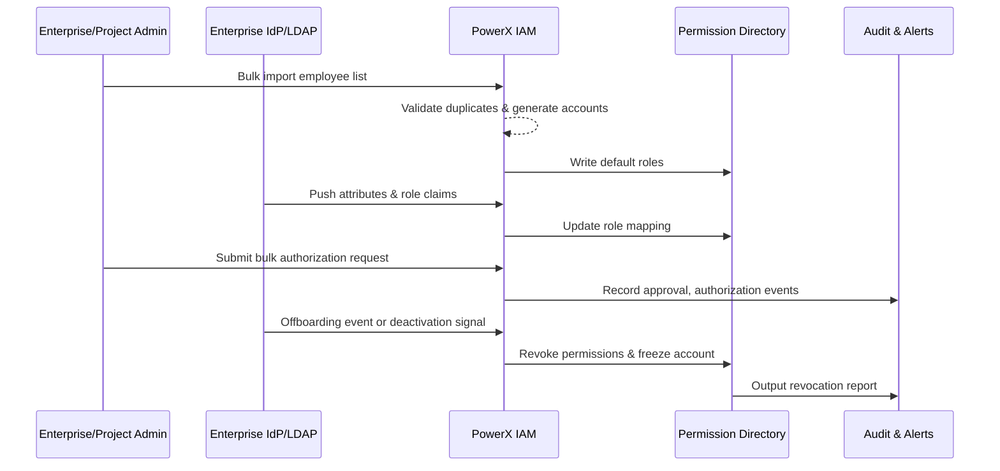

# PowerX User and Role Management

> PowerX provides end-to-end identity governance capabilities from employee onboarding to offboarding, covering bulk account creation, enterprise directory synchronization, project-level authorization and revocation. This main scenario coordinates enterprise administrators, project administrators, enterprise IdPs, and risk audit roles to ensure accurate role policy configuration, automated authorization and revocation execution, and full traceability of critical operations. The four core sub-scenarios handle bulk import account creation, OIDC/LDAP directory synchronization, bulk authorization approval, and automatic offboarding revocation respectively, targeting completion of authorization or revocation actions within 5 minutes while maintaining ≥99% synchronization success rate.

# Scope & Guardrails

- **In Scope**: Employee account creation, external directory synchronization, bulk authorization, offboarding revocation, and related approval, notification, and audit processes.
- **Out of Scope**: User login experience (see "SCN-IAM-LOGIN-001"), plugin internal fine-grained permissions, cross-tenant data sharing policies.
- **Environment & Flags**: `iam-directory-v2`, `sso-oidc-sync`, `iam-bulk-assign`, `iam-auto-revoke` Feature Flags; dependent on enterprise IdP, email/notification services, audit event bus, and batch task queues.

# Participants & Responsibilities

| Scope | Repository | Layer | Responsibility & Deliverables | Owners |
|-------|------------|-------|--------------------------------|--------|
| core-platform | powerx | service | User directory, role policy engine, import & authorization APIs | Li Wei (IAM Product Lead / iam@artisan-cloud.com) |
| automation | powerx | service | Scheduled sync tasks, offboarding revocation workflow, batch processors | Matrix Ops (Platform Ops Lead / ops@artisan-cloud.com) |
| governance | powerx | infra | Audit logs, revocation reports, anomaly alert configuration | Matrix Ops (Platform Ops Lead / ops@artisan-cloud.com) |
| integrations | powerx | service | IdP/OIDC/LDAP connectors, notification/email integration | Li Wei (IAM Product Lead / iam@artisan-cloud.com) |

# End-to-End Flow

1. **Stage 1 – Identity Registration & Import**: Enterprise administrator imports onboarding checklist, directory service validates data and creates accounts, assigns default roles.
2. **Stage 2 – Directory Synchronization & Mapping**: Scheduled tasks or OIDC callbacks sync organization and role claims, perform field mapping and conflict handling.
3. **Stage 3 – Authorization Approval & Activation**: Project administrator initiates bulk authorization, system executes approvals, least-privilege validation, and writes to permission directory.
4. **Stage 4 – Offboarding Revocation & Audit**: Offboarding event triggers account freeze, permission revocation, data archiving, and generates audit reports and alerts.

# Key Interactions & Contracts

- `POST /internal/iam/users/bulk-import` — Bulk employee import, supports field validation, duplicate detection, and default role assignment.
- `POST /internal/iam/sync/oidc`, `/cron/iam/sync-directory` — Pull organization/roles from IdP and execute mapping.
- `POST /internal/iam/roles/batch-assign` — Bulk authorization interface, built-in approval routing and least-privilege validation.
- `EVENT iam.user.offboarded` — Offboarding event, drives session termination, permission revocation, audit report generation.
- `EVENT iam.permission.anomaly` — Triggers high-priority alerts on authorization conflicts or revocation failures.

# Usecase Links

- `UC-IAM-USER-ROLE-IMPORT-001` — Bulk import employee account creation (service layer, PowerX repo).
- `UC-IAM-USER-ROLE-DIRECTORY-SYNC-001` — IdP directory synchronization mapping flow (service layer, PowerX repo).
- `UC-IAM-USER-ROLE-BULK-AUTH-001` — Project bulk authorization and approval (service layer, PowerX repo).
- `UC-IAM-USER-ROLE-OFFBOARD-001` — Automatic offboarding revocation and alerts (service layer, PowerX repo).

# Acceptance Criteria

1. Bulk import of 500 employees achieves ≥98% success rate with average duration ≤10 minutes.
2. Directory synchronization achieves ≥99% success rate, field mapping conflicts auto-rollback and notify administrators within 5 minutes.
3. Within 2 minutes of offboarding event trigger, accounts are frozen and all roles revoked, with complete traceable audit logs.

# Telemetry & Ops

- Metrics: `iam.bulk_import.success_rate`, `iam.directory_sync.duration`, `iam.batch_assign.latency`, `iam.offboard.revoke_latency`.
- Alert Thresholds: Import failure rate >5%/hour, sync duration >10 minutes, authorization delay >5 minutes, revocation delay >3 minutes.
- Observability Sources: `reports/iam/user-lifecycle-dashboard`, workflow metrics collection scripts, audit event aggregation panels.

# Open Issues & Follow-ups

| Risk/Issue | Impact Scope | Owner | ETA |
|------------|--------------|-------|-----|
| Directory synchronization prone to blocking during peak hours, need to evaluate tenant sharding strategy | automation | Matrix Ops | 2025-11-15 |
| Manual fallback path for offboarding revocation failures not solidified, need to supplement SOP | governance | Li Wei | 2025-11-22 |

# Appendix

- PowerX IAM role model design document (Confluence: IAM-RBAC-Design).
- Bulk import template and field validation rules documentation (Notion: IAM Bulk Import Spec).
- Offboarding revocation workflow BPMN configuration (Ops Runbook #IAM-OFFBOARD).
