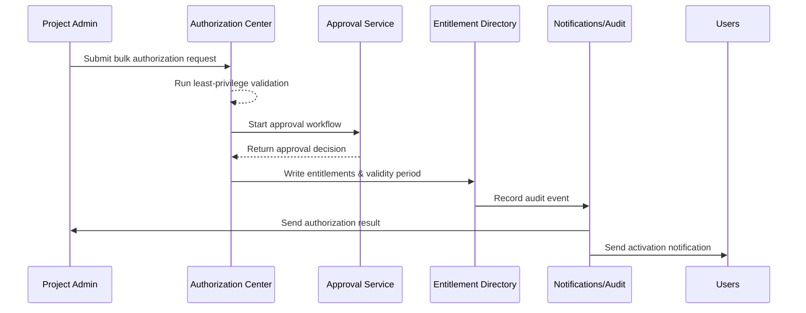

# Executive Summary

This sub-scenario covers how project administrators use the authorization center to grant roles or permission bundles to multiple members at once. It spans member selection, approval routing, least-privilege validation, entitlement persistence, and downstream notifications. The goal is to keep authorization turnaround within five minutes under a controlled approval chain while retaining full auditability and traceability.

# Scope & Guardrails

- **In Scope**: Member selection, bundle and validity configuration, approvals and least-privilege validation, writing entitlements, notifications, and audit logging.
- **Out of Scope**: Self-service authorization for single users, offboarding/revocation (handled in a dedicated scenario), cross-tenant sharing policies.
- **Environment & Flags**: Feature flags `iam-bulk-assign`, `minimal-privilege-check`; depends on the approval service, notification channels, and audit logging.

# Participants & Responsibilities

| Scope | Repository | Layer | Deliverables | Owners |
|-------|------------|-------|--------------|--------|
| core-platform | powerx | service | Authorization center APIs, permission bundle management, least-privilege validator | Li Wei (IAM Product Lead / iam@artisan-cloud.com) |
| governance | powerx | infra | Approval policy configuration, audit logging, anomaly alerts | Matrix Ops (Platform Ops Lead / ops@artisan-cloud.com) |
| automation | powerx | service | Approval workflow routing, notification delivery, expiry handling | Matrix Ops (Platform Ops Lead / ops@artisan-cloud.com) |

# End-to-End Flow

1. **Stage 1 – Configure Authorization**: The project administrator selects the project/resource scope, target members, permission bundles, and effective period.
2. **Stage 2 – Approval & Validation**: The system performs least-privilege checks and triggers approval flow (project lead / security team).
3. **Stage 3 – Persist Entitlements**: After approval, entitlements are written into the directory with source, validity period, and approval results recorded.
4. **Stage 4 – Notify & Monitor**: The system notifies members and the project administrator; high-risk or failed cases trigger alerts and pre-expiry reminders for revocation.

# Key Interactions & Contracts

- `POST /internal/iam/roles/batch-assign` — Create a bulk authorization task including members, bundles, expiry, approval strategy.
- `POST /internal/iam/roles/batch-assign/validate` — Perform least-privilege validation and return risk insights plus suggestions.
- `POST /internal/approvals/start` — Launch approval workflow with dynamic approvers and SLA controls.
- `EVENT iam.permission.granted` — Emitted when authorization succeeds; `EVENT iam.permission.pending_approval` — Indicates approvals in progress.
- `EVENT iam.permission.expiring` — Reminder to revoke or renew entitlements before expiry.

# Usecase Links

- (To be updated once the related usecase seed is finalized.)

# Acceptance Criteria

1. Average completion time for authorizing 100 members is ≤ 5 minutes; success rate ≥ 99%.
2. High-risk bundles must trigger security approval and retain justification; entitlements cannot activate until approval succeeds.
3. Duplicate grants are merged automatically; audit trails show authorization source, approval chain, and effective/expiry timestamps.

# Telemetry & Ops

- Metrics: `iam.batch_assign.queue_latency`, `iam.batch_assign.approval_duration`, `iam.batch_assign.failure_ratio`.
- Alert Thresholds: Approval wait > 30 minutes triggers reminders; authorization failure rate > 2% per hour raises alerts; more than 10 pending `iam.permission.expiring` events triggers prompts.
- Observability Sources: Authorization center dashboards, approval queue metrics, audit event streams.

# Open Issues & Follow-ups

| Risk / Item | Impact Area | Owner | ETA |
|-------------|-------------|-------|-----|
| Permission bundle granularity must align with plugin teams to avoid excessive custom bundles | core-platform | Li Wei | 2025-11-10 |
| Need Ops Runbook coverage for automatic escalation when approvals time out | governance | Matrix Ops | 2025-11-18 |

# Appendix

- Permission bundle definition guideline (`Docs: iam/permission-packages.md`).
- Approval workflow configuration example (Notion: IAM Bulk Assignment Approval).
- Authorization event schema (`Docs: iam/events/permission-granted.yaml`).
