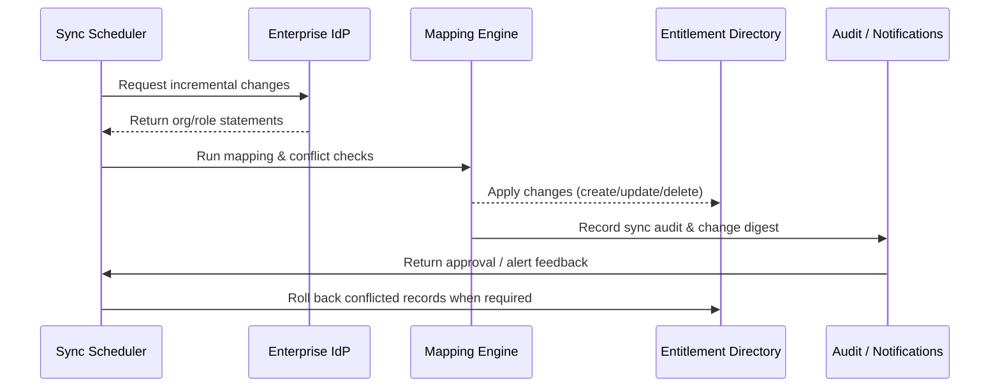

# Executive Summary

This sub-scenario explains how PowerX synchronizes organizational structures, job attributes, and role claims from enterprise IdPs (OIDC/LDAP). The objective is to meet a five-minute sync SLA while ensuring conflict rollback, audit trails, and change summaries that administrators can review.

# Scope & Guardrails

- **In Scope**: IdP connectivity, attribute mapping rules, incremental/full synchronization, conflict handling, approval triggers, audit notifications.
- **Out of Scope**: Initial account creation (covered by the bulk import scenario), project-level authorization, offboarding workflows.
- **Environment & Flags**: Feature flags `sso-oidc-sync`, `ldap-hub`; depends on IdP credentials, security proxies, audit logging, and the approval service.

# Participants & Responsibilities

| Scope | Repository | Layer | Deliverables | Owners |
|-------|------------|-------|--------------|--------|
| core-platform | powerx | service | IdP connectors, sync orchestration, mapping configuration management | Li Wei (IAM Product Lead / iam@artisan-cloud.com) |
| automation | powerx | service | Sync scheduling, rollback & retries, anomaly monitoring | Matrix Ops (Platform Ops Lead / ops@artisan-cloud.com) |
| governance | powerx | infra | Sync audit logging, approval records, alert forwarding | Matrix Ops (Platform Ops Lead / ops@artisan-cloud.com) |

# End-to-End Flow

1. **Stage 1 – Sync Trigger**: Cron jobs or IdP callbacks trigger synchronization and determine incremental vs. full mode per tenant configuration.
2. **Stage 2 – Attribute Mapping**: The sync engine pulls organization/role statements, applies mapping rules, runs conflict detection, and produces change sets.
3. **Stage 3 – Apply Changes**: The engine writes inserts/updates/deletes; conflicts or high-risk role updates are routed to approval.
4. **Stage 4 – Audit & Notify**: The system records audit events, generates change digests for administrators, and raises alerts with rollbacks when needed.

# Key Interactions & Contracts

- `GET /idp/oidc/users?since=<ts>`, `GET /idp/ldap/delta` — Standardized interfaces for pulling incremental IdP data.
- `POST /internal/iam/directory/apply` — Apply mapped organization/role change sets with idempotency and rollback tokens.
- `POST /internal/iam/directory/conflict` — Submit conflicts for approval or manual remediation.
- `EVENT iam.directory.sync_completed` — Carries stats, duration, and conflict counts for completed runs.
- `EVENT iam.directory.sync_failed` — Raised for high-priority alerts when sync fails.

# Usecase Links

- (To be updated once the related usecase seed is finalized.)

# Acceptance Criteria

1. Average incremental sync latency ≤ 5 minutes with ≥ 99% success.
2. High-risk role changes must go through approval, remain inactive before approval, and be fully traceable.
3. Conflicts must roll back automatically, with administrator notifications sent within three minutes.

# Telemetry & Ops

- Metrics: `iam.directory_sync.duration`, `iam.directory_sync.delta_size`, `iam.directory_sync.conflict_ratio`.
- Alert Thresholds: Two consecutive failures trigger a P1 alert; conflict ratio > 10% raises a P2 alert; approval backlog > 30 minutes prompts follow-up.
- Observability Sources: Directory sync dashboards, audit event feeds, approval queue monitoring.

# Open Issues & Follow-ups

| Risk / Item | Impact Area | Owner | ETA |
|-------------|-------------|-------|-----|
| Standardize mapping rules when multiple IdPs coexist to prevent rule conflicts | core-platform | Li Wei | 2025-11-12 |
| Align retry windows with IdP rate limits to avoid throttling | automation | Matrix Ops | 2025-11-20 |

# Appendix

- IdP mapping rule guide (`Docs: iam/directory-mapping.md`).
- Sync job orchestration design (Confluence: IAM Directory Sync).
- Approval workflow configuration example (Notion: IAM Role Change Approval).
