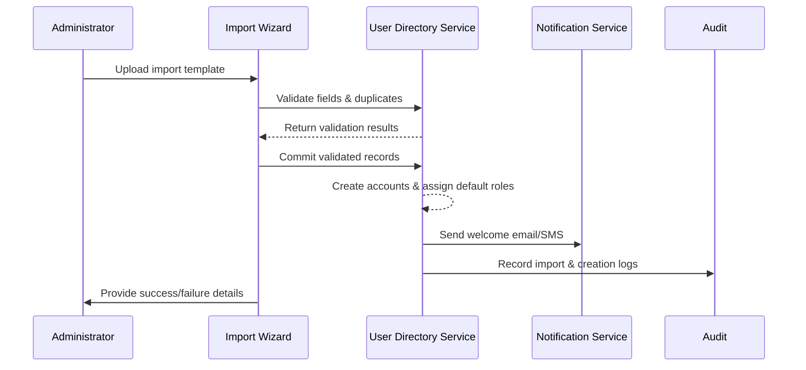

# Executive Summary

This sub-scenario describes how enterprise administrators use the PowerX console to import onboarding employees in bulk. The system validates templates, creates accounts, assigns default roles, and sends activation notifications. The goal is to achieve high-accuracy provisioning with minimal manual effort, clear error feedback, and auditable import logs.

# Scope & Guardrails

- **In Scope**: Template validation, duplicate detection, account creation, default role assignment, welcome notifications, import logging.
- **Out of Scope**: Directory synchronization (covered by `SCN-IAM-USER-ROLE-DIRECTORY-SYNC-001`), plugin-level permission configuration, offboarding workflows.
- **Environment & Flags**: Feature flags `iam-directory-v2`, `user-bulk-import`; depends on object storage (template upload), notification service, and the audit event bus.

# Participants & Responsibilities

| Scope | Repository | Layer | Deliverables | Owners |
|-------|------------|-------|--------------|--------|
| core-platform | powerx | service | Import validator, account provisioning, default role mapping | Li Wei (IAM Product Lead / iam@artisan-cloud.com) |
| automation | powerx | service | Batch scheduling, error report generation, task idempotency | Matrix Ops (Platform Ops Lead / ops@artisan-cloud.com) |
| governance | powerx | infra | Import audit events, error tracing, alert configuration | Matrix Ops (Platform Ops Lead / ops@artisan-cloud.com) |

# End-to-End Flow

1. **Stage 1 – Prepare Template**: Administrators download the template, fill in employee details plus role/org fields, and upload through the wizard.
2. **Stage 2 – Data Validation**: The validator checks required fields, formats, duplicates, and produces a pre-check report.
3. **Stage 3 – Account Provisioning**: Batch jobs create accounts, assign default roles, and trigger initial passwords or SSO binding flows.
4. **Stage 4 – Notify & Audit**: Welcome emails/SMS are sent to employees, audit logs capture outcomes, and administrators receive success/failure summaries.

# Key Interactions & Contracts

- `POST /internal/iam/users/bulk-import/validation` — Perform field, duplicate, and policy checks after upload.
- `POST /internal/iam/users/bulk-import/commit` — Provision validated records, assign roles.
- `POST /internal/notifications/send` — Send welcome communications with personalization variables.
- `EVENT iam.user.bulk_imported` — Carries success/failure statistics and references to detailed error lists.

# Usecase Links

- (To be updated once the related usecase seed is finalized.)

# Acceptance Criteria

1. Imports with ≤ 500 records finish within 10 minutes and succeed ≥ 98%.
2. Duplicate accounts or missing required fields must block provisioning with row-level error reports.
3. Failed rows can be re-uploaded without reprocessing successful accounts.

# Telemetry & Ops

- Metrics: `iam.bulk_import.batch_size`, `iam.bulk_import.success_rate`, `iam.bulk_import.error_ratio`, `iam.bulk_import.duration`.
- Alert Thresholds: Failure rate > 5% across three consecutive batches triggers a P1 alert; run time > 15 minutes triggers a P2 alert.
- Observability Sources: Import dashboards, object storage upload logs, audit event streams.

# Open Issues & Follow-ups

| Risk / Item | Impact Area | Owner | ETA |
|-------------|-------------|-------|-----|
| Template field extensions must stay aligned with HR systems to avoid version drift | core-platform | Li Wei | 2025-11-08 |
| Queue congestion under large imports requires load testing and batch concurrency tuning | automation | Matrix Ops | 2025-11-18 |

# Appendix

- Import template sample & field definitions (Notion: IAM Bulk Import Template).
- Batch job architecture design (Confluence: IAM Bulk Job Design).
- Audit event schema (`Docs: iam/events/bulk-import.yaml`).
