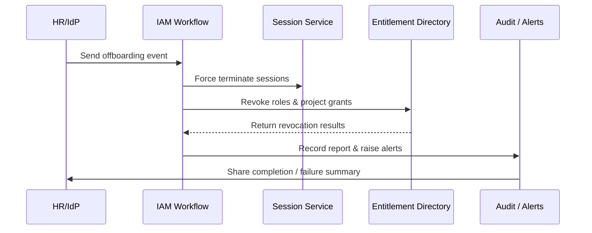

# Executive Summary

This sub-scenario covers the workflow triggered when an employee leaves or an account is deactivated. PowerX must automatically freeze the account, terminate active sessions, revoke roles and project permissions, complete data handover, and generate audit reports. The target SLA is revoking access within two minutes of the offboarding event, minimizing manual effort while meeting compliance expectations.

# Scope & Guardrails

- **In Scope**: Offboarding event ingestion, account freeze, session termination, permission revocation, data transfer, audit logging, and alerting.
- **Out of Scope**: Offboarding approval processes (managed by HR), data erasure policies for plugins or external systems.
- **Environment & Flags**: Feature flags `iam-auto-revoke`, `session-force-logout`; depends on HR/IdP webhooks, session management, notification systems, audit services.

# Participants & Responsibilities

| Scope | Repository | Layer | Deliverables | Owners |
|-------|------------|-------|--------------|--------|
| core-platform | powerx | service | Offboarding event listeners, revocation workflow orchestration, asset handover | Li Wei (IAM Product Lead / iam@artisan-cloud.com) |
| automation | powerx | service | Retries & compensation, data archiving, report generation | Matrix Ops (Platform Ops Lead / ops@artisan-cloud.com) |
| governance | powerx | infra | Audit logging, alert routing, risk remediation | Matrix Ops (Platform Ops Lead / ops@artisan-cloud.com) |

# End-to-End Flow

1. **Stage 1 – Event Trigger**: HR systems or IdP webhooks push offboarding events with employee identifiers, effective time, and handover assignees.
2. **Stage 2 – Freeze & Terminate**: IAM immediately freezes the account, terminates active sessions, and blocks new logins.
3. **Stage 3 – Permission Revocation**: The workflow revokes roles, project authorizations, and sensitive data access, including required notifications and ownership transfers.
4. **Stage 4 – Audit & Alerts**: The system compiles a processing report, records successful and failed items, raises alerts for failures, and schedules retries.

# Key Interactions & Contracts

- `POST /webhook/hr/offboard` — Offboarding event entry point with signature verification and queue persistence.
- `POST /internal/iam/users/{userId}/freeze` — Freeze account and label as non-loginable.
- `POST /internal/sessions/revoke` — Bulk terminate active sessions and tokens.
- `POST /internal/iam/permissions/revoke` — Revoke roles and project grants with idempotent retries.
- `EVENT iam.offboard.completed`, `EVENT iam.offboard.failed` — Audit events indicating successful or failed revocations.

# Usecase Links

- (To be updated once the related usecase seed is finalized.)

# Acceptance Criteria

1. Complete account freeze and permission revocation within two minutes of the offboarding trigger; success rate ≥ 99%.
2. Automatically retry failed revocations up to three times and raise a P1 alert including the outstanding entitlements.
3. Produce an offboarding report covering revocation results, session termination, and asset transfer details retained for at least one year.

# Telemetry & Ops

- Metrics: `iam.offboard.trigger_count`, `iam.offboard.revoke_latency`, `iam.offboard.retry_count`, `iam.offboard.failure_ratio`.
- Alert Thresholds: Revocation latency > 3 minutes triggers P1; failure rate > 1% per day escalates to P0; more than three retries flags the on-call team.
- Observability Sources: Offboarding dashboards, aggregated audit logs, alerting channels (Ops Chat).

# Open Issues & Follow-ups

| Risk / Item | Impact Area | Owner | ETA |
|-------------|-------------|-------|-----|
| Bring external SaaS connectors into the unified revocation workflow | automation | Matrix Ops | 2025-11-25 |
| Offboarding reports must support multilingual templates for regional compliance | governance | Li Wei | 2025-11-30 |

# Appendix

- Offboarding event schema (`Docs: iam/events/offboard.yaml`).
- Workflow BPMN model (Ops Runbook #IAM-OFFBOARD).
- Alerting & notification strategy (Confluence: IAM Offboarding Alerts).
