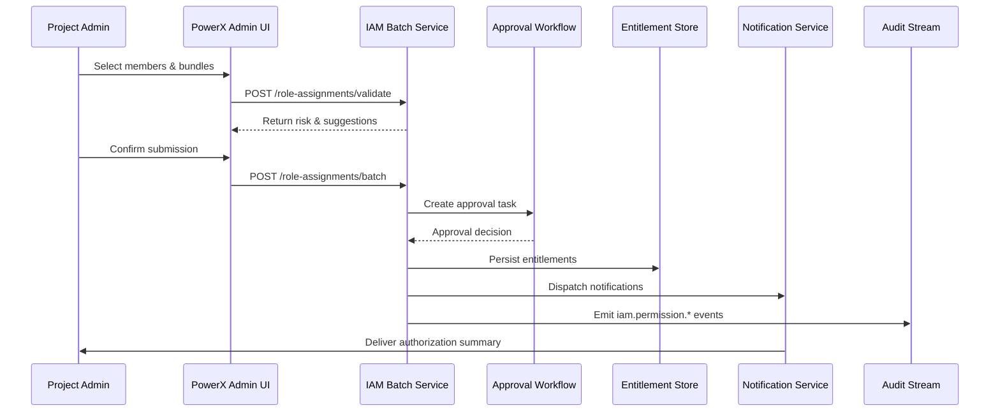

# Usecase Overview

- **Business Goal**: Enable project administrators to grant roles or permission bundles to many members at once, while approvals and least-privilege checks keep the process compliant and fully auditable.
- **Trigger Roles**: Project administrators (bulk grant initiators), security reviewers or project leads (approval nodes), platform audit service (event persistence).
- **Success Metrics**: End-to-end completion time ≤ 5 minutes for 100 members with ≥ 99% success; high-risk bundle approvals finish within 15 minutes; ≥ 90% of duplicate grants consolidated automatically.
- **Scenario Alignment**: Implements Stage 3 of `SCN-IAM-USER-ROLE-001`; depends on onboarding (`UC-IAM-USER-ROLE-IMPORT-001`) and directory sync (`UC-IAM-USER-ROLE-DIRECTORY-SYNC-001`) for baseline membership data.
- **Key Dependencies**: Feature flags `iam-bulk-assign`, `minimal-privilege-check`, workflow engine (`pkg/corex/flow`), notification services, audit event bus.

> Summary: Provide an end-to-end bulk authorization pipeline—from UI member/package selection through approval, risk checks, idempotent writes, notification, and audit—so the organization can authorize quickly without sacrificing control.

# Context & Assumptions

- **Prerequisites**
  - Feature flags `iam-bulk-assign`, `minimal-privilege-check`, and `audit-streaming` are enabled with default policies.
  - `docs/_data/docmap.yaml` entries for `UC-IAM-USER-ROLE-BULK-AUTH-001` match this seed’s scope/layer/domain/repo.
  - The PowerX Admin frontend integrates the bulk authorization wizard, including member search and permission bundle lookup.
  - Approval workflows and notification channels (email, Slack, in-app) are available in sandbox and production environments.
- **Inputs / Outputs**
  - Inputs: Project/resource scope, target members (CSV upload or directory picker), permission bundle or role ID, validity period, approval plan, remarks.
  - Outputs: Bulk authorization task ID, approval outcomes, persisted member-role records, `iam.permission.*` events, notification payloads, list of failed members.
- **Boundaries**
  - Does not handle offboarding (covered by `UC-IAM-USER-ROLE-OFFBOARD-001`).
  - Only supports single-tenant authorization; cross-tenant or cross-environment grants are out of scope.
  - Permission bundle definitions and least-privilege policies come from standards documents; this usecase only consumes them.

# Solution Blueprint

## System Breakdown

| Layer | Key Components / Modules | Responsibility | Entry Point |
|-------|--------------------------|----------------|-------------|
| Access Layer | `internal/transport/http/admin/iam/rbac_handler.go` | Expose validation/submit APIs, handle parameter validation, auth, audit hooks | `repos/powerx/internal/transport/http/admin/iam/` |
| Application Service Layer | `internal/service/iam/rbac_service.go` (plus `BatchAssignmentService`) | Orchestrate least-privilege checks, trigger approvals, manage batch writes and rollbacks | `repos/powerx/internal/service/iam/` |
| Persistence Layer | `pkg/corex/db/persistence/repository/iam/member_assignment_repo.go` | Idempotent writes for member-role bindings, deduplicate conflicts, maintain indices | `repos/powerx/pkg/corex/db/persistence/repository/iam/` |
| Workflow Layer | `pkg/corex/flow`, `internal/service/iam/batch_assignment_workflow.go` | Schedule approval tasks, handle timeouts/escalations, persist workflow logs | `repos/powerx/pkg/corex/flow/` |
| Notifications & Audit | `pkg/corex/audit`, `pkg/event_bus`, `pkg/notify` | Emit `iam.permission.*` events, deliver notifications, raise anomalies | `repos/powerx/pkg/corex/audit/`, `repos/powerx/pkg/event_bus/` |

## Flow & Timeline

1. **Step 1 – Draft Request**: Admin chooses members and bundles in the UI, calling `POST /api/v1/admin/iam/role-assignments/validate`. Backend runs least-privilege checks and conflict scans, returning risk reports and recommended splits.
2. **Step 2 – Submit Workflow**: After confirmation, admin calls `POST /api/v1/admin/iam/role-assignments/batch` to create the task. The service stores task metadata, marks status as “pending approval,” and pushes items into the approval engine.
3. **Step 3 – Approval & Escalation**: Approvers review tasks; if they time out, escalation policies trigger reminders or security takeovers.
4. **Step 4 – Persist Entitlements**: Once approved, the service writes entitlements in batches, ensuring idempotency, recording validity windows, and logging sources.
5. **Step 5 – Notify & Audit**: The system notifies members and administrators, emits audit events, and alerts on high-risk or failed items.
6. **Step 6 – Failure Handling**: Partial failures queue retry tasks; repeated failures produce PagerDuty alerts with affected member lists.

# Contracts & Interfaces

- **Inbound APIs / Events**
  - `POST /api/v1/admin/iam/role-assignments/validate` — Validate members/bundles before scheduling approvals; outputs risk details.
  - `POST /api/v1/admin/iam/role-assignments/batch` — Create bulk authorization tasks; returns `task_id` and initial status.
  - `GET /api/v1/admin/iam/role-assignments/:task_id` — Retrieve task status, approval progress, failure breakdown.
- **Outbound Calls**
  - `workflow.approval.start` (via `pkg/corex/flow`) — Launch approval instance with escalations and SLA settings.
  - `notify.SendBulk` — Notify members and admins; on failure, enqueue retries.
  - `event_bus.Publish("iam.permission.*")` — Broadcast granted/pending/expiring events for audit and observability.
- **Configuration & Scripts**
  - `config/iam.yaml` — Default batch size, per-tenant limits, approval SLA definitions.
  - `pkg/corex/flow/schemas` — Template definitions for approval paths (project owner → security → audit).
  - `scripts/qa/workflow-metrics.mjs` — Validate workflow metrics prior to release.

# Implementation Checklist

| Item | Description | Status | Owner |
|------|-------------|--------|-------|
| Data Model | Define `iam_batch_assignment_task` / `iam_batch_assignment_item` tables, indexes, status & audit fields | [ ] | |
| Business Logic | Implement `BatchAssignmentService` validation, approval orchestration, idempotent writes, rollback | [ ] | |
| Authorization Policy | Introduce `iam.permission.batch_assign` / `.batch_assign.approve` permissions and map to roles | [ ] | |
| Configuration Release | Ship default batch size, approval SLA configs, feature-flag rollout strategy | [ ] | |
| Documentation | Update `docs/standards/powerx/backend/iam/use_case.md`, Admin UI guides, and Ops runbooks | [ ] | |

# Testing Strategy

- **Unit Tests**: `go test ./internal/service/iam -run TestBatchAssignment` to cover least-privilege checks, approval rejection, idempotent binding.
- **Integration Tests**: `go test ./tests/integration/iam -run BatchAssignment` to simulate approval outcomes, partial failures, notification retries.
- **End-to-End**: QA follows `tests/manual/iam/batch-assign.md`, preparing 100 members and three bundles to verify completion within five minutes.
- **Non-functional**: Load test `POST /role-assignments/batch` at 20 RPS with 200 members, monitor P95 latency; run chaos tests for approval outages to confirm degrade paths.
- **Automation**: Add the scenario to `npm run test:workflows` so dashboards include bulk authorization metrics.

# Observability & Ops

- **Metrics**: `iam_batch_assign_latency_seconds` (P95 ≤ 300s), `iam_batch_assign_success_total`, `iam_batch_assign_failure_total`, `iam_batch_assign_pending_gauge`.
- **Logs**: Log `tenant_id`, `task_id`, member count, bundle IDs at INFO; include `error_code`, approval nodes, failed members at ERROR; push structured audit JSON.
- **Alerts**:
  - `iam_batch_assign_failure_total` > 2% per hour → PagerDuty (`IAM Oncall`).
  - Approval wait time > 15 minutes → Slack `#iam-alerts` with escalation.
  - Three consecutive `iam.permission.anomaly` events → Create high-priority incident.
- **Dashboards**: Grafana “IAM / Batch Authorization Overview”, `reports/iam/user-role-bulk-auth.csv`, Datadog `iam.permission` namespace.

# Rollback & Failure Handling

- **Rollback Steps**
  - Use Argo Rollouts to revert to the previous service version.
  - Disable `iam-bulk-assign` to fall back to single-user authorization.
  - If needed, run `scripts/migrations/iam_batch_assignment.down.sql` to remove task tables.
- **Remediation**
  - Approval service outage: run `scripts/ops/batch-assign/force-approve.sh --task <ID>` with security sign-off.
  - Partial failures: call `POST /role-assignments/:task_id/retry` to reprocess only failed members.
  - Notification failure: use notification service replay or export failure list for manual mailings.
- **Data Repair**
  - Run `scripts/db/iam/backfill_assignment_snapshot.go` to rebuild authorization snapshots.
  - Coordinate with DBAs to reconcile `iam_member_assignment` with task records when mismatched.

# Follow-ups & Risks

| Risk / Item | Impact | Mitigation | Owner | ETA |
|-------------|--------|------------|-------|-----|
| Permission bundle definitions not aligned with plugin teams | High-risk permissions bypass approval | Publish shared bundle catalog and mandate pre-launch reviews | Li Wei | 2025-11-10 |
| Approval timeouts lack auto-escalation | Authorizations exceed SLA | Enable double reminders and automatic escalation to security | Matrix Ops | 2025-11-12 |
| Stale least-privilege data | Risk of false positives/negatives | Refresh policy cache hourly; fall back to manual review on failure | Michael Hu | 2025-11-08 |
| Missing multilingual notification templates | Poor UX for international tenants | Coordinate with localization to add templates | Matrix Ops | 2025-11-18 |

# References & Links

- Scenario: `docs/scenarios/iam/SCN-IAM-USER-ROLE-BULK-AUTH-001.md`
- Main scenario: `docs/scenarios/iam/SCN-IAM-USER-ROLE-001.md`
- Docmap: `docs/_data/docmap.yaml`
- IAM standard: `docs/standards/powerx/backend/iam/use_case.md`
- Frontend guard guideline: `docs/standards/powerx/web-admin/auth-and-iam/Permission_Guards_and_RBAC.md`
- Workflow metrics script: `scripts/qa/workflow-metrics.mjs`
