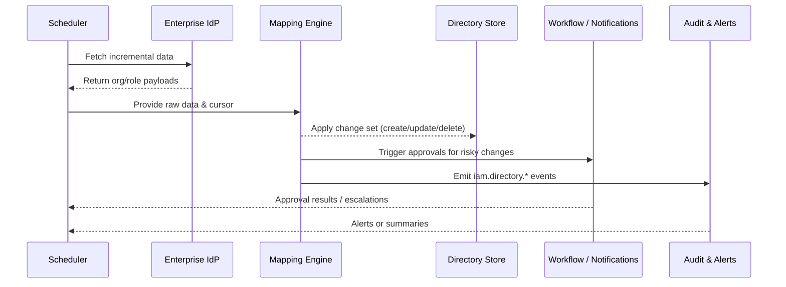

# Usecase Overview

- **Business Goal**: Keep organizational units, job profiles, and role claims from enterprise IdPs (OIDC/LDAP) continuously aligned with PowerX so that member attributes and authorization baselines stay consistent, conflicts can roll back, and every change is auditable.
- **Trigger Roles**: Matrix Ops (operations scheduling), enterprise administrators (configure mapping and manual sync), security teams (approve high-risk role changes), audit & risk functions.
- **Success Metrics**: Incremental sync duration ≤ 5 minutes with ≥ 99% success; conflict rollback ≤ 2 minutes; reconciliation reports delivered to admins within 10 minutes.
- **Scenario Alignment**: Implements Stage 2 of `SCN-IAM-USER-ROLE-001`; shares member baselines with onboarding (`UC-IAM-USER-ROLE-IMPORT-001`) and provides role data for bulk authorization (`UC-IAM-USER-ROLE-BULK-AUTH-001`).
- **Key Dependencies**: Feature flags `iam-directory-v2`, `sso-oidc-sync`, `ldap-hub`, `audit-streaming`; requires approval workflows, notification services, and the audit event bus.

> Summary: Build a unified directory sync pipeline that pulls IdP deltas on a per-tenant cadence, applies mapping rules, routes approvals, writes changes idempotently, and feeds audit/alert systems so role policies stay in lockstep with enterprise directories.

# Context & Assumptions

- **Prerequisites**
  - `docs/_data/docmap.yaml` entry for `UC-IAM-USER-ROLE-DIRECTORY-SYNC-001` aligns with this seed’s scope/layer/domain/repo.
  - Feature flags `iam-directory-v2`, `sso-oidc-sync`, `ldap-hub`, `audit-streaming` are enabled with baseline settings.
  - Each tenant has configured valid OIDC/LDAP credentials and sync plans (frequency, incremental markers, approval strategy) in Admin Console.
  - Approval and notification systems are reachable; audit streams retain at least seven days of history.
  - IdP rate limits and pagination have documented constraints in the integration guide.
- **Inputs / Outputs**
  - Inputs: Tenant sync plans (cron/webhook), IdP access token or LDAP bind info, raw org/job/role data, previous cursor.
  - Outputs: Change sets (create/update/delete), approval tasks, rollback tokens, `iam.directory.*` events, administrator summaries, metrics.
- **Boundaries**
  - Initial account provisioning stays with the import seed; this usecase only updates existing members.
  - Cross-tenant directory sharing is out of scope; multi-IdP aggregation is a future enhancement.
  - Application-level fine-grained permissions are excluded—only directory-level roles/org structures sync.

# Solution Blueprint

## System Breakdown

| Layer | Key Components / Modules | Responsibility | Entry Point |
|-------|--------------------------|----------------|-------------|
| Access Layer | `internal/transport/http/admin/iam/directory_handler.go` | Manual sync trigger, status inspection, mapping configuration updates | `repos/powerx/internal/transport/http/admin/iam/` |
| Scheduling Layer | `internal/service/iam/directory_sync_service.go` | Coordinate cron/webhook/manual triggers, manage cursors and tenant plans | `repos/powerx/internal/service/iam/` |
| Mapping Engine | `internal/service/iam/directory_mapper.go` | Apply field mappings, detect conflicts, route risky changes for approval | `repos/powerx/internal/service/iam/` |
| Persistence Layer | `pkg/corex/db/persistence/repository/iam/*` | Idempotent writes for members/org/role bindings with version management | `repos/powerx/pkg/corex/db/persistence/repository/iam/` |
| Approval & Observability | `pkg/corex/flow`, `pkg/corex/audit`, `pkg/event_bus` | Launch approvals, dispatch notifications, record audit events, raise alerts | `repos/powerx/pkg/corex/` |

## Flow & Timeline

1. **Step 1 – Schedule Trigger**: Cron job or IdP webhook invokes `directory_sync_service`, loading tenant config and last cursor.
2. **Step 2 – Fetch Delta**: The service calls OIDC/LDAP endpoints to page through organizations, roles, and assignments while tracking capture windows.
3. **Step 3 – Map & Validate**: Mapping engine applies rule sets, flags conflicts (duplicate email, revoked roles), and queues high-risk changes for approval.
4. **Step 4 – Idempotent Writes**: Approved changes are written in batches; transactions and version checks protect against replay issues.
5. **Step 5 – Rollback & Compensation**: Failures or conflicts produce rollback tokens, revert affected records, and schedule retries.
6. **Step 6 – Audit & Notify**: The run emits audit events, metrics, and administrator summaries; alerts fire for anomalies.

# Contracts & Interfaces

- **Inbound**
  - `cron.iam.directory-sync` — Scheduled event containing tenant ID, plan ID, previous cursor; retry up to three times with exponential backoff.
  - `POST /api/v1/admin/iam/directory-sync/run` — Manual trigger with optional `dry_run` flag for diff-only output.
  - `EVENT iam.directory.sync_request` — Converted IdP webhook that initiates immediate sync.
- **Outbound**
  - `GET /idp/oidc/users?since=<cursor>` / `LDAP.Search` — Incremental pulls; 10 s timeout, up to three retries.
  - `workflow.approval.start` — Build approval instances with escalation and SLA metadata.
  - `notify.SendBulk` — Send summaries/alerts to administrators; fall back to SLA queue on failure.
  - `event_bus.Publish("iam.directory.*")` — Broadcast sync completion/failure/conflict events to audit consumers.
- **Configuration & Scripts**
  - `config/iam-directory.yaml` — Default sync frequency, batch size, conflict thresholds.
  - `config/iam-directory-mapping.yaml` — Field mapping templates per IdP type.
  - `scripts/qa/directory-sync.mjs` — QA harness to simulate IdP responses and conflict scenarios.
  - `docs/standards/powerx/backend/iam/use_case.md` — Mapping and approval policies.

# Implementation Checklist

| Item | Description | Status | Owner |
|------|-------------|--------|-------|
| Data Model | Design `iam_directory_sync_task` / `iam_directory_change_log` tables with rollback tokens | [ ] | |
| IdP Integration | Implement OIDC/LDAP connectors, pagination, throttling, credential encryption | [ ] | |
| Mapping & Conflict Handling | Build mapping engine, conflict classification, approval routing | [ ] | |
| Idempotent Writes | Extend member/org/role repositories for version-aware batch writes | [ ] | |
| Approval & Notifications | Configure approval templates, alerting strategies, admin digests | [ ] | |
| Metrics & Audit | Instrument `iam.directory_sync.*` metrics, audit events, Grafana dashboards | [ ] | |
| Documentation | Update standards, Admin guides, Runbooks; sync docmap and site links | [ ] | |

# Testing Strategy

- **Unit Tests**: `go test ./internal/service/iam -run TestDirectorySync` – cursors, mapping rules, conflict classes, rollback paths.
- **Integration Tests**: `go test ./internal/tests/integration -run DirectorySync` with mocked OIDC/LDAP/approval/notification services to verify happy path, conflict approval, failure retries.
- **End-to-End**: QA follows `tests/manual/iam/directory-sync.md`, using sandbox IdP plus `scripts/qa/directory-sync.mjs` to validate metrics and audit logs.
- **Non-functional**: Load test with 10k-member deltas finishing ≤ 5 minutes; run chaos experiments for IdP timeouts or approval outages; execute `npm run test:workflows -- --suite directory-sync` to capture workflow KPIs.
- **Regression**: Include configuration linting via `npm run lint` and documentation validation via `npm run docs:build`.

# Observability & Ops

- **Metrics**: `iam_directory_sync_duration_seconds{tenant,mode}`, `iam_directory_sync_conflict_total{severity}`, `iam_directory_sync_rollback_total`, `iam_directory_sync_pending_approval`, `iam_directory_sync_delta_size`.
- **Logs**: INFO with tenant, batch, cursor, success/failure counts; WARN/ERROR include conflict details, approval IDs, rollback tokens; all logs carry TraceID.
- **Alerts**:
  - Two consecutive failures → PagerDuty P1 with rollback token.
  - Conflict ratio > 10% → Slack `#iam-alerts`, prompt mapping review.
  - Approvals pending > 30 minutes → Automatic escalation to security team.
  - Credential expiry within seven days → Notification to tenant admins.
- **Dashboards**: Grafana “IAM / Directory Sync Overview”, Datadog `iam.directory_sync` namespace, `reports/iam/directory-sync-summary.csv`.

# Rollback & Failure Handling

- **Rollback Steps**
  - Use Argo Rollouts to revert sync services and workflows.
  - Disable `sso-oidc-sync` / `ldap-hub` to revert to manual sync.
  - Run `scripts/migrations/iam_directory_sync.down.sql` if schema rollback is required.
- **Remediation**
  - IdP rate limiting: enter exponential backoff, notify tenant admins, reduce batch size.
  - Approval service outage: execute `scripts/ops/directory-sync/force-approve.sh` with security oversight.
  - Data inconsistency: trigger `replay-from-checkpoint` to replay from last successful cursor.
- **Data Repair**
  - `scripts/db/iam/backfill_directory_snapshot.go` to regenerate directory snapshots.
  - DBA-led reconciliation for mismatched bindings, recorded in audit logs.

# Follow-ups & Risks

| Risk / Item | Impact | Mitigation | Owner | ETA |
|-------------|--------|------------|-------|-----|
| Multiple IdPs causing mapping conflicts | Incorrect role changes | Introduce priority/namespace policies and update mapping standards | Li Wei | 2025-11-12 |
| LDAP credential rotation delays | Sync failures/security exposure | Add expiry reminders and auto-disable expired credentials | Matrix Ops | 2025-11-08 |
| Approval backlog during peak hours | Authorization delays | SLA escalation with on-call reminders; expand auto-approval safe list | Matrix Ops | 2025-11-15 |
| Limited metric history | Poor trend analysis | Persist metrics in `reports/_state/iam-directory-sync.json` for 30-day windows | Michael Hu | 2025-11-05 |

# References & Links

- Scenario: `docs/scenarios/iam/SCN-IAM-USER-ROLE-DIRECTORY-SYNC-001.md`
- Main scenario: `docs/scenarios/iam/SCN-IAM-USER-ROLE-001.md`
- Docmap: `docs/_data/docmap.yaml`
- IAM standard: `docs/standards/powerx/backend/iam/use_case.md`
- Frontend guard guideline: `docs/standards/powerx/web-admin/auth-and-iam/Permission_Guards_and_RBAC.md`
- Workflow metrics script: `scripts/qa/workflow-metrics.mjs`
