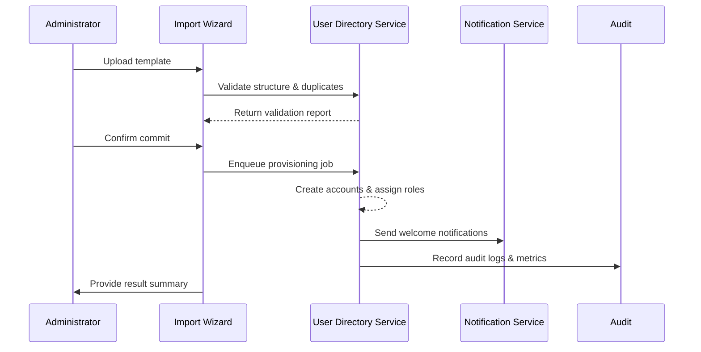

# Usecase Overview

- **Business Goal**: Allow enterprise administrators to create employee accounts in bulk, assign default roles, and send activation notices with high accuracy and full traceability—completing 500 accounts within 10 minutes.
- **Trigger Roles**: Enterprise administrators (template upload, import launch), Matrix Ops (monitoring & operations), security teams (approve sensitive attributes), notification & audit teams.
- **Success Metrics**: Import success rate ≥ 98%; end-to-end runtime ≤ 10 minutes; 100% of errors reported with row details; average retry cycle ≤ 5 minutes.
- **Scenario Alignment**: Supports Stage 1 of `SCN-IAM-USER-ROLE-001`, feeds membership baselines for directory sync and bulk authorization.
- **Key Dependencies**: Feature flags `user-bulk-import`, `iam-directory-v2`, `notify-transactional`, `audit-streaming`; object storage, approval workflows, notification channels, audit bus.

> Summary: Deliver a self-service bulk provisioning experience that guides administrators through template upload, pre-validation, batch creation, notification, and audit logging so that onboarding stays fast, compliant, and transparent.

# Context & Assumptions

- **Prerequisites**
  - `docs/_data/docmap.yaml` entry for this usecase matches scope/layer/domain/repo values.
  - Feature flags `user-bulk-import`, `iam-directory-v2`, `notify-transactional`, `audit-streaming` are enabled with default configuration.
  - Admin console integrates the import wizard with template download, drag-and-drop upload, and inline error preview.
  - Each tenant has a default role strategy (by department / job family); import workers possess credentials for storage, notifications, and audit buses.
  - Batch queues and async workers are available with retry/idempotency capabilities.
- **Inputs / Outputs**
  - Inputs: Template file (CSV/XLSX), tenant ID, operator ID, default role policy, approval notes, welcome-notification toggle.
  - Outputs: Import task ID, validation report (row, error type, suggestion), created account list, default role binding results, notification status, `iam.user.bulk_imported` event.
- **Boundaries**
  - Organization structure import is handled by the directory sync usecase.
  - Plugin-level fine-grained permissions are out of scope (only default roles set).
  - Cross-tenant imports are not supported; multi-tenant cases handled separately.

# Solution Blueprint

## System Breakdown

| Layer | Key Components / Modules | Responsibility | Entry Point |
|-------|--------------------------|----------------|-------------|
| Client Layer | `apps/admin/iam/bulk-import/` | Provide template download, file upload, progress status, error preview | `repos/powerx/apps/admin/iam/bulk-import/` |
| Access Layer | `internal/transport/http/admin/iam/import_handler.go` | Expose validation/commit/status APIs, enforce auth & audit hooks | `repos/powerx/internal/transport/http/admin/iam/` |
| Application Service Layer | `internal/service/iam/bulk_import_service.go` | Parse templates, run rules, schedule batches, track task state | `repos/powerx/internal/service/iam/` |
| Domain Service Layer | `internal/service/iam/default_role_resolver.go` | Resolve tenant default roles, handle conflicts, trigger approvals | `repos/powerx/internal/service/iam/` |
| Persistence Layer | `pkg/corex/db/persistence/repository/iam/*` | Create accounts, bind roles, store logs, enforce idempotency | `repos/powerx/pkg/corex/db/persistence/repository/iam/` |
| Audit & Notification | `pkg/corex/audit`, `pkg/event_bus`, `pkg/notify` | Emit audit events, aggregate metrics, send welcome messages and alerts | `repos/powerx/pkg/corex/audit/`, `repos/powerx/pkg/event_bus/` |

## Flow & Timeline

1. **Step 1 – Upload Template**: Administrator uploads the file; service stores it in object storage and returns a file ID while triggering validation.
2. **Step 2 – Pre-Validation**: The service parses the template, checks required fields, duplicates, policy constraints, and produces a downloadable report.
3. **Step 3 – Batch Provisioning**: On confirmation, the system enqueues an async job to create accounts, assign default roles, and issue initial credentials/SSO bindings.
4. **Step 4 – Notifications & Audit**: Welcome emails/SMS go to employees; audit logs capture task results; administrators receive summarized success/failure info.
5. **Step 5 – Retry Handling**: Failed rows are tracked separately, supporting targeted retries without touching successful accounts.

# Contracts & Interfaces

- **Inbound**
  - `POST /internal/iam/users/bulk-import/validation` — Upload & validate template.
  - `POST /internal/iam/users/bulk-import/commit` — Commit validated rows to provisioning pipeline.
  - `GET /internal/iam/users/bulk-import/:task_id` — Retrieve status, success/failed row exports.
- **Outbound**
  - `storage.PutObject` / `storage.GetObject` — Store original templates and generated reports.
  - `workflow.approval.start` — Optional approval for sensitive role assignments.
  - `notify.SendTransactional` — Deliver welcome messages, escalate on failure.
  - `event_bus.Publish("iam.user.bulk_imported")` — Emit completion events with stats.
- **Configuration & Scripts**
  - `config/iam-bulk-import.yaml` — Batch size, concurrency, retry, approval whitelist.
  - `scripts/ops/bulk-import/retry_failed.sh` — Ops tool to replay failed rows.
  - `docs/standards/powerx/backend/iam/use_case.md` — Default role mapping & audit requirements.

# Implementation Checklist

| Item | Description | Status | Owner |
|------|-------------|--------|-------|
| Data Model | Define `iam_bulk_import_task` / `iam_bulk_import_record` tables, state machine, audit fields | [ ] | |
| Template Parsing | Implement CSV/XLSX parser, field validation, duplicate detection, error reports | [ ] | |
| Batch Scheduling | Build async job framework, configure batch size/concurrency, retry logic | [ ] | |
| Account Provisioning | Extend member service for batch creation, default role binding, initial secret generation | [ ] | |
| Notifications & Approvals | Integrate welcome notifications, approval flow, failure replay & degradation | [ ] | |
| Audit & Metrics | Instrument `iam.bulk_import.*` metrics, produce reports, export to dashboards | [ ] | |
| Config & Docs | Publish feature flag rollout, config samples, Runbook updates, docmap sync | [ ] | |

# Testing Strategy

- **Unit Tests**: `go test ./internal/service/iam -run TestBulkImport` for parsing, validation, duplicate detection, approval triggers.
- **Integration Tests**: `go test ./internal/tests/integration -run BulkImport` with mocked storage, notifications, approval to cover success, partial failure, retry.
- **End-to-End**: QA runs `tests/manual/iam/bulk-import.md`, importing 200 records to verify welcome notifications, audit logs, error downloads.
- **Non-functional**: Load test 1k-record imports (P95 ≤ 10 minutes); chaos inject storage/notification failures; gather workflow metrics via `npm run test:workflows -- --suite bulk-import`.
- **Regression**: Include configuration lint in `npm run lint` and doc builds via `npm run docs:build`.

# Observability & Ops

- **Metrics**: `iam_bulk_import_duration_seconds{tenant}` (P95 ≤ 600s), `iam_bulk_import_success_total`, `iam_bulk_import_failure_total`, `iam_bulk_import_error_ratio`, `iam_bulk_import_retry_total`, `iam_bulk_import_notification_latency_seconds`.
- **Logs**: INFO records operator, batch ID, success/failure counts; WARN/ERROR include error types, row numbers, rollback indicators; logs carry `trace_id` / `task_id`.
- **Alerts**:
  - Failure rate > 5% for three consecutive batches → PagerDuty alert.
  - Runtime > 15 minutes → Slack `#iam-alerts` escalation.
  - Approval pending > 30 minutes → Automatic escalation to security.
  - Notification failure ratio > 3% → PagerDuty warning with retry instructions.
- **Dashboards**: Grafana “IAM / Bulk Import Overview”, Datadog `iam.bulk_import`, weekly report `reports/iam/bulk-import-summary.csv`.

# Rollback & Failure Handling

- **Rollback Steps**
  - Argo Rollouts revert of import services and workers.
  - Disable `user-bulk-import` to fall back to manual provisioning.
  - Execute `scripts/migrations/iam_bulk_import.down.sql` if schema rollback is required.
- **Remediation**
  - Storage outage: switch to backup storage or enable local cache, inform admins to retry later.
  - Batch failure: run `scripts/ops/bulk-import/retry_failed.sh` or re-upload filtered template.
  - Notification failure: use notification service replays or export failure list for manual outreach.
- **Data Repair**
  - Run `scripts/db/iam/backfill_import_results.go` to reconcile logs and account tables.
  - Coordinate with DBA to fix duplicate bindings or incorrect states, logging remediation in audit trail.

# Follow-ups & Risks

| Risk / Item | Impact | Mitigation | Owner | ETA |
|-------------|--------|------------|-------|-----|
| Template changes out of sync with HR systems | Import errors or missing fields | Establish version governance, add template version detection & upgrade prompts | Li Wei | 2025-11-08 |
| Large imports congest queues | SLA overruns | Implement dynamic batch sizing, priority queues, throttling | Matrix Ops | 2025-11-18 |
| Welcome notifications fail without retries | Employees miss activation info | Add retry/monitoring thresholds, provide manual resend tools | Matrix Ops | 2025-11-05 |
| Default role policies missing | Accounts lack permissions | Validate policies before commit, offer policy templates in Admin UI | Michael Hu | 2025-11-03 |

# References & Links

- Scenario: `docs/scenarios/iam/SCN-IAM-USER-ROLE-IMPORT-001.md`
- Main scenario: `docs/scenarios/iam/SCN-IAM-USER-ROLE-001.md`
- Docmap: `docs/_data/docmap.yaml`
- IAM standard: `docs/standards/powerx/backend/iam/use_case.md`
- Import guide: `docs/guides/usecases/generate-usecase-seeds.md`
- Workflow metrics script: `scripts/qa/workflow-metrics.mjs`
