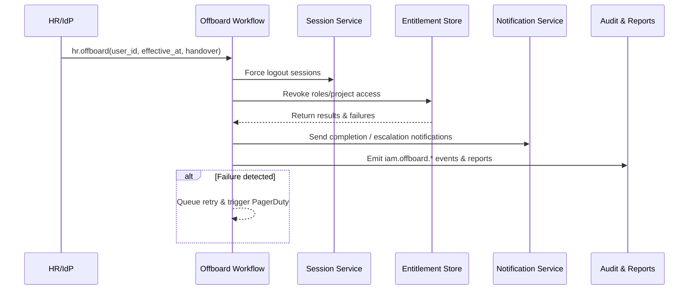

# Usecase Overview

- **Business Goal**: Ensure that whenever an employee leaves or an account is disabled, PowerX automatically freezes access, terminates sessions, revokes roles/project grants, coordinates asset handover, and produces auditable reports within compliance SLAs.
- **Trigger Roles**: HR/IdP systems (emit offboarding events), IAM automation workflows, Ops team (handle retries and manual overrides), security & audit teams (review reports, resolve exceptions).
- **Success Metrics**: Complete freeze plus revocations within two minutes; ≥ 99% revocation success; average retry ≤ 5 minutes; alert MTTA ≤ 10 minutes; reports generated for 100% of offboarding events.
- **Scenario Alignment**: Implements Stage 4 of `SCN-IAM-USER-ROLE-001`; shares entitlement data with bulk authorization and relies on membership baselines from import/directory sync usecases.
- **Key Dependencies**: HR/IdP webhooks, session management service, notification system, audit event stream, docmap alignment for powerx repository.

> Summary: Deliver an event-driven revocation workflow that freezes accounts, removes entitlements, transfers assets, and closes the loop with notifications, alerts, and compliance reports—eliminating manual intervention risk.

# Context & Assumptions

- **Prerequisites**
  - Feature flags `iam-auto-revoke`, `session-force-logout`, `notify-transactional`, `audit-streaming` are enabled with default settings.
  - HR or IdP platforms can push signed offboarding events via webhook/MQ containing effective time, handover assignees, and retention requirements.
  - Session service supports batch logout and token revocation; entitlement directory supports idempotent revocation.
  - Notification channels (email/Slack/PagerDuty) are configured; audit storage retains data for ≥ 1 year.
  - Ops runbooks define manual fallback scripts, approvals, and communication templates.
- **Inputs / Outputs**
  - Inputs: `hr.offboard`, `iam.user.offboarded`, `session.force_logout` events; admin-triggered manual revocations; asset handover confirmations.
  - Outputs: Account freeze status, session termination records, role/project revocation logs, asset transfer tasks, notifications/alerts, `iam.offboard.completed` / `.failed` events, offboarding reports (CSV/JSON).
- **Boundaries**
  - HR approval workflows and external SaaS deprovisioning are handled elsewhere.
  - Plugin-level data deletion is out of scope; plug-ins consume offboarding events separately.
  - Cross-tenant accounts are revoked per tenant; global cleanup is orchestrated via multi-tenant flows.

# Solution Blueprint

## System Breakdown

| Layer | Key Components / Modules | Responsibility | Entry Point |
|-------|--------------------------|----------------|-------------|
| Access Layer | `internal/transport/http/admin/iam/member_handler.go` | Receive webhooks, expose manual retry/report APIs, enforce signature & auth | `repos/powerx/internal/transport/http/admin/iam/` |
| Workflow Layer | `internal/service/iam/offboard_workflow.go` | Coordinate freeze → revoke → notify → report, manage retries and alerts | `repos/powerx/internal/service/iam/` |
| Account & Entitlement Layer | `internal/service/iam/member_service.go`, `pkg/corex/db/persistence/repository/iam` | Update account state, remove roles/project grants, log audit snapshots | `repos/powerx/internal/service/iam/`, `repos/powerx/pkg/corex/db/persistence/repository/iam/` |
| Session Layer | `internal/transport/http/admin/auth/session_handler.go` (or equivalent) | Force logout sessions/tokens, return context for audit records | `repos/powerx/internal/transport/http/admin/auth/` |
| Notifications & Audit | `internal/infra/plugin/manager/notify/notify.go`, `pkg/corex/audit`, `pkg/event_bus` | Dispatch notifications & PagerDuty alerts, emit audit events, generate reports | `repos/powerx/internal/infra/plugin/manager/notify/`, `repos/powerx/pkg/corex/audit/`, `repos/powerx/pkg/event_bus/` |

## Flow & Timeline

1. **Step 1 – Ingest Event**: HR/IdP sends an offboarding event; webhook validates signatures, deduplicates, and enqueues a revocation task.
2. **Step 2 – Freeze & Logout**: Workflow immediately freezes the account, invokes session service to terminate all active sessions, and logs initial audit entry.
3. **Step 3 – Revoke Entitlements**: The workflow removes role/project bindings, handles asset transfer rules, and records successes/failures per item.
4. **Step 4 – Notify & Alert**: Notifications go to managers, handover assignees, and audit teams; failures trigger PagerDuty/Slack alerts with retry IDs.
5. **Step 5 – Retry & Closure**: Scheduler retries failed items (max three attempts). Final result generates a downloadable offboarding report and emits completion events.

# Contracts & Interfaces

- **Inbound**
  - `POST /webhook/hr/offboard` — Signed webhook for offboarding events; supports `dry_run`, `handover_contact`, `effective_at`.
  - `POST /api/v1/admin/iam/users/:id/offboard` — Admin API to trigger or retry offboarding manually.
- **Outbound**
  - `POST /internal/iam/users/:id/freeze` — Freeze accounts and block login.
  - `POST /internal/sessions/revoke` — Terminate sessions/tokens with retry (3 attempts, 5 s timeout).
  - `POST /internal/iam/permissions/revoke` — Remove role/project bindings with idempotent keys `user_id + role_id`.
  - `notify.SendTransactional` — Notify managers, handover owners, security teams; queue compensation when failures occur.
  - `event_bus.Publish("iam.offboard.*")` — Emit completion/failure/retry events to audit and Ops dashboards.
- **Configuration & Scripts**
  - `config/iam-offboard.yaml` — SLA targets, retry counts, alert thresholds, asset transfer rules.
  - `scripts/ops/offboard/retry_failed.sh` — Ops script to retry failed revocations.
  - `scripts/ops/offboard/export_report.sh` — Generate compliance reports and upload to archival storage.
  - `docs/standards/governance/audit-events.md` — Audit schema definitions.

# Implementation Checklist

| Item | Description | Status | Owner |
|------|-------------|--------|-------|
| Data Model | Create `iam_offboard_task` / `iam_offboard_attempt` tables (status, failure reason, retry count, report path) | [ ] | Matrix Ops |
| Workflow Orchestration | Implement freeze → revoke → notify → report pipeline with retries | [ ] | Michael Hu |
| Session Termination | Integrate session service for forced logout and token revocation with audit context | [ ] | Michael Hu |
| Entitlement Revocation | Extend repositories for batch unbinding, asset transfer rules, audit stamping | [ ] | Matrix Ops |
| Notifications & Alerts | Configure templates, PagerDuty/Slack routing, failure compensation | [ ] | Matrix Ops |
| Reporting | Generate CSV/JSON offboarding reports stored under `reports/usecases/iam-offboard/` | [ ] | Michael Hu |
| Documentation | Publish configuration samples, update Runbooks, sync docmap/site links | [ ] | Michael Hu |

# Testing Strategy

- **Unit Tests**: `go test ./internal/service/iam -run TestOffboardWorkflow` for deduplication, revocation ordering, retry scheduling, notification branches.
- **Integration Tests**: `go test ./internal/tests/integration -run Offboard` mocking HR webhooks, session, notification, audit to cover success, failure, manual retry.
- **End-to-End**: QA runs `tests/manual/iam/offboard.md`, triggering offboarding, verifying session termination, entitlements revocation, report generation, and alerts.
- **Non-functional**: Stress test with 100 concurrent offboard events (>50 RPS) ensuring P95 ≤ 120 s; chaos inject session or notification outage to confirm degradation handling; include scenario in `npm run test:workflows -- --suite offboard`.
- **Regression**: Participate in `npm run lint` (config validation) and `npm run docs:build` for site checks.

# Observability & Ops

- **Metrics**: `iam_offboard_trigger_total`, `iam_offboard_completed_total`, `iam_offboard_failed_total`, `iam_offboard_revoke_latency_seconds` (P95 ≤ 120 s), `iam_offboard_retry_total`, `iam_offboard_asset_transfer_pending`, `session_force_logout_latency_seconds`.
- **Logs**: INFO logs include user, tenant, trigger source, revoked items, asset transfer notes; WARN/ERROR logs add `error_code`, retry count, alert ID, always with TraceID.
- **Alerts**:
  - Revocation latency > 3 minutes or failure rate > 1% per day → PagerDuty P1.
  - Three consecutive retries still failing → Slack `#iam-alerts` plus Ops Runbook link.
  - Session termination or asset transfer timeout → PagerDuty P0.
  - Report generation failure → Email to audit plus Ops follow-up.
- **Dashboards**: Grafana “IAM / Offboarding Automation”, Datadog `iam.offboard`, `reports/iam/offboard-dashboard.csv`.

# Rollback & Failure Handling

- **Rollback Steps**
  - Roll back workflow/service deployments; disable `iam-auto-revoke` and `session-force-logout` to revert to manual process.
  - Pause retry workers to prevent duplicate actions during rollback.
  - Execute cleanup scripts to restore correct account states if necessary.
- **Remediation**
  - Session termination failure: run `scripts/ops/offboard/force-logout.sh --user <ID>` or use session service console.
  - Entitlement mismatch: invoke `POST /api/v1/admin/iam/users/:id/offboard?retry=true` or manually unbind roles with scripts.
  - Notification outage: resend via notification admin console and annotate in audit.
- **Data Repair**
  - `scripts/ops/offboard/rebuild-report.sh --user <ID>` to regenerate offboarding reports.
  - DBA reconciliation for `iam_offboard_task` / `tenant_lifecycle_log`, with remediation notes in audit.
  - All repair actions require Matrix Ops approval and documented evidence.

# Follow-ups & Risks

| Risk / Item | Impact | Mitigation | Owner | ETA |
|-------------|--------|------------|-------|-----|
| External SaaS connectors not yet integrated | Residual access risk | Extend event fan-out to connectors, add monitoring coverage | Matrix Ops | 2025-11-25 |
| Multi-region compliance report requirements | Reports unusable abroad | Work with legal/localization to supply multilingual templates | Li Wei | 2025-11-30 |
| Mass offboarding surges overload queues | SLA degradation | Scale workflow concurrency, introduce priority queues, strengthen alerts | Matrix Ops | 2025-11-12 |
| Session service outage leaves accounts unfrozen | Access risk | Fall back to login disablement + audit notifications for manual action | Michael Hu | 2025-11-05 |

# References & Links

- Scenario: `docs/scenarios/iam/SCN-IAM-USER-ROLE-OFFBOARD-001.md`
- Main scenario: `docs/scenarios/iam/SCN-IAM-USER-ROLE-001.md`
- Docmap: `docs/_data/docmap.yaml`
- Audit standard: `docs/standards/governance/audit-events.md`
- Offboarding event schema: `docs/iam/events/offboard.yaml`
- Workflow metrics script: `scripts/qa/workflow-metrics.mjs`
