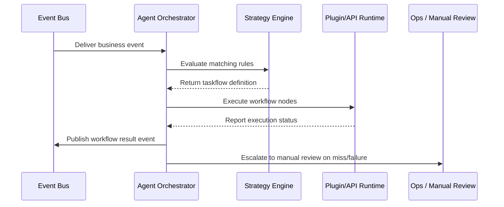

scn_id: SCN-OPS-AGENT-ORCHESTRATION-001
title: Agent Automation Taskflow Orchestration
status: Draft
version: v0.1.0
owners:
  - name: Matrix Ops
    role: Platform Ops Lead
    contact: ops@artisan-cloud.com
  - name: Eva Zhang
    role: Automation Steward
    contact: automation@artisan-cloud.com
domains: [ops]
layers: [service, ops]
repos:
  - key: powerx
    scope: core-platform
    responsibility: Agent strategy library, orchestration service, visualization, and audit
related_usecases:
  - doc_id: UC-OPS-AGENT-ORCHESTRATION-001
    layer: service
    domain: ops
last_reviewed_at: 2025-10-31

---

# Executive Summary

The Agent orchestration service subscribes to the event bus, evaluates the strategy library, and automatically builds taskflows that invoke plugins or external APIs. This child scenario covers event intake, strategy matching, taskflow construction, execution feedback, and human takeover. The goal is to complete automated decisions within 10 seconds while keeping the entire loop observable and auditable.

# Scope & Guardrails

- **In Scope**: Event subscription, strategy evaluation, taskflow construction, node execution, status feedback, and human escalation.
- **Out of Scope**: Strategy authoring IDEs, external system access provisioning, and long-running manual workflows (handled by dedicated operations systems).
- **Environment & Flags**: `agent-orchestrator`, `agent-strategy-library`, `audit-streaming`; depends on the event bus, strategy library, and the Ops console orchestration view.

# Participants & Responsibilities

| Scope | Repository | Layer | Responsibilities | Owners |
|-------|------------|-------|------------------|--------|
| core-platform | powerx | service | Event subscription, strategy matching, taskflow construction, node execution | Matrix Ops (Platform Ops Lead / ops@artisan-cloud.com) |
| automation | powerx | ops | Strategy library governance, visualization, human handoff flows, runbooks | Eva Zhang (Automation Steward / automation@artisan-cloud.com) |

# End-to-End Flow

1. **Stage 1 – Event Intake & Idempotency**: The Agent subscribes to events, validates tenant scope and idempotency keys, and assembles the context payload.
2. **Stage 2 – Strategy Matching**: Strategy rules evaluate event type, conditions, and tenant policies to decide whether to assemble a taskflow.
3. **Stage 3 – Taskflow Construction & Execution**: Sequential and parallel nodes are created, downstream plugins/APIs are invoked, and runtime states are tracked.
4. **Stage 4 – Feedback & Human Escalation**: Execution results are published back to the event bus and audit stream; misses or repeated failures are escalated for manual review.

# Key Interactions & Contracts

- **APIs / Events**: `EVENT plugin.job.completed`, `EVENT agent.workflow.generated`, `POST /internal/agent/events`, `POST /ops/manual-review`.
- **Configs / Schemas**: `config/agent/strategies/*.yaml`, `docs/standards/agent/orchestration-contract.md`, `docs/standards/events/agent-workflow-schema.md`.
- **Security / Compliance**: Strategy approval and release, least-privilege access, operation audits, MFA for human takeover.

# Usecase Links

- `UC-OPS-AGENT-ORCHESTRATION-001` — Automated taskflow orchestration powered by Agent strategies.

# Acceptance Criteria

1. Strategy hit rate ≥ 80%, taskflow generation latency ≤ 10 seconds.
2. Automated execution success rate ≥ 95%; trigger manual escalation within 3 failed attempts; human response within 10 minutes.
3. Orchestration views render the full topology, and audit logs retain event context, strategy version, and execution trace.

# Telemetry & Ops

- Metrics: `agent.strategy.hit_rate`, `agent.workflow.generated_total`, `agent.node.success_total`, `agent.manual_escalation_total`, `agent.workflow.latency_p95`.
- Alert thresholds: Strategy miss rate > 20% over 15 minutes, automatic task failure rate > 10%, manual backlog > 20 items.
- Observability sources: Grafana `Runtime Ops / Agent Automation`, Datadog `agent.*`, Ops console orchestration view, `scripts/ops/agent-replay.mjs`.

# Open Issues & Follow-ups

| Risk / Item | Impact | Owner | ETA |
|-------------|--------|-------|-----|
| No version rollback or regression tests for strategies | Faulty strategies may cause widespread failures | Eva Zhang | 2025-11-10 |
| Agent execution permissions not fully hardened | Potential unauthorized actions | Matrix Ops | 2025-11-18 |

# Appendix

- `docs/meta/scenarios/powerx/core-platform/runtime-ops/event-and-taskflow-management/primary.md`
- `scripts/ops/agent-strategy-test.mjs`, `scripts/ops/agent-replay.mjs`
- Agent strategy governance guideline (Confluence: Runtime-Ops-Agent-Policy)
