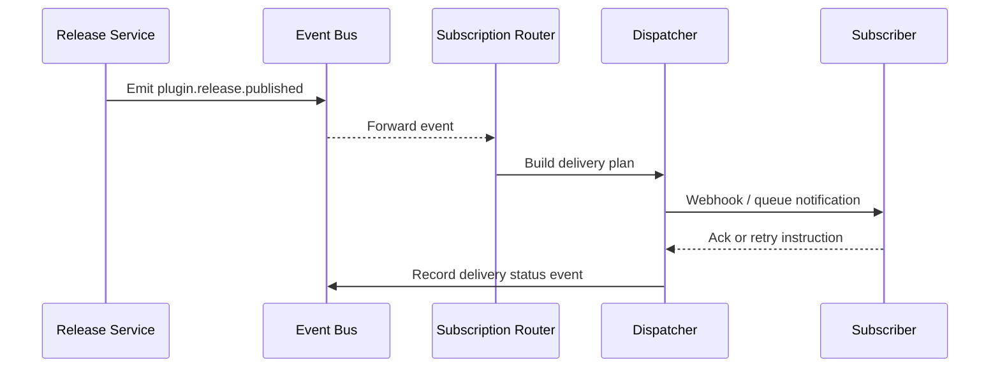

scn_id: SCN-OPS-EVENT-NOTIFY-001
title: Plugin Release Event Subscription & Notification
status: Draft
version: v0.1.0
owners:
  - name: Matrix Ops
    role: Platform Ops Lead
    contact: ops@artisan-cloud.com
  - name: Eva Zhang
    role: Automation Steward
    contact: automation@artisan-cloud.com
domains: [ops]
layers: [service, integration]
repos:
  - key: powerx
    scope: core-platform
    responsibility: >
      Event bus, subscription governance, retry policies
  - key: powerx-plugin
    scope: plugin-ecosystem
    responsibility: >
      Plugin event adapters, subscription configuration management
related_usecases:
  - doc_id: UC-OPS-EVENT-NOTIFY-001
    layer: service
    domain: ops
last_reviewed_at: 2025-10-31

---

# Executive Summary

When a plugin is released in a production tenant, the system must deliver `plugin.release.published` and other critical events to the Ops console, CI/CD, and alerting endpoints within 5 seconds. This sub-scenario focuses on the unified event model, subscription governance, and multi-channel delivery so that notifications are reliable, retries are automatic, the entire chain is traceable, and duplicate or throttled deliveries are avoided.

# Scope & Guardrails

- **In Scope**: Event schema standardization, tenant isolation, subscription matching, Webhook/queue delivery, delayed retries, event tracing, and auditing.
- **Out of Scope**: Plugin release approval workflows, downstream subscriber business logic, and cross-region mirroring (covered by the global operations scenario).
- **Environment & Flags**: "`event-bus-v2`, `plugin-release-webhook`, `audit-streaming`; depends on the Kafka event bus, subscription configuration store, and the Ops console event center."

# Participants & Responsibilities

| Scope | Repository | Layer | Responsibilities | Owners |
|-------|------------|-------|------------------|--------|
| core-platform | powerx | service | Event schema validation, subscription matching, delivery & retry, audit trail | Matrix Ops (Platform Ops Lead / ops@artisan-cloud.com) |
| plugin-ecosystem | powerx-plugin | integration | Plugin release adapters, subscription templates, SDK tooling | Plugin Guild (Plugin Partner / plugin@artisan-cloud.com) |
| automation | powerx | ops | Event replay scripts, failure alerting, Ops governance capabilities | Eva Zhang (Automation Steward / automation@artisan-cloud.com) |

# End-to-End Flow

1. **Stage 1 – Event Publication**: "The release pipeline emits a standardized `plugin.release.published` event to the bus and records an idempotency key."
2. **Stage 2 – Subscription Matching**: The router resolves subscriptions by tenant, tags, and rate limits to build the delivery plan.
3. **Stage 3 – Multi-channel Delivery**: The dispatcher pushes via Webhook or message queues; failures enter delayed retry or circuit breaking.
4. **Stage 4 – Traceability & Remediation**: Delivery results are stored in the event log so Ops can query, replay, or create manual work orders.

# Key Interactions & Contracts

- **APIs / Events**: "`EVENT plugin.release.published`, `EVENT event.delivery.failed`, `POST /internal/events/publish` (replay), `POST /internal/events/subscriptions`."
- **Configs / Schemas**: "`docs/standards/events/event-bus-schema.md`, `config/events/subscriptions.yaml`, `docs/standards/ops/event-retry-policy.md`."
- **Security / Compliance**: HMAC signature validation, anti-replay idempotency keys, tenant isolation, audit logging, approval for escalated failures.

# Usecase Links

- `UC-OPS-EVENT-NOTIFY-001` — Multi-channel notification for plugin release events.

# Acceptance Criteria

1. Initial delivery success rate ≥ 97%; cumulative success rate after retries ≥ 99.5%; duplicate delivery rate < 0.5%.
2. Event center surfaces delivery details within 1 minute and supports filtering by tenant, subscriber, and status with replay capability.
3. Failed deliveries automatically enter delayed retry and trigger PagerDuty alerts once thresholds are exceeded.

# Telemetry & Ops

- Metrics: "`event.delivery.success_total`, `event.delivery.retry_total`, `event.delivery.latency_p95`, `event.delivery.duplicate_total`."
- Alert thresholds: Failure rate > 5% over 5 minutes, signature validation errors, delivery latency > 10 seconds.
- Observability sources: "Grafana `Runtime Ops / Event Delivery`, Datadog `event.delivery.*`, Ops console event center, `scripts/ops/replay-event.mjs`."

# Open Issues & Follow-ups

| Risk / Item | Impact | Owner | ETA |
|-------------|--------|-------|-----|
| Cross-region mirroring latency > 8 seconds impacts global subscribers | Multi-region subscribers | Matrix Ops | 2025-11-12 |
| No automated reminder for rotating signing keys | Webhook delivery security | Eva Zhang | 2025-11-18 |

# Appendix

- `docs/meta/scenarios/powerx/core-platform/runtime-ops/event-and-taskflow-management/primary.md`
- `scripts/ops/replay-event.mjs`, `scripts/ops/validate-webhook.mjs`
- Ops console subscription configuration guide (Confluence: Runtime-Ops-Event-Subscriptions)
