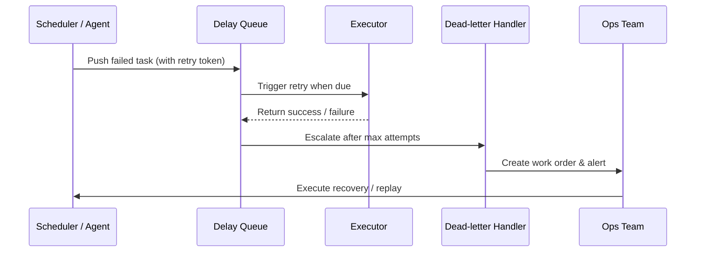

scn_id: SCN-OPS-RETRY-RECOVERY-001
title: Task Retry and Recovery Loop
status: Draft
version: v0.1.0
owners:
  - name: Matrix Ops
    role: Platform Ops Lead
    contact: ops@artisan-cloud.com
  - name: Eva Zhang
    role: Automation Steward
    contact: automation@artisan-cloud.com
domains: [ops]
layers: [ops, service]
repos:
  - key: powerx
    scope: core-platform
    responsibility: >
      Delay queues, retry strategies, dead-letter handling, recovery scripts
related_usecases:
  - doc_id: UC-OPS-RETRY-RECOVERY-001
    layer: ops
    domain: ops
last_reviewed_at: 2025-10-31

---

# Executive Summary

When a task execution fails, the platform must transition it into a delayed retry queue and escalate to dead-letter processing and manual recovery once thresholds are exceeded. This sub-scenario defines retry policies, backoff algorithms, DLQ governance, and runbook-based recovery so that critical tasks can be restored under abnormal conditions with full audit traceability.

# Scope & Guardrails

- **In Scope**: Delay queue enqueue/dequeue, retry policies, backoff algorithms, dead-letter queues, work-order escalation, runbook recovery, auditing, and alerting.
- **Out of Scope**: Cross-repo data repair, financial compensation, and infrastructure-level disaster recovery.
- **Environment & Flags**: "`task-retry-queue`, `dlq-inspector`, `audit-streaming`; depends on Redis/Kafka, work-order tooling, and PagerDuty/Slack alerts."

# Participants & Responsibilities

| Scope | Repository | Layer | Responsibilities | Owners |
|-------|------------|-------|------------------|--------|
| core-platform | powerx | ops | Delay queue, retry strategy, DLQ processing, metrics collection | Matrix Ops (Platform Ops Lead / ops@artisan-cloud.com) |
| automation | powerx | ops | Runbooks, work-order integration, alert configuration, queue inspection scripts | Eva Zhang (Automation Steward / automation@artisan-cloud.com) |

# End-to-End Flow

1. **Stage 1 – Failure Enqueue**: Task failure events trigger retry policies, enqueueing jobs into the delay queue with idempotency tokens.
2. **Stage 2 – Delayed Retry**: When due, the task is executed again; success closes alerts and updates status.
3. **Stage 3 – Dead-letter Escalation**: Repeated failures move the task into the DLQ, automatically creating a work order and firing PagerDuty.
4. **Stage 4 – Manual Recovery & Closure**: Operators follow runbooks to remediate, recording outcomes and syncing audits/metrics.

# Key Interactions & Contracts

- **APIs / Events**: "`EVENT task.execution.failed`, `EVENT task.retry.scheduled`, `POST /internal/tasks/retry`, `POST /ops/workorders`."
- **Configs / Schemas**: "`config/tasks/retry-policies.yaml`, `docs/standards/ops/task-retry-governance.md`, `docs/standards/events/retry-status-schema.md`."
- **Security / Compliance**: Retry idempotency validation, work-order approvals, audit logging, safeguards against duplicate execution and privilege escalation.

# Usecase Links

- `UC-OPS-RETRY-RECOVERY-001` — Delay queue retry and recovery loop.

# Acceptance Criteria

1. Automatic retry success rate ≥ 90%, retry latency adheres to SLA (default 2-minute backoff).
2. Work orders are created and on-call responders notified within 5 minutes after DLQ escalation; manual recovery completion rate ≥ 95%.
3. Ops console displays real-time views for retry queues, DLQ, and recovery status with one-click replay and policy tuning.

# Telemetry & Ops

- Metrics: "`task.retry.scheduled_total`, `task.retry.success_total`, `task.retry.failure_total`, `task.retry.dlq_total`, `task.retry.escalated_total`."
- Alert thresholds: Retry failure rate > 15% over 10 minutes, DLQ size beyond threshold, work-order creation failures.
- Observability sources: "Grafana `Runtime Ops / Retry & Recovery`, Datadog `task.retry.*`, Ops console recovery dashboard, `scripts/ops/retry-inspect.mjs`."

# Open Issues & Follow-ups

| Risk / Item | Impact | Owner | ETA |
|-------------|--------|-------|-----|
| DLQ cleanup is not automated | Work-order backlog and delayed recovery | Matrix Ops | 2025-11-07 |
| Retry strategy not aligned with business SLA | Recovery might be delayed | Eva Zhang | 2025-11-14 |

# Appendix

- `docs/meta/scenarios/powerx/core-platform/runtime-ops/event-and-taskflow-management/primary.md`
- `scripts/ops/retry-inspect.mjs`, `scripts/ops/recovery-runbook.mjs`
- Retry governance runbook (Confluence: Runtime-Ops-Retry-Recovery)
