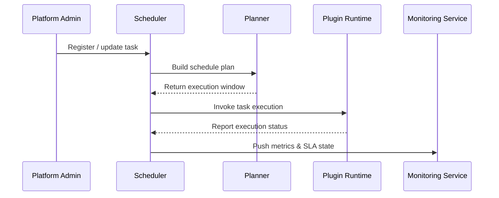

scn_id: SCN-OPS-TASK-SCHEDULE-001
title: Scheduler for Cron & Event-driven Tasks
status: Draft
version: v0.1.0
owners:
  - name: Matrix Ops
    role: Platform Ops Lead
    contact: ops@artisan-cloud.com
  - name: Eva Zhang
    role: Automation Steward
    contact: automation@artisan-cloud.com
domains: [ops]
layers: [ops, service]
repos:
  - key: powerx
    scope: core-platform
    responsibility: >
      Cron parsing, resource validation, task execution pipeline
related_usecases:
  - doc_id: UC-OPS-TASK-SCHEDULE-001
    layer: ops
    domain: ops
last_reviewed_at: 2025-10-31

---

# Executive Summary

The scheduling center triggers plugin workloads based on Cron expressions or event rules, ensuring tasks meet SLA commitments with full observability. This sub-scenario covers task registration, resource validation, execution invocation, status updates, and failure remediation so that batch, periodic, and event-driven jobs run reliably across tenants.

# Scope & Guardrails

- **In Scope**: Cron/event task registration, Cron parsing, tenant quotas and mutual exclusion, execution triggers, status tracking, SLA alerting, retry hand-offs.
- **Out of Scope**: Plugin business logic, infrastructure scaling, and manual work-order approvals.
- **Environment & Flags**: "`task-scheduler-v3`, `task-sla-monitor`, `task-retry-queue`; depends on Redis/Etcd locks, Kafka execution queues, and Ops console dashboards."

# Participants & Responsibilities

| Scope | Repository | Layer | Responsibilities | Owners |
|-------|------------|-------|------------------|--------|
| core-platform | powerx | ops | Cron engine, task planner, execution client, status feedback | Matrix Ops (Platform Ops Lead / ops@artisan-cloud.com) |
| automation | powerx | ops | SLA alerting, runbooks, inspection reports, Ops console integration | Eva Zhang (Automation Steward / automation@artisan-cloud.com) |

# End-to-End Flow

1. **Stage 1 – Task Registration**: Admins configure Cron/event tasks while validating tenant scope and mutual exclusion rules.
2. **Stage 2 – Pre-flight Scheduling**: Ahead of trigger time, the scheduler performs resource checks, quota validation, and jitter control, queuing or warning when needed.
3. **Stage 3 – Task Execution**: At trigger time the runtime client invokes plugin runtimes/agents, records trace IDs, and captures heartbeats.
4. **Stage 4 – Status Tracking**: Execution results are persisted to the task store and metrics pipeline; failures dispatch retries or recovery.

# Key Interactions & Contracts

- **APIs / Events**: "`POST /internal/tasks/register`, `PUT /internal/tasks/{id}/pause|resume`, `EVENT task.execution.updated`, `EVENT task.execution.failed`."
- **Configs / Schemas**: "`config/tasks/default_policy.yaml`, `docs/standards/ops/task-sla-matrix.md`, `docs/standards/events/task-status-schema.md`."
- **Security / Compliance**: Task operation permissions, audit logging, tenant-level quotas and isolation, SLA alert approvals.

# Usecase Links

- `UC-OPS-TASK-SCHEDULE-001` — Scheduler for Cron and event-driven task management.

# Acceptance Criteria

1. On-time execution rate ≥ 98%, task success rate ≥ 97%, trigger latency < 1 minute.
2. Ops console shows real-time task status and logs, supports pause/resume and manual retries.
3. Resource conflicts are warned ≥ 90% in advance; SLA breaches alert within 60 seconds.

# Telemetry & Ops

- Metrics: "`task.scheduler.on_time_rate`, `task.scheduler.missed_total`, `task.execution.success_total`, `task.execution.retry_total`, `task.sla.breach_total`."
- Alert thresholds: Scheduling failure rate > 5% over 5 minutes, three consecutive SLA breaches, lock contention > 70%.
- Observability sources: "Grafana `Runtime Ops / Scheduler Overview`, Datadog `task.scheduler.*`, Ops console timeline, `scripts/ops/task-sla-report.mjs`."

# Open Issues & Follow-ups

| Risk / Item | Impact | Owner | ETA |
|-------------|--------|-------|-----|
| Scheduler auto-scaling not in place | SLA risks during peak load | Matrix Ops | 2025-11-08 |
| Mutual exclusion rules are complex and error-prone | Tasks blocked unintentionally | Eva Zhang | 2025-11-15 |

# Appendix

- `docs/meta/scenarios/powerx/core-platform/runtime-ops/event-and-taskflow-management/primary.md`
- `scripts/ops/task-dryrun.mjs`, `scripts/ops/task-sla-report.mjs`
- Ops console scheduling configuration guide (Confluence: Runtime-Ops-Scheduler)
