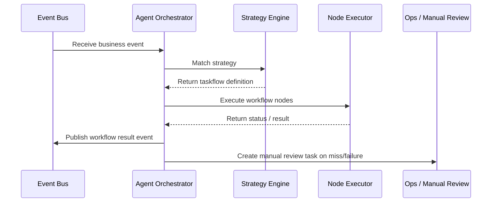

doc_id: UC-OPS-AGENT-ORCHESTRATION-001
scn_id: SCN-OPS-EVENT-TASKFLOW-001
title: Agent Automation Taskflow Orchestration
status: Draft
version: v0.1.0
repo_key: powerx
scope: powerx
layer: service
domain: ops
scenario_title: "PowerX Event & Taskflow Management"
owners:
  - name: Matrix Ops
    role: Platform Ops Lead
    contact: ops@artisan-cloud.com
  - name: Eva Zhang
    role: Automation Steward
    contact: automation@artisan-cloud.com
contributors: []
linked_requirements:
  - SCN-OPS-EVENT-TASKFLOW-001-C
code_refs:
  - repo: powerx
    path: internal/agent/subscribers/event_listener.go
    description: Event subscription, filtering, and context construction
  - repo: powerx
    path: internal/agent/strategy/matcher.go
    description: Strategy matching engine with condition and weight evaluation
  - repo: powerx
    path: internal/agent/orchestrator/workflow_builder.go
    description: Automated taskflow construction and dependency management
  - repo: powerx
    path: internal/agent/executor/node_runner.go
    description: Node execution, retry handling, and status feedback
  - repo: powerx
    path: pkg/ops/agent_insight_reporter.go
    description: Orchestration visualization, metrics, and audit emission
feature_flags:
  - agent-orchestrator
  - agent-strategy-library
  - audit-streaming
optional: false
last_reviewed_at: 2025-10-31

---

# Usecase Overview

- **Business Goal**: Automatically match strategies when the Agent receives specific business events, generate taskflows that invoke plugins or external APIs, and keep execution observable and auditable with minimal manual intervention.
- **Success Metrics**: Strategy hit rate ≥ 80%; taskflow generation latency ≤ 10 seconds; automated execution success rate ≥ 95%; manual intervention rate < 10%; audit log completeness 100%.
- **Scenario Alignment**: Supports Stage 3 of `SCN-OPS-EVENT-TASKFLOW-001`, linking event notifications and scheduling, while providing context for retry/recovery flows.

> Strategy-driven Agent orchestration enables event-triggered automation across reporting, notification, and approval chains.

# Context & Assumptions

- **Prerequisites**
  - Feature flags `agent-orchestrator`, `agent-strategy-library`, and `audit-streaming` are enabled.
  - Agent services run with high availability and provide strategy libraries, variable templates, and permission checks.
  - The event bus delivers standardized payloads with tenant identifiers, context, and idempotency keys.
  - Downstream plugins/APIs support idempotent calls, trace propagation, and asynchronous status callbacks.
- **Inputs / Outputs**
  - Inputs: Subscribed events (for example, `plugin.job.completed`, `tenant.request.pending`), strategy configuration, context variables, tenant and permission metadata.
  - Outputs: Generated taskflows (nodes, dependencies, parameters), execution outcomes, audit records, manual approval tasks or alerts.
- **Boundaries**
  - Excludes strategy-authoring IDEs or simulators (covered by separate standards).
  - Does not manage credential provisioning for external systems—assumes pre-configured credentials.
  - Long-running manual workflows are overseen by operations systems outside this usecase.

# Solution Blueprint

## Architecture Layers

| Layer | Key Modules | Responsibility | Code Entry |
|-------|-------------|----------------|------------|
| Event Listener | `internal/agent/subscribers/event_listener.go` | Subscribe to events, assemble context, enforce idempotency | `services/agent/subscribers` |
| Strategy Evaluation | `internal/agent/strategy/matcher.go` | Match strategies, validate conditions, compute variables | `services/agent/strategy` |
| Orchestration Builder | `internal/agent/orchestrator/workflow_builder.go` | Construct task nodes, dependencies, and parameter injection | `services/agent/orchestrator` |
| Node Execution | `internal/agent/executor/node_runner.go` | Execute nodes, manage retries, write back status | `services/agent/executor` |
| Visualization | `pkg/ops/agent_insight_reporter.go` | Produce orchestration views, metrics, and audit events | `pkg/ops` |

## Flow & Sequence

1. **Step 1 – Event Intake**: The Agent validates tenant scope, ensures idempotency, and builds the context dictionary.
2. **Step 2 – Strategy Matching**: The strategy engine evaluates event type, conditions, and weights to pick the correct strategy and merge parameter templates.
3. **Step 3 – Taskflow Construction**: The workflow builder generates sequential/parallel nodes, dependencies, and callback policies.
4. **Step 4 – Node Execution**: The node runner invokes plugins/APIs, handles success/failure/delay, updates state, and emits audit trails.
5. **Step 5 – Feedback & Escalation**: Unmatched or repeatedly failing workflows create manual review tasks and notify responsible owners.

# Contracts & Interfaces

- **Inbound APIs / Events**
  - `EVENT plugin.job.completed`, `EVENT tenant.request.pending` — include tenant, job ID, and contextual payload.
  - `POST /internal/agent/events` — Manual replay endpoint requiring signature and idempotency validation.
- **Outbound Calls**
  - `POST /plugin/runtime/{pluginId}/execute` — Invoke plugin automation with strategy context.
  - `POST /notifications/agent-task` — Notify stakeholders about created or failed tasks.
  - `POST /ops/manual-review` — Generate manual review work orders.
- **Configs & Scripts**
  - `config/agent/strategies/*.yaml` — Strategy definitions and templates.
  - `scripts/ops/agent-strategy-test.mjs` — Strategy unit tests and simulation tool.
  - `scripts/ops/agent-replay.mjs` — Event replay and troubleshooting script.

# Implementation Checklist

| Item | Description | Status | Owner |
|------|-------------|--------|-------|
| Strategy Library | Implement DSL, condition parsing, version control | [ ] | Eva Zhang |
| Idempotency Governance | Generate idempotency keys, caching, expiry policies | [ ] | Matrix Ops |
| Orchestration Builder | Create taskflow templates, dependency parsing, variable injection | [ ] | Eva Zhang |
| Observability | Emit metrics, orchestration views, audit logs, alerts | [ ] | Matrix Ops |
| Manual Escalation | Integrate Ops work orders/notifications with approval flow | [ ] | Eva Zhang |

# Testing Strategy

- **Unit**: Strategy matching, condition combinations, variable substitution, idempotency cache, node state machine.
- **Integration**: Run C-1 to validate automated report generation upon events; run C-2 to confirm unmatched strategies enter manual review.
- **End-to-End**: Drive diverse sandbox events to inspect orchestration views, Ops console status, and notifications; simulate retry and manual takeover.
- **Non-functional**: Load test at 200 TPS event ingestion; inject failures in strategy library or downstream APIs to verify graceful degradation and alerting.

# Observability & Ops

- **Metrics**: `agent.strategy.hit_rate`, `agent.workflow.generated_total`, `agent.node.success_total`, `agent.manual_escalation_total`, `agent.workflow.latency_p95`.
- **Logging**: Capture `event_id`, `strategy_id`, `workflow_id`, `node_id`, `status`, `duration`, `escalation_reason`; redact sensitive data.
- **Alerts**: Strategy miss rate > 20% over 15 minutes, automated failure rate > 10%, manual backlog > 20 items; notify via Slack/PagerDuty.
- **Dashboards**: Grafana `Runtime Ops / Agent Automation`, Datadog `agent.*`, Ops console orchestration view.

# Rollback & Failure Handling

- **Rollback Steps**: Revert strategy library and Agent service, disable `agent-orchestrator`, and clean up active workflows.
- **Mitigations**: Use `agent-replay.mjs` to replay critical events, manually trigger required tasks, and fill in execution outcomes.
- **Data Repair**: Validate `agent_workflows` table, fix orphaned nodes, and regenerate audit traces.

# Follow-ups & Risks

| Risk / Item | Impact | Mitigation | Owner | ETA |
|-------------|--------|------------|-------|-----|
| No rollback or regression for strategies | Widespread workflow failures | Introduce strategy approval and rollback mechanism | Eva Zhang | 2025-11-10 |
| Agent execution permissions incomplete | Potential over-privileged actions | Integrate with permission system, enforce least privilege | Matrix Ops | 2025-11-18 |

# References & Links

- Scenario: `docs/scenarios/runtime-ops/SCN-OPS-EVENT-TASKFLOW-001.md`
- Child Scenario: `docs/scenarios/runtime-ops/SCN-OPS-AGENT-ORCHESTRATION-001.md`
- Background: `docs/meta/scenarios/powerx/core-platform/runtime-ops/event-and-taskflow-management/primary.md`
- Tooling: `scripts/ops/agent-strategy-test.mjs`, `scripts/ops/agent-replay.mjs`
