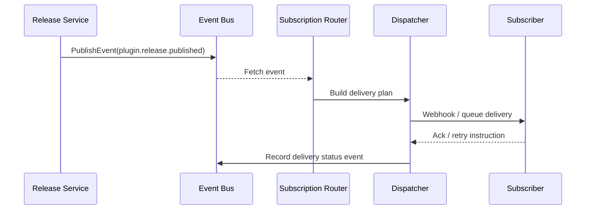

doc_id: UC-OPS-EVENT-NOTIFY-001
scn_id: SCN-OPS-EVENT-TASKFLOW-001
title: Plugin Release Event Notification Orchestration
status: Draft
version: v0.1.0
repo_key: powerx
scope: powerx
layer: service
domain: ops
scenario_title: "PowerX Event & Taskflow Management"
owners:
  - name: Matrix Ops
    role: Platform Ops Lead
    contact: ops@artisan-cloud.com
  - name: Eva Zhang
    role: Automation Steward
    contact: automation@artisan-cloud.com
contributors: []
linked_requirements:
  - SCN-OPS-EVENT-TASKFLOW-001-A
code_refs:
  - repo: powerx
    path: internal/events/bus/publisher.go
    description: Standard event model wrapper and publication entrypoint
  - repo: powerx
    path: internal/events/subscriptions/router.go
    description: Subscription matching, idempotency checks, and rate governance
  - repo: powerx
    path: internal/events/delivery/webhook_dispatcher.go
    description: Webhook / queue delivery pipelines and retry policies
  - repo: powerx
    path: internal/events/storage/event_log_repository.go
    description: Event persistence and trace query interface
  - repo: powerx
    path: pkg/audit/event_audit_logger.go
    description: Audit log emission and alert triggers
feature_flags:
  - event-bus-v2
  - plugin-release-webhook
  - audit-streaming
optional: false
last_reviewed_at: 2025-10-31

---

# Usecase Overview

- **Business Goal**: "Deliver `plugin.release.published` and other critical events to every subscriber within 5 seconds after a plugin release, with traceability, compensation, and idempotency guarantees so that cross-system collaboration fires on time."
- **Success Metrics**: Initial delivery success rate ≥ 97%; cumulative success rate after retries ≥ 99.5%; duplicate delivery rate < 0.5%; subscriber ACK latency P95 ≤ 3 seconds; audit coverage 100%.
- **Scenario Alignment**: "Supports Stage 1 of `SCN-OPS-EVENT-TASKFLOW-001`, providing the trusted event source for scheduling, Agent orchestration, and recovery flows."

> Unified event models and delivery strategies enable a closed loop that notifies the Ops console, CI/CD, and alert platforms immediately after each plugin release.

# Context & Assumptions

- **Prerequisites**
  - Feature flags `event-bus-v2`, `plugin-release-webhook`, and `audit-streaming` are enabled.
  - Kafka / event bus is available; subscriptions are stored in the `event_subscription` table and maintained through the console.
  - Subscriber Webhook/queue endpoints support HMAC signatures, idempotency tokens, and retry handling.
- **Inputs / Outputs**
  - Inputs: "`plugin.release.published` events emitted by the release pipeline, subscription definitions, idempotency keys, tenant context."
  - Outputs: Delivery requests per subscriber, delivery status, event log persistence, audit events, metrics.
- **Boundaries**
  - Does not cover release pipeline approval or signing workflows.
  - Subscriber internal processing is out of scope; this usecase guarantees delivery and failure alerting only.
  - Cross-region replication latency is handled by mirroring tasks; this usecase focuses on the primary region.

# Solution Blueprint

## Architecture Layers

| Layer | Key Modules | Responsibility | Code Entry |
|-------|-------------|----------------|------------|
| Event Publication | `internal/events/bus/publisher.go` | Validate schema & tenant, generate idempotency key, publish to bus | `services/events` |
| Subscription Matching | `internal/events/subscriptions/router.go` | Resolve subscribers, apply rate limits and permissions | `services/events` |
| Delivery Execution | `internal/events/delivery/webhook_dispatcher.go` | Webhook/queue delivery, retry, circuit breaking, delay control | `services/events/delivery` |
| Storage & Trace | `internal/events/storage/event_log_repository.go` | Persist events, delivery status, retry history for query | `services/events/storage` |
| Audit & Observability | `pkg/audit/event_audit_logger.go` | Emit audit stream, trigger failure alerts, publish metrics | `pkg/audit` |

## Flow & Sequence

1. **Step 1 – Publish Event**: "The release service calls `PublishEvent`, validating schema, tenant, and idempotency key before writing to Kafka topics."
2. **Step 2 – Match Subscriptions**: The router consumes events, filters subscribers by tenant and tags, and applies rate limits/blacklists.
3. **Step 3 – Execute Delivery**: The dispatcher sends Webhook/queue messages, records response codes and latency, and schedules delayed retries on failures.
4. **Step 4 – Trace & Alert**: Delivery outcomes are written to the event store and audit stream; breaches trigger PagerDuty/IM alerts and sync to the Ops console.
5. **Step 5 – Compensation & Replay**: Operators replay events, adjust subscriptions, or create work orders through the console/CLI.



# Contracts & Interfaces

- **Inbound APIs / Events**
  - `EVENT plugin.release.published` — Payload includes version, tenant, dependency list, actor, checksum.
  - `POST /internal/events/publish` — Manual replay endpoint requiring signatures and idempotency.
- **Outbound Calls**
  - Webhook: "`POST https://<subscriber>/powerx/events` with `X-PowerX-Signature`, 3 retries with exponential backoff."
  - Queue: "Deliver to tenant-defined Kafka topics/AMQP exchanges with `tenant_id`, `event_id`, `attempt`."
- **Configs & Scripts**
  - `config/events/subscriptions.yaml` — Default subscription templates.
  - `scripts/ops/replay-event.mjs` — Event replay utility.
  - `scripts/ops/validate-webhook.mjs` — Signature and connectivity test script.

# Implementation Checklist

| Item | Description | Status | Owner |
|------|-------------|--------|-------|
| Event schema | Define `plugin.release.published` schema and version compatibility | [ ] | Matrix Ops |
| Subscription governance | Implement tenant/tag matching, idempotency tokens, rate limiting | [ ] | Eva Zhang |
| Delivery channels | Build Webhook/queue dispatchers with retry & circuit breaking | [ ] | Matrix Ops |
| Console capabilities | Update subscription management, event trace UI, replay entry | [ ] | Eva Zhang |
| Observability & alerting | Integrate metrics, audit, PagerDuty/IM alerts, reporting scripts | [ ] | Matrix Ops |

# Testing Strategy

- **Unit**: Event publication validation, subscription filters (tags/tenants), HMAC signature generation/verification, retry scheduler.
- **Integration**: Validate successful delivery, delayed retry, idempotency enforcement using Kafka and Webhook simulators; run Usecase A-1/A-2.
- **End-to-End**: Trigger a real plugin release in staging; confirm Ops console, alerting platform, and CI/CD receive notifications; ensure event trace availability.
- **Non-functional**: Load test with 500 TPS; inject network drops/signature mismatches to verify retries and alert loop.

# Observability & Ops

- **Metrics**: "`event.delivery.success_total`, `event.delivery.retry_total`, `event.delivery.latency_p95`, `event.delivery.duplicate_total`."
- **Logging**: "Record `event_id`, `tenant_id`, `subscriber_id`, `attempt`, `status`, `latency_ms`, `signature_id`; redact sensitive data."
- **Alerts**: Consecutive failures > 3 or failure rate > 5% over 5 minutes trigger PagerDuty; signature validation failures notify security channel.
- **Dashboards**: "Grafana `Runtime Ops / Event Delivery`, Datadog `event.delivery.*`, Ops console event center."

# Rollback & Failure Handling

- **Rollback Steps**: Roll back publisher/dispatcher images, restore prior config, disable new feature flags, clean pending retries.
- **Mitigations**: "Use `replay-event.mjs` to resend failed events; adjust subscription settings; manually notify critical subscribers."
- **Data Repair**: "Run `scripts/audit/reconcile-event-log.mjs` to reconcile event store and audit stream; fix idempotency anomalies via SQL update."

# Follow-ups & Risks

| Risk / Item | Impact | Mitigation | Owner | ETA |
|-------------|--------|------------|-------|-----|
| Subscriber Webhook flooding causes delivery delay | Event latency, queue backlog | Add rate limiting, isolation queues, circuit breakers | Matrix Ops | 2025-11-05 |
| Missing automated reminders for signature key rotation | Security & delivery reliability | Introduce rotation schedule and alerts, enhance detection script | Eva Zhang | 2025-11-12 |

# References & Links

- Scenario: "`docs/scenarios/runtime-ops/SCN-OPS-EVENT-TASKFLOW-001.md`"
- Background: "`docs/meta/scenarios/powerx/core-platform/runtime-ops/event-and-taskflow-management/primary.md`"
- Scripts: "`scripts/ops/replay-event.mjs`, `scripts/ops/validate-webhook.mjs`"

---

# Preconditions

- The scenario has entries in `docs/_data/docmap.yaml`, and corresponding repositories exist in `docs/_data/repos.yaml`.
- This notification path requires the `event-bus-v2`, `plugin-release-webhook`, and `audit-streaming` feature flags, as well as healthy Kafka, subscription configuration storage, Ops event center, and signing key vaults.
- Operational scripts (`scripts/ops/replay-event.mjs`, `scripts/ops/validate-webhook.mjs`) are up to date and ready for verification or compensation.

# Generation Workflow

1. **Register / Update docmap Children**

   ```yaml
   # docs/_data/docmap.yaml
   - scn_id: SCN-OPS-EVENT-TASKFLOW-001
     title: PowerX 事件与任务流管理
     children:
       - doc_id: UC-OPS-EVENT-NOTIFY-001
         scope: powerx
         layer: service
         domain: ops
         optional: false
         repo: powerx
         path: docs/usecases-seeds/SCN-OPS-EVENT-TASKFLOW-001/UC-OPS-EVENT-NOTIFY-001.md
       - doc_id: UC-OPS-TASK-SCHEDULE-001
         scope: powerx
         layer: ops
         domain: ops
         optional: false
         repo: powerx
         path: docs/usecases-seeds/SCN-OPS-EVENT-TASKFLOW-001/UC-OPS-TASK-SCHEDULE-001.md
       - doc_id: UC-OPS-AGENT-ORCHESTRATION-001
         scope: powerx
         layer: service
         domain: ops
         optional: false
         repo: powerx
         path: docs/usecases-seeds/SCN-OPS-EVENT-TASKFLOW-001/UC-OPS-AGENT-ORCHESTRATION-001.md
       - doc_id: UC-OPS-RETRY-RECOVERY-001
         scope: powerx
         layer: ops
         domain: ops
         optional: false
         repo: powerx
         path: docs/usecases-seeds/SCN-OPS-EVENT-TASKFLOW-001/UC-OPS-RETRY-RECOVERY-001.md
   ```

   - Ensure `doc_id` and `path` match the Seed files and downstream distribution paths.
   - `optional: true/false` flags are consumed by leadership views and publishing scripts (default to mandatory).

2. **Copy Template into the Target Directory**

   ```bash
   mkdir -p docs/usecases-seeds/SCN-OPS-EVENT-TASKFLOW-001
   cp docs/usecases-seeds/_template.md \
     docs/usecases-seeds/SCN-OPS-EVENT-TASKFLOW-001/UC-OPS-EVENT-NOTIFY-001.md
   ```

   - Keep `doc_id` consistent with docmap to avoid missing files during generation.
   - If multiple repos share the workflow, generate dedicated Seeds and reference shared modules in the body.

3. **Fill in the Frontmatter**

   - Align `doc_id`, `scn_id`, `scope`, `layer`, `domain` with docmap entries.
   - Use `repo_key` from `docs/_data/repos.yaml` (`powerx` here) and set `scenario_title` to the primary scenario name.
   - Default owners: Matrix Ops (Platform Ops Lead) and Eva Zhang (Automation Steward); update docmap if ownership changes.
  - Include feature flags `event-bus-v2`, `plugin-release-webhook`, `audit-streaming`, and append any additional dependencies.

4. **Complete the Body Sections**

   - `Usecase Overview`: Highlight five-second delivery, ≥99.5% cumulative success, and idempotency targets.
   - `Context & Assumptions`: Detail schemas, subscription storage, Webhook HMAC, idempotency rules, and cross-region expectations.
   - `Solution Blueprint` through `Rollback & Failure Handling`: Elaborate on publication, matching, delivery, tracing/replay, and alert handling.
   - `Contracts & Interfaces`: Document `EVENT plugin.release.published`, `EVENT event.delivery.failed`, `POST /internal/events/publish`, and Webhook retry policies.
   - `Testing Strategy`: Cover positive delivery, delayed retry, signature failure, load/chaos testing.

5. **Cross-link Scenario Documentation**

   - Add a reference in `docs/scenarios/runtime-ops/SCN-OPS-EVENT-NOTIFY-001.md` so readers can jump between scenario and Seed.
   - Update related standards (`docs/standards/events/event-bus-schema.md`, etc.) if new contracts are introduced.

# Self-checklist

- Frontmatter matches `docmap.yaml`; names and paths are case-consistent.
- Seed text covers publication, subscription governance, idempotency, retries, alerting, and compensation.
- `scripts/ops/replay-event.mjs` and `scripts/ops/validate-webhook.mjs` are validated against the latest code and telemetry.
- `npm run lint` and `npm run docs:build` succeed, ensuring syntax and build health.
- `npm run publish:scenarios -- --scn-id SCN-OPS-EVENT-TASKFLOW-001 --validate-only` passes structural checks.
- Downstream maintainers are informed; default branch (`dev/docs`) is writable; credentials/configs are staged in sandbox and production.

# FAQ

| Question | Resolution |
|----------|------------|
| What if subscriber Webhooks flood the system? | Document rate limiting, isolation queues, and circuit breakers within the Seed, plus metrics and runbooks. |
| How to handle large cross-region latency? | Note mirroring SLA in prerequisites, describe compensation strategies (manual replay or regional isolation), and extend scripts if needed. |

After completing these steps, follow the Usecase Seed publishing guide to distribute updates downstream.
