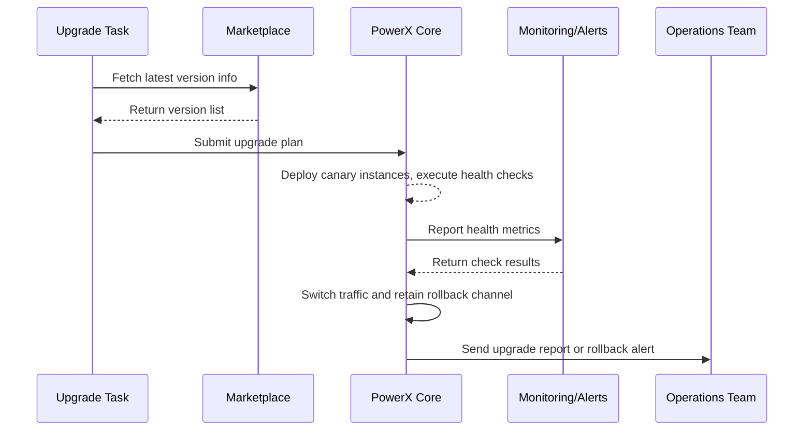

> This document has been translated. View the original Chinese version: [/zh/scenarios/SCN-OPS-PLUGIN-LIFECYCLE-001/SCN-OPS-PLUGIN-AUTO-UPGRADE-001.html](/zh/scenarios/SCN-OPS-PLUGIN-LIFECYCLE-001/SCN-OPS-PLUGIN-AUTO-UPGRADE-001.html).

# Executive Summary

This sub-scenario describes how automated tasks detect new plugin versions and execute canary upgrades within maintenance windows, including health checks, traffic switching, and automatic rollback on anomalies. The process covers upgrade plan generation, canary instance deployment, monitoring metric validation, automatic report generation and notifications. The goal is to complete version iteration without interrupting critical business while ensuring rollback paths and audit closure.

# Scope & Guardrails

- **In Scope**: Version comparison and upgrade planning, canary instance deployment, configuration loading, health checks, traffic switching, rollback strategies, reporting and notifications.
- **Out of Scope**: Plugin code testing, Marketplace publishing approval, manual upgrade operation details.
- **Environment & Flags**: `plugin-upgrade-scheduler`, `plugin-traffic-shifter`, `plugin-health-check`, `plugin-upgrade-pause`; depends on Marketplace version repository, monitoring metrics, audit logs, notification services.

# Participants & Responsibilities

| Scope | Repository | Layer | Responsibilities & Deliverables | Owners |
|-------|------------|-------|---------------------------------|--------|
| core-platform | powerx | ops | Upgrade plan generation, canary deployment, health checks, traffic switching, rollback | Matrix Ops (Platform Ops Lead / ops@artisan-cloud.com) |
| automation | powerx | ops | Upgrade task orchestration, maintenance window management, reporting and notifications | Eva Zhang (Automation Steward / automation@artisan-cloud.com) |
| marketplace | powerx-marketplace | service | Version metadata, image distribution, upgrade notifications | Michael Hu (Plugin Tech Lead / tech@artisan-cloud.com) |

# End-to-End Flow

1. **Stage 1 – Version Detection & Plan Generation**: Upgrade tasks compare Marketplace/image repositories, generate upgrade plans and notify operations.
2. **Stage 2 – Canary Instance Deployment & Health Checks**: Deploy canary instances within maintenance windows, load configurations, execute health checks and collect metrics.
3. **Stage 3 – Traffic Switching & Rollback Assurance**: Gradually switch traffic after health checks pass, retain rollback channels for old versions and monitor core metrics.
4. **Stage 4 – Reporting & Notifications**: Generate reports upon upgrade completion, update version status, automatically rollback on exceptions and trigger alerts.

# Key Interactions & Contracts

- **APIs / Events**: `POST /api/plugins/upgrade/plan`, `POST /api/plugins/upgrade/execute`, `POST /api/plugins/upgrade/rollback`, `EVENT plugin.upgrade.progress`, `EVENT plugin.upgrade.rollback`.
- **Configs / Schemas**: `config/plugins/upgrade_windows.yaml`, `config/plugins/health_checks.yaml`, `docs/standards/powerx-plugin/lifecycle/capabilities.md`.
- **Security / Compliance**: Upgrade tasks require approval, canary environment isolation, change logs and metric retention, rollback actions logged to audit.

# Usecase Links

- `UC-OPS-PLUGIN-AUTO-UPGRADE-001` — Automated canary upgrade and rollback governance.

# Acceptance Criteria

1. Canary upgrades cover at least 20% of traffic and complete health validation within 15 minutes.
2. Key metrics remain stable after traffic switching, with automatic rollback to previous version and traffic recovery on anomalies.
3. Upgrade reports record version numbers, canary data, metrics and rollback results, with notifications sent to operations and administrators.

# Telemetry & Ops

- Metrics: `plugin.upgrade.success_rate`, `plugin.upgrade.duration_p95`, `plugin.upgrade.rollback_total`, `plugin.upgrade.healthcheck_failure_total`.
- Alert thresholds: Health check failure rate >5%, upgrades exceeding maintenance window, rollback count >2/week.
- Observability sources: Grafana `Runtime Ops / Plugin Upgrade`, Datadog `plugin.upgrade.*`, Ops console upgrade reports.

# Open Issues & Follow-ups

| Risk/Issue | Impact Scope | Owner | ETA |
|------------|--------------|-------|-----|
| Some plugins lack canary metric threshold configuration, making automatic decisions difficult | Upgrade decisions | Matrix Ops | 2025-11-16 |
| Upgrade pause switch only supports global scope, needs tenant-level refinement | Operational flexibility | Eva Zhang | 2025-11-20 |

# Appendix

- `docs/meta/scenarios/powerx/core-platform/runtime-ops/plugin-install-and-ops/primary.md`
- `docs/standards/powerx-plugin/lifecycle/capabilities.md`
- Operations Manual: Confluence "Plugin Upgrade Playbook"

