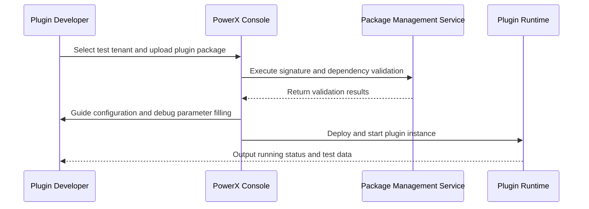

> This document has been translated. View the original Chinese version: [/zh/scenarios/SCN-OPS-PLUGIN-LIFECYCLE-001/SCN-OPS-PLUGIN-DEV-INSTALL-001.html](/zh/scenarios/SCN-OPS-PLUGIN-LIFECYCLE-001/SCN-OPS-PLUGIN-DEV-INSTALL-001.html).

# Executive Summary

This sub-scenario focuses on the process where plugin developers manually upload `.pxp` or build artifacts for installation and debugging in test tenants. The system performs package signature, dependency, and resource quota validation during upload, and guides environment variables, key placeholders, and debug log configuration through installation wizards. The goal is to enable developers to complete sandbox deployment within 2 minutes, independently verify plugin behavior, while ensuring test tenant isolation, rollback capability, and audit traceability.

# Scope & Guardrails

- **In Scope**: Local package upload, signature and dependency validation, tenant quota verification, installation wizard configuration, automatic sandbox test data generation, rollback and log tracking.
- **Out of Scope**: Plugin code build process, Marketplace publishing, production tenant installation and billing policies.
- **Environment & Flags**: `px-plugin-runtime-v2`, `plugin-sandbox-mode`, `plugin-dev-logs`; depends on package management service, tenant isolation configuration, debug log channels and audit streams.

# Participants & Responsibilities

| Scope | Repository | Layer | Responsibilities & Deliverables | Owners |
|-------|------------|-------|---------------------------------|--------|
| sandbox | powerx | ops | Plugin installation orchestration, signature and dependency validation, resource quota control, sandbox log panel | Matrix Ops (Platform Ops Lead / ops@artisan-cloud.com) |
| plugin-ecosystem | powerx-plugin | proto | Plugin CLI upload, package structure specification, developer debugging toolchain | Michael Hu (Plugin Tech Lead / tech@artisan-cloud.com) |

# End-to-End Flow

1. **Stage 1 – Sandbox Tenant Selection & Permission Validation**: Developer selects test tenant in console, system validates upload permissions and tenant resources.
2. **Stage 2 – Package Upload & Validation**: Upload local plugin package, platform executes signature, dependency, version compatibility checks and writes audit logs.
3. **Stage 3 – Installation Wizard Configuration**: Wizard guides filling environment variables, key placeholders, debug log levels and completes resource pre-provisioning.
4. **Stage 4 – Startup & Test Data Generation**: Runtime starts plugin instance, generates test data/entry point, outputs running status and logs to developer.

# Key Interactions & Contracts

- **APIs / Events**: `POST /api/plugins/install/local`, `POST /internal/plugins/packages/validate`, `EVENT plugin.install.sandbox_completed`, `EVENT plugin.install.failed`.
- **Configs / Schemas**: `docs/standards/powerx-plugin/lifecycle/package.md`, `docs/standards/powerx-plugin/lifecycle/manifest-mapping.md`, `config/plugins/sandbox_limits.yaml`.
- **Security / Compliance**: Mandatory signature and hash verification, sandbox tenant access restrictions, debug operations logged to audit, uploader requires `plugin:dev` permission.

# Usecase Links

- `UC-OPS-PLUGIN-DEV-INSTALL-001` — Manual plugin upload in test tenant.

# Acceptance Criteria

1. Plugin installation completes within 2 minutes, status changes to "running", generating independent test entry point.
2. Failure scenarios (signature, dependency, quota) trigger automatic rollback and prompt developer for fixes.
3. All upload, configuration, and log operations written to audit, with sandbox tenant resources fully isolated.

# Telemetry & Ops

- Metrics: `plugin.install.sandbox_duration_p95`, `plugin.install.sandbox_success_rate`, `plugin.install.rollback_total`, `plugin.sandbox.resource_usage`.
- Alert thresholds: Sandbox installation failure rate >10%/30 minutes, resource quota overage rate >80%, signature validation failure 3 consecutive times.
- Observability sources: Grafana `Runtime Ops / Plugin Sandbox`, console debug log panel, `node scripts/qa/workflow-metrics.mjs`.

# Open Issues & Follow-ups

| Risk/Issue | Impact Scope | Owner | ETA |
|------------|--------------|-------|-----|
| Sandbox tenant quotas inconsistent with production, affecting regression testing | Test tenants | Matrix Ops | 2025-11-12 |
| CLI lacks local signature pre-validation, easily triggering failures | Developer experience | Michael Hu | 2025-11-18 |

# Appendix

- `docs/meta/scenarios/powerx/core-platform/runtime-ops/plugin-install-and-ops/primary.md`
- `docs/standards/powerx-plugin/lifecycle/package.md`
- Developer Guide: Confluence "PowerX Plugin Sandbox Playbook"

