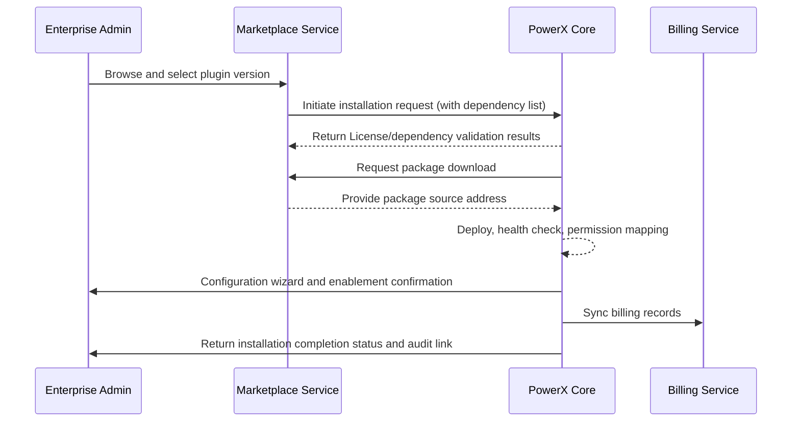

> This document has been translated. View the original Chinese version: [/zh/scenarios/SCN-OPS-PLUGIN-LIFECYCLE-001/SCN-OPS-PLUGIN-MARKETPLACE-INSTALL-001.html](/zh/scenarios/SCN-OPS-PLUGIN-LIFECYCLE-001/SCN-OPS-PLUGIN-MARKETPLACE-INSTALL-001.html).

# Executive Summary

This sub-scenario covers the complete process where enterprise administrators install official plugins with one click in production tenants through Marketplace. After version selection, the system automatically completes License and dependency validation, pulls packages, deploys instances and executes self-checks, then guides administrators to configure permissions, parameters and publish to tenant users. The goal is to complete deployment without manual intervention, ensuring billing, permissions, and audit chains are complete, with automatic rollback and notifications on anomalies.

# Scope & Guardrails

- **In Scope**: Marketplace browsing and version selection, License/dependency validation, package pulling and deployment, self-checks, configuration wizard, permission assignment, billing sync, rollback and audit.
- **Out of Scope**: Marketplace review, billing settlement policies, plugin internal business logic, custom secondary development.
- **Environment & Flags**: `px-marketplace`, `px-plugin-runtime-v2`, `plugin-license-guard`, `plugin-config-wizard`; depends on Marketplace service, tenant and License service, runtime monitoring, notification and audit.

# Participants & Responsibilities

| Scope | Repository | Layer | Responsibilities & Deliverables | Owners |
|-------|------------|-------|---------------------------------|--------|
| core-platform | powerx | service | Installation orchestration, dependency validation, runtime enablement, audit and rollback | Matrix Ops (Platform Ops Lead / ops@artisan-cloud.com) |
| marketplace | powerx-marketplace | service | Plugin catalog, License verification, package source distribution, billing records | Michael Hu (Plugin Tech Lead / tech@artisan-cloud.com) |

# End-to-End Flow

1. **Stage 1 – Plugin Selection & Information Confirmation**: Administrator browses plugins in Marketplace, confirms version, permission requests and pricing terms.
2. **Stage 2 – License & Dependency Validation**: System validates tenant License, billing permissions, whether dependency plugins are satisfied, and prepares installation plan.
3. **Stage 3 – Automatic Deployment & Self-Check**: Automatically pulls packages, deploys instances, executes health checks and permission mapping.
4. **Stage 4 – Configuration & Publishing**: Administrator completes configuration wizard, authorizes roles, system publishes plugin, syncs billing records and writes audit logs.

# Key Interactions & Contracts

- **APIs / Events**: `POST /api/marketplace/plugins/install`, `POST /api/plugins/install/marketplace`, `EVENT plugin.install.completed`, `EVENT plugin.install.rollback`.
- **Configs / Schemas**: `docs/standards/powerx-marketplace/marketplace/lifecycle-operations.md`, `docs/standards/powerx-plugin/lifecycle/package.md`, `config/plugins/marketplace_defaults.yaml`.
- **Security / Compliance**: License and tenant authorization validation, Marketplace distribution signature verification, permission assignment requires approval, billing and audit trail retention.

# Usecase Links

- `UC-OPS-PLUGIN-MARKETPLACE-INSTALL-001` — Production tenant Marketplace one-click install.

# Acceptance Criteria

1. Installation process completes automatically, plugin status is "enabled", relevant roles gain access entry points.
2. Installation blocked when License or dependencies are unsatisfied, prompting for fixes with no residual instances.
3. Billing and audit records consistent with installation operations, with automatic rollback and notifications to administrators and operations on anomalies.

# Telemetry & Ops

- Metrics: `plugin.install.marketplace_duration_p95`, `plugin.install.marketplace_success_rate`, `plugin.install.dependency_block_total`, `plugin.billing.sync_latency`.
- Alert thresholds: Installation failure rate >3%/30 minutes, dependency block rate >10%, billing sync latency >5 minutes.
- Observability sources: Grafana `Runtime Ops / Plugin Marketplace`, Marketplace audit logs, Ops console plugin running panel.

# Open Issues & Follow-ups

| Risk/Issue | Impact Scope | Owner | ETA |
|------------|--------------|-------|-----|
| Dependency blocking lacks auto-completion hints, requiring manual troubleshooting by administrators | Installation success rate | Matrix Ops | 2025-11-14 |
| Billing sync needs retry and alerting strategy supplements | Financial reconciliation | Michael Hu | 2025-11-22 |

# Appendix

- `docs/meta/scenarios/powerx/core-platform/runtime-ops/plugin-install-and-ops/primary.md`
- `docs/standards/powerx-marketplace/marketplace/lifecycle-operations.md`
- Operations Manual: Confluence "Marketplace Install Runbook"

