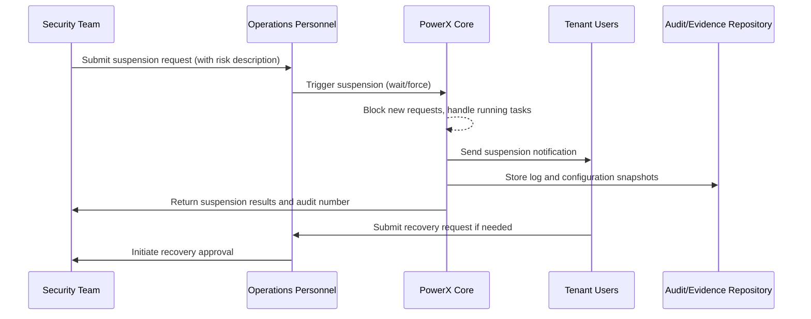

> This document has been translated. View the original Chinese version: [/zh/scenarios/SCN-OPS-PLUGIN-LIFECYCLE-001/SCN-OPS-PLUGIN-RISK-SUSPEND-001.html](/zh/scenarios/SCN-OPS-PLUGIN-LIFECYCLE-001/SCN-OPS-PLUGIN-RISK-SUSPEND-001.html).

# Executive Summary

This sub-scenario handles suspension actions when security or compliance teams discover plugins with risks. It covers suspension request initiation, gradual blocking of new requests, waiting for or forcibly terminating running tasks, generating log and configuration snapshots, notifying relevant personnel, and ensuring re-enablement requires approval. The goal is to complete suspension within 1 minute, block risk propagation, while retaining complete evidence chains and audit trails.

# Scope & Guardrails

- **In Scope**: Suspension request approval, waiting/forced suspension, user notifications, log and configuration snapshots, approval and audit, recovery process.
- **Out of Scope**: Vulnerability root cause analysis, patch development, Marketplace security review process.
- **Environment & Flags**: `plugin-safety-lock`, `plugin-suspend-force`, `plugin-audit-stream`; depends on notification service, audit log service, configuration and key vault, ticketing system.

# Participants & Responsibilities

| Scope | Repository | Layer | Responsibilities & Deliverables | Owners |
|-------|------------|-------|---------------------------------|--------|
| core-platform | powerx | ops | Suspension orchestration, workflow approval, log and configuration snapshots, recovery requests | Matrix Ops (Platform Ops Lead / ops@artisan-cloud.com) |
| governance | powerx | security | Risk assessment, approval strategies, evidence archiving, compliance reports | Eva Zhang (Automation Steward / automation@artisan-cloud.com) |
| marketplace | powerx-marketplace | service | Risk plugin tagging, delisting notifications, dependency reminders | Michael Hu (Plugin Tech Lead / tech@artisan-cloud.com) |

# End-to-End Flow

1. **Stage 1 – Risk Identification & Approval**: Security team submits suspension request, system validates permissions and enters approval, triggering forced mode when necessary.
2. **Stage 2 – Suspension Orchestration**: Console locates plugin, gradually blocks new requests, waits for current tasks to complete or forcibly terminates per policy.
3. **Stage 3 – Notification & Evidence Retention**: System sends suspension notifications, generates log packages, configuration snapshots and operation audit, stored in evidence repository.
4. **Stage 4 – Recovery & Review**: If recovery needed, administrator submits enablement request, requiring security review and audit record updates.

# Key Interactions & Contracts

- **APIs / Events**: `POST /api/plugins/{pluginId}/suspend`, `POST /api/plugins/{pluginId}/suspend/force`, `POST /api/plugins/{pluginId}/resume`, `EVENT plugin.suspend.completed`, `EVENT plugin.resume.requested`.
- **Configs / Schemas**: `config/plugins/suspend_policies.yaml`, `docs/standards/powerx-plugin/security/vulnerability-response.md`, `docs/standards/powerx-plugin/security/audit-logs.md`.
- **Security / Compliance**: Suspension requires dual approval, forced mode records executor and reason, evidence chain retention ≥30 days, recovery requires security review and approval.

# Usecase Links

- `UC-OPS-PLUGIN-RISK-SUSPEND-001` — Risk plugin suspension and evidence retention.

# Acceptance Criteria

1. Suspension takes effect within 1 minute, relevant users receive notifications, plugin status marked as "suspended".
2. Forced suspension mode generates complete log package and configuration snapshots, with audit numbers written.
3. Recovery process requires approval from both administrators and security teams, with audit records traceable to executor and timestamp.

# Telemetry & Ops

- Metrics: `plugin.suspend.response_time`, `plugin.suspend.success_rate`, `plugin.suspend.force_total`, `plugin.resume.approval_duration`.
- Alert thresholds: Suspension response time >60 seconds, forced suspension failures, recovery approval exceeding 24 hours unprocessed.
- Observability sources: Grafana `Runtime Ops / Plugin Safety`, audit logs, ticketing system, Ops console.

# Open Issues & Follow-ups

| Risk/Issue | Impact Scope | Owner | ETA |
|------------|--------------|-------|-----|
| Suspension notification channels lack multi-language templates, affecting international tenants | User experience | Matrix Ops | 2025-11-24 |
| Evidence repository capacity limits causing log archiving delays | Compliance | Eva Zhang | 2025-11-28 |

# Appendix

- `docs/meta/scenarios/powerx/core-platform/runtime-ops/plugin-install-and-ops/primary.md`
- `docs/standards/powerx-plugin/security/vulnerability-response.md`
- `docs/standards/powerx-plugin/security/audit-logs.md`

