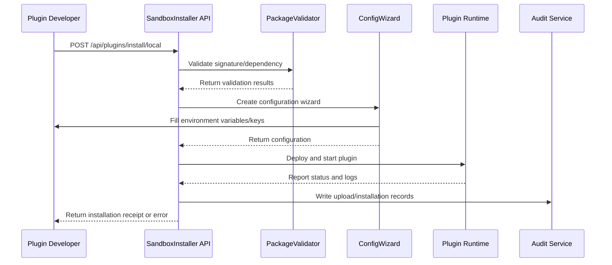

doc_id: UC-OPS-PLUGIN-DEV-INSTALL-001
scn_id: SCN-OPS-PLUGIN-LIFECYCLE-001
title: Manual Plugin Upload in Test Tenant
status: Draft
version: v0.1.0
repo_key: powerx
scope: powerx
layer: ops
domain: ops
scenario_title: "PowerX Plugin Installation & Operations"
owners:
  - name: Matrix Ops
    role: Platform Ops Lead
    contact: ops@artisan-cloud.com
  - name: Michael Hu
    role: Plugin Tech Lead
    contact: tech@artisan-cloud.com
contributors: []
linked_requirements:
  - SCN-OPS-PLUGIN-LIFECYCLE-001-A
code_refs:
  - repo: powerx
    path: internal/plugins/runtime/installer/sandbox_installer.go
    description: Sandbox tenant plugin installation orchestration, resource allocation and rollback
  - repo: powerx
    path: internal/plugins/runtime/validator/signature_validator.go
    description: Plugin package signature, dependency and version compatibility validation
  - repo: powerx
    path: internal/plugins/runtime/config/wizard_flow.go
    description: Installation wizard parameter collection, environment variable and key placeholder expansion
  - repo: powerx
    path: internal/plugins/runtime/logs/dev_channel.go
    description: Sandbox log channel, debug level control and isolation
  - repo: powerx
    path: pkg/audit/plugins/sandbox_audit_writer.go
    description: Upload, validation, rollback action audit logging
feature_flags:
  - px-plugin-runtime-v2
  - plugin-sandbox-mode
  - plugin-dev-logs
optional: false
last_reviewed_at: 2025-11-02

---

# Usecase Overview

- **Business Objective**: Enable plugin developers to quickly and controllably deploy locally built packages in test tenants, complete feature validation and debugging, while ensuring resource isolation, signature security and rollback capabilities.
- **Success Metrics**: Installation time ≤ 2 minutes; sandbox installation success rate ≥ 95%; signature validation false rejection rate < 1%; rollback time ≤ 30 seconds.
- **Scenario Association**: "Corresponds to main scenario `SCN-OPS-PLUGIN-LIFECYCLE-001` Stage 1-3, supporting developers to complete sandbox validation before production release."

> Through unified sandbox installation wizard and validation process, achieve rapid plugin iteration and security isolation, avoiding debugging blocks due to signature, dependency or quota issues.

# Context & Assumptions

- **Prerequisites**
  - Feature Flags `px-plugin-runtime-v2`, `plugin-sandbox-mode`, `plugin-dev-logs` are enabled.
  - Test tenants have independent resource quotas, log storage and audit space.
  - Developer accounts have `plugin: "dev`, `tenant:sandbox:write` permissions."
  - Package management service can access offline packages, signature certificates and dependency indexes.
- **Input/Output**
  - Input: "`.pxp` plugin package, `manifest.json`, dependency declarations, signature digest, environment variable templates."
  - Output: plugin running instance, debug logs, audit records, installation receipt, sandbox test entry point.
- **Boundaries**
  - Not handling plugin code building and packaging; not covering production tenant installation and billing; not responsible for Marketplace publishing and approval.

# Solution Blueprint

## System Decomposition

| Module | Responsibility | Code Entry Point |
|--------|----------------|------------------|
| SandboxInstaller | Controls tenant isolation, resource quota, installation orchestration, rollback | `internal/plugins/runtime/installer/sandbox_installer.go` |
| PackageValidator | Validates signature, version, dependency, compatibility | `internal/plugins/runtime/validator/signature_validator.go` |
| ConfigWizard | Guides parameter filling, environment variable completion, key placeholder validation | `internal/plugins/runtime/config/wizard_flow.go` |
| DevLogChannel | Outputs debug logs, controls levels, cleanup strategy | `internal/plugins/runtime/logs/dev_channel.go` |
| SandboxAuditWriter | Records upload, validation, rollback actions, generates audit chain | `pkg/audit/plugins/sandbox_audit_writer.go` |

## Process & Timeline

1. **Step 1 – Upload & Validation**: Developer uploads package, PackageValidator validates signature, dependency, version and writes audit logs.
2. **Step 2 – Resource & Isolation Configuration**: SandboxInstaller calculates resource quotas, tenant isolation strategy, reserves running instances.
3. **Step 3 – Installation Wizard**: ConfigWizard guides filling environment variables, key placeholders, debug log levels.
4. **Step 4 – Deployment & Startup**: Runtime deploys plugin, DevLogChannel outputs debug logs, SandboxInstaller tracks status.
5. **Step 5 – Receipt & Rollback**: On success, generate receipt and test entry point; on failure, trigger automatic rollback and release resources.

# Contracts & Interfaces

- **Inbound APIs / Events**
  - `POST /api/plugins/install/local` — Upload local plugin package and trigger installation wizard.
  - `POST /internal/plugins/packages/validate` — Signature, dependency, version validation; returns blocking reasons.
  - `EVENT plugin.install.sandbox_completed` — Installation completion event, with `tenant_id`, `trace_id`, `install_duration_ms`.
- **Outbound Calls**
  - `POST /internal/tenants/{tenantId}/quota/reserve` — Validate and reserve sandbox resource quotas.
  - `POST /internal/notify/dev-channel` — Push installation results and debug entry point.
  - `POST /audit/logs` — Write audit records, including uploader, package version, operation type.
- **Configurations & Scripts**
  - `config/plugins/sandbox_limits.yaml` — Sandbox tenant resource quotas, timeouts, concurrency limits.
  - `scripts/workflows/plugin-sandbox-dryrun.mjs` — Local signature and dependency pre-validation script (requires developer execution).
  - `docs/standards/powerx-plugin/lifecycle/package.md` — Package structure and manifest field specifications.

# Implementation Checklist

| Item | Description | Status | Owner |
|------|-------------|--------|-------|
| Signature Validation | Integrate offline/online certificate verification, echo error details | [ ] | Michael Hu |
| Resource Quotas | Support sandbox tenant resource reservation, overflow alerts and rollback | [ ] | Matrix Ops |
| Configuration Wizard | Support environment variable templates, key placeholder validation, default debug levels | [ ] | Michael Hu |
| Audit Logging | Write upload, installation, rollback actions to audit aggregation | [ ] | Matrix Ops |
| Developer CLI | Provide local `--validate-only` mode to reduce mis-uploads | [ ] | Michael Hu |

# Testing Strategy

- **Unit Tests**: Signature validation, dependency parsing, resource quota calculation, installation state machine, rollback process.
- **Integration Tests**: Execute A-1, A-2 cases from primary.md, covering successful installation and signature failure rollback; introduce insufficient resources, dependency conflict scenarios.
- **End-to-End Validation**: Upload real plugins in sandbox environment, verify log output, audit records, test entry points and rollback.
- **Non-Functional Tests**: Concurrent upload pressure (≥10 concurrent), large package (>200MB) transfer, signature service failure simulation.

# Observability & Ops

- **Metrics**: "`plugin.install.sandbox_duration_p95`, `plugin.install.sandbox_success_rate`, `plugin.install.rollback_total`, `plugin.install.signature_failure_total`."
- **Logs**: "Record `tenant_id`, `plugin_id`, `version`, `install_mode`, `duration_ms`, `status`, `failure_reason`."
- **Alerts**: Consecutive signature validation failures, resource quota exceeded, installation time >120 seconds trigger PagerDuty; notify developers when debug log channel is abnormal.
- **Dashboards**: "Grafana `Runtime Ops / Plugin Sandbox`, internal audit panel, console debug page."

# Rollback & Failure Handling

- **Rollback Steps**: One-click rollback releases resources, revokes configuration, closes log channels; notify developers and provide error reports.
- **Remediation**: "Guide developers to execute `plugin-sandbox-dryrun.mjs`, fix package signature or dependencies; provide resource quota expansion suggestions."
- **Data Repair**: Allow re-triggering installation, clean up semi-installed states, sync audit status to failed.

- **数据修复**：允许重新触发安装、清理半安装状态、同步审计状态为失败。

# Follow-ups & Risks

| 风险/事项 | 影响 | 缓解方案 | 负责人 | ETA |
|-----------|------|----------|--------|-----|
| 沙箱资源配额模型与生产不一致导致回归差异 | 测试准确性 | 引入“仿真配额”配置、允许自助调节 | Matrix Ops | 2025-11-12 |
| 开发者缺少本地校验工具导致重复失败 | 开发效率 | 在 CLI 加入 `px-plugin validate` 指令并产出手册 | Michael Hu | 2025-11-18 |

# References & Links

- 主场景：`docs/scenarios/runtime-ops/SCN-OPS-PLUGIN-LIFECYCLE-001.md`
- 子场景：`docs/scenarios/runtime-ops/SCN-OPS-PLUGIN-DEV-INSTALL-001.md`
- 背景材料：`docs/meta/scenarios/powerx/core-platform/runtime-ops/plugin-install-and-ops/primary.md`
- 标准文档：`docs/standards/powerx-plugin/lifecycle/package.md`
