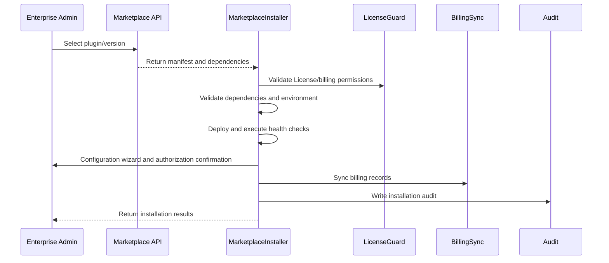

doc_id: UC-OPS-PLUGIN-MARKETPLACE-INSTALL-001
scn_id: SCN-OPS-PLUGIN-LIFECYCLE-001
title: Production Tenant Marketplace One-Click Install
status: Draft
version: v0.1.0
repo_key: powerx
scope: powerx
layer: service
domain: ops
scenario_title: "PowerX Plugin Installation & Operations"
owners:
  - name: Matrix Ops
    role: Platform Ops Lead
    contact: ops@artisan-cloud.com
  - name: Michael Hu
    role: Plugin Tech Lead
    contact: tech@artisan-cloud.com
contributors: []
linked_requirements:
  - SCN-OPS-PLUGIN-LIFECYCLE-001-B
code_refs:
  - repo: powerx
    path: internal/plugins/runtime/installer/marketplace_installer.go
    description: Marketplace installation orchestration, state management and rollback
  - repo: powerx
    path: internal/plugins/runtime/license/license_guard.go
    description: License/tenant authorization validation, billing permission judgment
  - repo: powerx
    path: internal/plugins/runtime/dependency/resolver.go
    description: Plugin dependency resolution, blocking hints and completion suggestions
  - repo: powerx
    path: internal/plugins/runtime/config/marketplace_wizard.go
    description: Marketplace installation configuration wizard, role authorization, default parameters
  - repo: powerx
    path: pkg/billing/marketplace_sync.go
    description: Installation billing record synchronization, retry and audit
feature_flags:
  - px-marketplace
  - plugin-license-guard
  - plugin-config-wizard
optional: false
last_reviewed_at: 2025-11-02

---

# Usecase Overview

- **Business Objective**: Implement automated process for enterprise administrators to install official plugins with one click in production tenants through Marketplace, ensuring License, dependency, configuration, permissions, billing and audit chains are complete.
- **Success Metrics**: Installation success rate ≥ 98%; dependency blocking rate < 5%; billing sync latency < 1 minute; rollback time ≤ 2 minutes.
- **Scenario Association**: "Corresponds to main scenario `SCN-OPS-PLUGIN-LIFECYCLE-001` Stage 1-4, covering Marketplace version selection, automatic deployment and publishing enablement."

> Through unified Marketplace installation orchestration, production tenants can complete plugin deployment with zero manual operations, with instant rollback and notifications on anomalies.

# Context & Assumptions

- **Prerequisites**
  - Feature Flags `px-marketplace`, `plugin-license-guard`, `plugin-config-wizard` are enabled.
  - Marketplace provides version metadata, dependency list, package source address and signature information.
  - License service is real-time available, supporting tenant quotas, billing authorization and dependency plugin validation.
  - Billing service supports installation event synchronization and retry; notification system can reach administrators and operations.
- **Input/Output**
  - Input: "plugin `manifest`, version number, dependency list, License terms, default configuration templates."
  - Output: installation status, permission authorization results, billing records, audit logs, rollback records.
- **Boundaries**
  - Not responsible for Marketplace review and publishing; not handling plugin internal business logic; not covering subsequent billing settlement processes.

# Solution Blueprint

## System Decomposition

| Module | Responsibility | Code Entry Point |
|--------|----------------|------------------|
| MarketplaceInstaller | Automated installation orchestration, deployment state machine, rollback | `internal/plugins/runtime/installer/marketplace_installer.go` |
| LicenseGuard | Validates License, billing authorization and tenant restrictions | `internal/plugins/runtime/license/license_guard.go` |
| DependencyResolver | Checks dependency plugins, version compatibility and completion hints | `internal/plugins/runtime/dependency/resolver.go` |
| ConfigWizard | Guides administrators to complete configuration, role authorization, default parameter settings | `internal/plugins/runtime/config/marketplace_wizard.go` |
| BillingSync | Installation event billing synchronization, retry and audit | `pkg/billing/marketplace_sync.go` |

## Process & Timeline

1. **Step 1 – Version Selection**: Administrator selects plugin version in Marketplace, system fetches manifest and dependencies.
2. **Step 2 – License/Dependency Validation**: LicenseGuard and DependencyResolver validate tenant authorization, dependency chain, billing permissions.
3. **Step 3 – Deployment & Self-Check**: MarketplaceInstaller pulls packages, deploys plugins, executes health checks and permission mapping.
4. **Step 4 – Configuration & Publishing**: ConfigWizard guides administrators to configure parameters, authorize roles, complete enablement and notify users.
5. **Step 5 – Billing & Audit**: BillingSync writes billing records, Audit service records operation chains; anomalies trigger automatic rollback.

# Contracts & Interfaces

- **Inbound APIs / Events**
  - `POST /api/marketplace/plugins/install` — Initiate one-click installation request.
  - `POST /api/plugins/install/marketplace` — Core internal installation orchestration interface.
  - `EVENT plugin.install.completed`, `EVENT plugin.install.rollback` — Installation completion/rollback notifications.
- **Outbound Calls**
  - `GET /marketplace/plugins/{id}/versions/{version}` — Fetch plugin manifest, dependencies, signature.
  - `POST /license/validate` — Validate tenant License, quotas and billing permissions.
  - `POST /billing/records` — Write installation billing records.
  - `POST /notify/admins` — Notify administrators and operations of installation results.
- **Configurations & Scripts**
  - `config/plugins/marketplace_defaults.yaml` — Default parameters, role mapping, enablement policies.
  - `docs/standards/powerx-marketplace/marketplace/lifecycle-operations.md` — Installation process and dependency governance standards.
  - `docs/standards/powerx-plugin/lifecycle/package.md` — Plugin package structure specifications.

# Implementation Checklist

| Item | Description | Status | Owner |
|------|-------------|--------|-------|
| License Validation | Support multi-tier License, trial period, License expiration prompts | [ ] | Matrix Ops |
| Dependency Governance | Provide dependency missing blocking and completion guidance, support automatic queue retry | [ ] | Michael Hu |
| Health Checks | Dual-channel health checks (pre/post installation), error log storage | [ ] | Matrix Ops |
| Configuration Wizard | Support tenant preset templates, batch permission authorization settings | [ ] | Michael Hu |
| Billing Sync | Introduce async retry, alert thresholds, reconciliation validation | [ ] | Matrix Ops |

# Testing Strategy

- **Unit Tests**: License validation, dependency parsing, installation state machine, billing sync retry, rollback logic.
- **Integration Tests**: Execute B-1/B-2 cases from primary.md; simulate License expiry, dependency missing, package download failure, health check failure.
- **End-to-End Validation**: Execute one-click installation in pre-production tenants, verify permission authorization, portal entry, billing records, audit logs.
- **Non-Functional Tests**: Marketplace response delays, package download timeouts, billing service anomalies, installation idempotent retry.

# Observability & Ops

- **Metrics**: "`plugin.install.marketplace_duration_p95`, `plugin.install.marketplace_success_rate`, `plugin.install.dependency_block_total`, `plugin.install.rollback_total`, `plugin.billing.sync_latency`."
- **Logs**: "Record `tenant_id`, `plugin_id`, `version`, `license_plan`, `dependency_status`, `install_duration_ms`, `result`."
- **Alerts**: Installation failure rate >3%, dependency block rate >10%, billing sync failure 3 consecutive times, installation time >10 minutes.
- **Dashboards**: "Grafana `Runtime Ops / Plugin Marketplace`, Marketplace audit logs, billing reconciliation dashboard."

# Rollback & Failure Handling

- **Rollback Steps**: Stop and uninstall new instances, restore old version (if any), revoke configuration and permission changes, update audit to "rollback".
- **Remediation**: Guide administrators to install dependency plugins, complete License; provide manual retry or queue retry entry points.
- **Data Repair**: Correct billing records, sync audit status, regenerate installation reports and notify relevant personnel.

- **数据修复**：修正计费记录、同步审计状态、重新生成安装报告并通知相关人员。

# Follow-ups & Risks

| 风险/事项 | 影响 | 缓解方案 | 负责人 | ETA |
|-----------|------|----------|--------|-----|
| 依赖阻断缺乏自动补齐导致安装中断 | 安装效率 | 引入“自动补齐依赖”选项，提供一键安装依赖 | Matrix Ops | 2025-11-14 |
| 计费同步缺乏重试与告警 | 财务对账 | 增加幂等重试、告警、对账脚本 | Michael Hu | 2025-11-22 |

# References & Links

- 主场景：`docs/scenarios/runtime-ops/SCN-OPS-PLUGIN-LIFECYCLE-001.md`
- 子场景：`docs/scenarios/runtime-ops/SCN-OPS-PLUGIN-MARKETPLACE-INSTALL-001.md`
- 背景材料：`docs/meta/scenarios/powerx/core-platform/runtime-ops/plugin-install-and-ops/primary.md`
- 标准文档：`docs/standards/powerx-marketplace/marketplace/lifecycle-operations.md`
