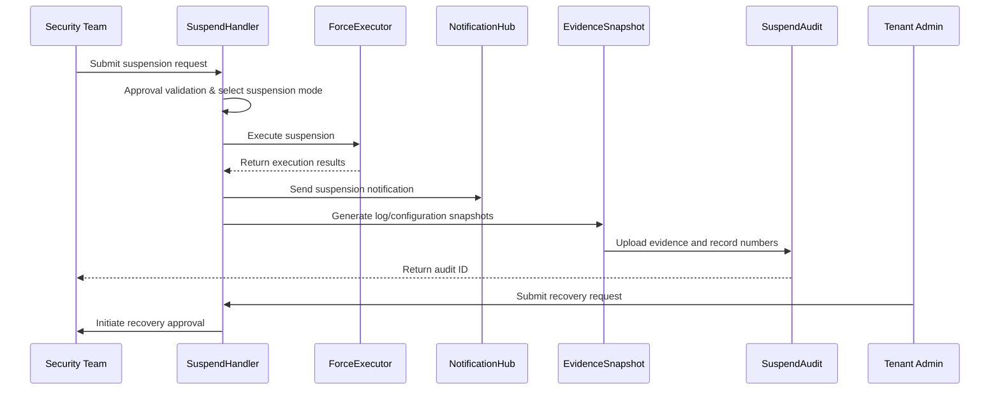

doc_id: UC-OPS-PLUGIN-RISK-SUSPEND-001
scn_id: SCN-OPS-PLUGIN-LIFECYCLE-001
title: Risk Plugin Suspension and Evidence Retention
status: Draft
version: v0.1.0
repo_key: powerx
scope: powerx
layer: ops
domain: ops
scenario_title: "PowerX Plugin Installation & Operations"
owners:
  - name: Matrix Ops
    role: Platform Ops Lead
    contact: ops@artisan-cloud.com
  - name: Eva Zhang
    role: Automation Steward
    contact: automation@artisan-cloud.com
contributors: []
linked_requirements:
  - SCN-OPS-PLUGIN-LIFECYCLE-001-D
code_refs:
  - repo: powerx
    path: internal/plugins/runtime/suspend/handler.go
    description: Suspension workflow orchestration, approval validation, state changes
  - repo: powerx
    path: internal/plugins/runtime/suspend/force_executor.go
    description: Forced suspension execution, running task termination, timeout control
  - repo: powerx
    path: internal/plugins/runtime/notifications/notifier.go
    description: Suspension/resume notifications, channel routing, multi-language templates
  - repo: powerx
    path: internal/plugins/runtime/evidence/snapshot_builder.go
    description: Log, configuration, metric snapshot generation and archiving
  - repo: powerx
    path: pkg/audit/plugins/suspend_audit.go
    description: Suspension/resume audit, approval records, evidence numbering
feature_flags:
  - plugin-safety-lock
  - plugin-suspend-force
  - plugin-audit-stream
optional: false
last_reviewed_at: 2025-11-02

---

# Usecase Overview

- **Business Objective**: When plugins have security or compliance risks, provide approvable, fast, and auditable suspension capabilities, while retaining complete evidence chains to support subsequent investigation and recovery.
- **Success Metrics**: Suspension response time ≤ 60 seconds; forced suspension success rate ≥ 99%; evidence snapshot generation < 2 minutes; recovery approval closure ≤ 24 hours.
- **Scenario Association**: Corresponds to main scenario `SCN-OPS-PLUGIN-LIFECYCLE-001` Stage 4, covering risk identification, suspension execution, notifications, evidence and recovery.

> Through suspension orchestration, forced execution and evidence archiving, ensure risk plugins can be controlled within one minute, while retaining chains for compliance review and supporting approved recovery.

# Context & Assumptions

- **Prerequisites**
  - Feature Flags `plugin-safety-lock`, `plugin-suspend-force`, `plugin-audit-stream` are enabled.
  - Security teams have permissions to submit suspension approvals; ticketing system and audit service are available.
  - Configuration, log, metric storage supports snapshot archiving with sufficient capacity.
  - Notification system supports multi-channel reach to administrators and tenant users.
- **Input/Output**
  - Input: suspension reason, plugin ID, tenant ID, suspension mode (wait/force), evidence requirements, approval credentials.
  - Output: suspension status, notification records, log/configuration snapshots, audit numbers, recovery approval tasks.
- **Boundaries**
  - Not responsible for vulnerability fixing or patch development; not covering Marketplace delisting; not including third-party forensics processes.

# Solution Blueprint

## System Decomposition

| Module | Responsibility | Code Entry Point |
|--------|----------------|------------------|
| SuspendHandler | Suspension approval, orchestration, state management, recovery requests | `internal/plugins/runtime/suspend/handler.go` |
| ForceExecutor | Forced suspension execution, timeout control, task termination strategies | `internal/plugins/runtime/suspend/force_executor.go` |
| NotificationHub | Notify administrators, tenant users, ticketing system | `internal/plugins/runtime/notifications/notifier.go` |
| EvidenceSnapshot | Generate log, configuration, metric snapshots, upload to evidence repository | `internal/plugins/runtime/evidence/snapshot_builder.go` |
| SuspendAudit | Record suspension/resume actions, approval chains, evidence numbers | `pkg/audit/plugins/suspend_audit.go` |

## Process & Timeline

1. **Step 1 – Suspension Request & Approval**: SuspendHandler receives security team request, validates permissions and starts approval, allowing forced mode when necessary.
2. **Step 2 – Execute Suspension**: Execute wait or forced suspension, block new requests, handle in-flight tasks, record executor and timestamp.
3. **Step 3 – Notification & Evidence**: NotificationHub sends suspension notifications, EvidenceSnapshot generates log, configuration snapshots and uploads to evidence repository.
4. **Step 4 – Audit & Recovery**: SuspendAudit writes audit; if recovery needed, administrator submits request and passes security review.

# Contracts & Interfaces

- **Inbound APIs / Events**
  - `POST /api/plugins/{pluginId}/suspend` — Initiate suspension (wait mode).
  - `POST /api/plugins/{pluginId}/suspend/force` — Force suspension.
  - `POST /api/plugins/{pluginId}/resume` — Recovery request.
  - `EVENT plugin.suspend.completed`, `EVENT plugin.resume.requested`.
- **Outbound Calls**
  - `POST /notify/security`, `POST /notify/tenant-users` — Suspension/resume notifications.
  - `POST /evidence/upload` — Upload log, configuration, metric snapshots.
  - `POST /audit/logs` — Record approvals, executions, evidence numbers.
  - `POST /tickets/create` — Create or update security tickets.
- **Configurations & Scripts**
  - `config/plugins/suspend_policies.yaml` — Suspension approval policies, default modes, timeout configurations.
  - `config/plugins/evidence_retention.yaml` — Evidence retention days, storage strategies.
  - `docs/standards/powerx-plugin/security/vulnerability-response.md` — Risk response processes.

# Implementation Checklist

| Item | Description | Status | Owner |
|------|-------------|--------|-------|
| Suspension Approval | Support multi-level approval, approval templates, exception paths | [ ] | Matrix Ops |
| Forced Execution | Provide wait/force strategies, running task termination and timeout handling | [ ] | Eva Zhang |
| Evidence Snapshot | Collect logs, configuration, metrics, version info and upload to evidence repository | [ ] | Matrix Ops |
| Notification Channels | Support email, SMS, console, webhook, multi-language templates | [ ] | Eva Zhang |
| Recovery Process | Dual approval, audit association, operation replay | [ ] | Matrix Ops |

# Testing Strategy

- **Unit Tests**: Approval state machine, permission validation, forced suspension execution, notification templates, evidence generation.
- **Integration Tests**: Execute D-1/D-2 cases from primary.md; verify wait mode, forced mode; simulate evidence storage failures, notification failures.
- **End-to-End Validation**: Trigger suspension in pre-production environment, check response time, notifications, log snapshots, audit chains; verify recovery approval.
- **Non-Functional Tests**: Concurrent suspension requests, evidence repository capacity limits, long-running task termination, audit service degradation.

# Observability & Ops

- **Metrics**: `plugin.suspend.response_time`, `plugin.suspend.success_rate`, `plugin.suspend.force_total`, `plugin.resume.approval_duration`.
- **Logs**: Record `plugin_id`, `tenant_id`, `mode`, `requester`, `approver`, `status`, `evidence_id`, `elapsed_ms`.
- **Alerts**: Suspension response >60 seconds, forced suspension failures, evidence upload failures, recovery approval timeouts.
- **Dashboards**: Grafana `Runtime Ops / Plugin Safety`, audit panel, ticketing system dashboard, notification delivery monitoring.

# Rollback & Failure Handling

- **Rollback Steps**: If suspension fails, automatically retry or escalate approval; on forced failure, trigger alert and lock plugin, block entrance.
- **Remediation**: Provide manual execution scripts, manual evidence upload; notify security team to intervene; record failure reasons.
- **Data Repair**: Can regenerate evidence snapshots, supplement audit records; re-send messages to users with failed notifications.

# Follow-ups & Risks

| Risk/Item | Impact | Mitigation | Owner | ETA |
|-----------|--------|------------|-------|-----|
| Multi-language notification templates missing affecting international tenants | User experience | Add multi-language templates and include in audit | Matrix Ops | 2025-11-24 |
| Evidence repository capacity insufficient causing archiving failures | Compliance risk | Early capacity alerts, auto-scaling, tiered cleanup strategies | Eva Zhang | 2025-11-28 |

# References & Links

- Main Scenario: `docs/scenarios/runtime-ops/SCN-OPS-PLUGIN-LIFECYCLE-001.md`
- Sub-Scenario: `docs/scenarios/runtime-ops/SCN-OPS-PLUGIN-RISK-SUSPEND-001.md`
- Background Materials: `docs/meta/scenarios/powerx/core-platform/runtime-ops/plugin-install-and-ops/primary.md`
- Standards: `docs/standards/powerx-plugin/security/vulnerability-response.md`
