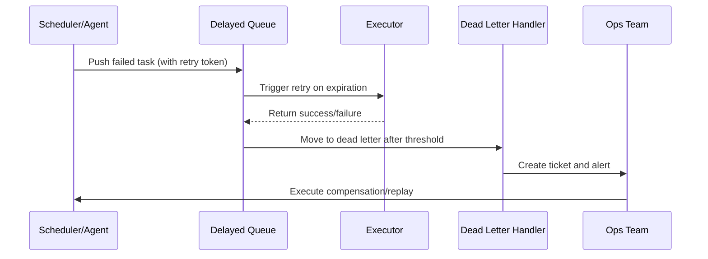

# Executive Summary

When task execution fails, the platform needs to automatically enter a delayed queue for retry, and escalate to dead letter and manual compensation after reaching threshold. This sub-scenario defines retry strategies, backoff algorithms, dead letter governance, and Runbook compensation processes, ensuring critical tasks can recover under exceptional circumstances with full audit traceability.

# Scope & Guardrails

- **In Scope**: Delayed queue enqueue/dequeue, retry strategies, backoff algorithms, dead letter queues, ticket escalation, Runbook compensation, audit and alerts.
- **Out of Scope**: Cross-repository data repair, payment fund compensation, infrastructure disaster recovery.
- **Environment & Flags**: `task-retry-queue`, `dlq-inspector`, `audit-streaming`; depends on Redis/Kafka, Ops ticketing system, PagerDuty/Slack notifications.

# Participants & Responsibilities

| Scope | Repository | Layer | Responsibility & Deliverables | Owners |
|-------|------------|-------|--------------------------------|--------|
| core-platform | powerx | ops | Delayed queues, retry strategies, dead letter handling, metrics collection | Matrix Ops (Platform Ops Lead / ops@artisan-cloud.com) |
| automation | powerx | ops | Runbooks, ticketing integration, alert configuration, queue inspection scripts | Eva Zhang (Automation Steward / automation@artisan-cloud.com) |

# End-to-End Flow

1. **Stage 1 – Failure Enqueue**: Task failure event triggers retry strategy, writes to delayed queue and records idempotent token.
2. **Stage 2 – Delayed Retry**: Re-execute task after expiration, close alerts and update status on success.
3. **Stage 3 – Dead Letter Escalation**: After multiple failures, task enters dead letter queue, automatically creates ticket and triggers PagerDuty.
4. **Stage 4 – Manual Compensation & Wrap-up**: Ops executes compensation according to Runbook, records results and syncs audit and metrics.

# Key Interactions & Contracts

- **APIs / Events**: `EVENT task.execution.failed`, `EVENT task.retry.scheduled`, `POST /internal/tasks/retry`, `POST /ops/workorders`.
- **Configs / Schemas**: `config/tasks/retry-policies.yaml`, `docs/standards/ops/task-retry-governance.md`, `docs/standards/events/retry-status-schema.md`.
- **Security / Compliance**: Retry idempotent token validation, ticket approval, audit records, prevent duplicate execution and privilege escalation.

# Usecase Links

- `UC-OPS-RETRY-RECOVERY-001` — Delayed queue retry and compensation loop.

# Acceptance Criteria

1. Automatic retry success rate ≥90%, retry latency meets SLA (default 2-minute backoff).
2. Dead letter escalation creates tickets and notifies on-call within 5 minutes, manual compensation completion rate ≥95%.
3. Ops console provides real-time view of retry queue, dead letter queue, compensation status, supports one-click replay and strategy adjustment.

# Telemetry & Ops

- Metrics: `task.retry.scheduled_total`, `task.retry.success_total`, `task.retry.failure_total`, `task.retry.dlq_total`, `task.retry.escalated_total`.
- Alert Thresholds: Retry failure rate >15%/10 minutes, dead letter queue length exceeds threshold, ticket creation failure.
- Observability Sources: Grafana `Runtime Ops / Retry & Recovery`, Datadog `task.retry.*`, Ops console compensation panel, `scripts/ops/retry-inspect.mjs`.

# Open Issues & Follow-ups

| Risk/Issue | Impact Scope | Owner | ETA |
|------------|--------------|-------|-----|
| Dead letter backlog cleanup process not automated | Ticket backlog and compensation delays | Matrix Ops | 2025-11-07 |
| Retry strategy not integrated with business SLA | Recovery actions may be too late | Eva Zhang | 2025-11-14 |

# Appendix

- `docs/meta/scenarios/powerx/core-platform/runtime-ops/event-and-taskflow-management/primary.md`
- `scripts/ops/retry-inspect.mjs`, `scripts/ops/recovery-runbook.mjs`
- Retry Governance Runbook (Confluence: Runtime-Ops-Retry-Recovery)
