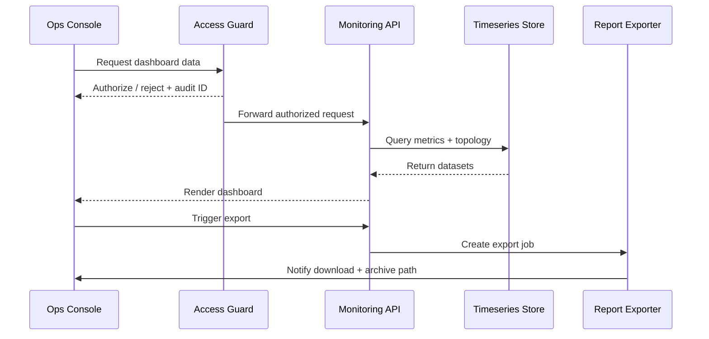

# Executive Summary

Ops engineers need a unified console to inspect tenant plugin health, historical performance, and instance topology, then export a report once their inspection is complete. This child scenario keeps dashboard data latency under one minute, supports tenant/plugin/instance filters, topology views, export files, and inspection notes, and enforces strict access control and auditing.

# Scope & Guardrails

- **In Scope**: Metrics query APIs, topology rendering, access isolation, inspection report export, inspection note archiving.
- **Out of Scope**: Plugin-specific visualization widgets, cross-scenario SLA compensation reports, third-party BI integrations.
- **Environment & Flags**: `ops-console-monitoring`, `monitoring-report-export`, `observability-topology`; relies on the time-series database, topology store, RBAC, and audit services.

# Participants & Responsibilities

| Scope | Repository | Layer | Responsibilities | Owners |
|-------|------------|-------|------------------|--------|
| core-platform | powerx | service | Metrics query, topology services, export jobs, API security | Matrix Ops (Platform Ops Lead / ops@artisan-cloud.com) |
| ops-tooling | powerx | ops | Console UI, inspection workflow, access auditing, report archiving | Iris Chen (Observability Steward / observability@artisan-cloud.com) |

# End-to-End Flow

1. **Stage 1 – Access Validation**: Ops signs in to the console; requests pass RBAC and tenant checks and generate an audit entry.
2. **Stage 2 – Metrics Query**: APIs fetch CPU, memory, latency, and error-rate data from the time-series store with aggregation and caching applied.
3. **Stage 3 – Topology Rendering**: Instance topology and dependencies are retrieved and rendered with current alert/health indicators.
4. **Stage 4 – Inspection Notes**: Ops records inspection findings, anomalies, and follow-up actions, storing them in the inspection log.
5. **Stage 5 – Export & Archive**: Export jobs build CSV/PNG outputs, notify Ops to download, and archive the files automatically.

# Key Interactions & Contracts

- **APIs**: `GET /ops/monitoring/dashboard`, `POST /ops/monitoring/export`, `POST /ops/monitoring/inspection-notes`.
- **Configs / Schemas**: `config/monitoring/dashboard_widgets.yaml`, `docs/standards/_shared/downstream-readonly-setup.md` (access governance).
- **Security / Compliance**: All access flows through `ops_access_guard`; sensitive metrics are masked; exported files require signature validation and lifecycle management.

# Usecase Links

- `UC-OPS-MONITORING-DASHBOARD-001` — Ops console dashboard inspection and report archiving.

# Acceptance Criteria

1. Dashboard refresh latency < 60 seconds; topology view render P95 < 3 seconds.
2. Export job success rate ≥ 99%; failed jobs retry automatically with operator notification.
3. Unauthorized access attempts are denied and audited; policy violations trigger security notifications.

# Telemetry & Ops

- Metrics: `monitoring.dashboard.latency_p95`, `monitoring.dashboard.render_total`, `monitoring.export.success_total`, `monitoring.audit.denied_total`.
- Alert thresholds: API error rate >2% over 5 minutes raises P1; export failure rate >5% per day raises P2.
- Observability sources: Grafana “Ops Console / Monitoring Dashboard”, audit center, export job reports.

# Open Issues & Follow-ups

| Risk / Item | Impact | Owner | ETA |
|-------------|--------|-------|-----|
| Metric coverage gaps | Inspections may miss latent issues | Matrix Ops | 2025-11-20 |
| Export job backlog during peaks | Report delays and poor UX | Iris Chen | 2025-11-25 |

# Appendix

- `docs/meta/scenarios/powerx/core-platform/runtime-ops/system-monitoring-and-alerting/primary.md`
- `docs/usecases-seeds/SCN-OPS-SYSTEM-MONITORING-001/UC-OPS-MONITORING-DASHBOARD-001.md`
