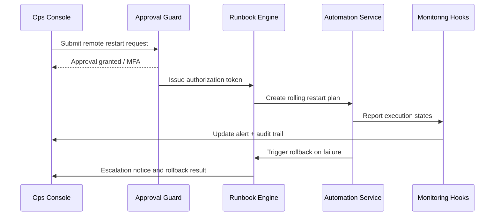

# Executive Summary

When a critical alert fires, Ops or tenant administrators need a single-click remote restart embedded in the incident context. The system must automatically complete approval, rolling restarts, health verification, rollback, and auditing. This child scenario focuses on approval chains, runbook templates, automation execution, and failure escalation, targeting recovery within five minutes while keeping the process auditable.

# Scope & Guardrails

- **In Scope**: Alert ownership, approval validation, runbook generation, rolling restarts, health probes, rollback, and escalation notifications.
- **Out of Scope**: Cross-region disaster recovery, plugin code fixes, manual SSH workflows.
- **Environment & Flags**: `remote-ops-automation`, `monitoring-service`, `ops-approval-center`; depends on the approval center, runbook engine, automation services, and health probes.

# Participants & Responsibilities

| Scope | Repository | Layer | Responsibilities | Owners |
|-------|------------|-------|------------------|--------|
| core-platform | powerx | service | Approval validation, runbook templates, automation invocations, health probe feedback | Matrix Ops (Platform Ops Lead / ops@artisan-cloud.com) |
| ops-tooling | powerx | ops | Alert console operations, approval workflows, execution status view, audit reporting | Iris Chen (Observability Steward / observability@artisan-cloud.com) |

# End-to-End Flow

1. **Stage 1 – Alert Ownership & Approval**: On-call Ops launches remote restart from the alert detail page; the request passes RBAC, MFA, and approval center checks.
2. **Stage 2 – Runbook Generation**: The runbook engine loads the template, defines rolling batches, wait windows, and health verification steps.
3. **Stage 3 – Execution & Monitoring**: The automation service restarts instances batch by batch, running health probes and recording state.
4. **Stage 4 – Status Feedback**: Results are written back to the alert center and audit store; successful runs close the alert and emit recovery times.
5. **Stage 5 – Rollback & Escalation**: Failed probes trigger immediate rollback and promote the alert to P0, notifying human responders to continue.

# Key Interactions & Contracts

- **APIs / Events**: `POST /ops/alerts/{alert_id}/remote-restart`, `POST /automation/restart`, `POST /automation/rollback`, `EVENT monitoring.restart.status`.
- **Configs / Schemas**: `config/automation/runbooks/remote_restart.yaml`, `docs/standards/powerx/backend/integration/06_gateway/EventBus_and_Message_Fabric.md`.
- **Security / Compliance**: Approvals require dual confirmation and MFA; every action is audited; runbook execution logs are retained for 180 days; failure escalation must notify security on-call.

# Usecase Links

- `UC-OPS-MONITORING-REMOTE-RESTART-001` — Alert-driven remote restart and rollback.

# Acceptance Criteria

1. Automation starts within one minute after approval, with success rate ≥ 95% and mean recovery time ≤ 5 minutes.
2. Failure paths trigger rollback and escalate the alert; P0 notifications reach all on-call channels within one minute.
3. Audit logs capture approvers, executors, runbook ID, instance list, status, and duration.

# Telemetry & Ops

- Metrics: `monitoring.remote_restart.trigger_total`, `monitoring.remote_restart.success_total`, `monitoring.remote_restart.failure_total`, `monitoring.remote_restart.rollback_total`, `monitoring.remote_restart.mttr`.
- Alert thresholds: Failure rate >5% per day triggers P0; approval latency P95 > 2 minutes triggers P1.
- Observability sources: Grafana “Automation / Remote Actions”, approval center reports, audit logs.

# Open Issues & Follow-ups

| Risk / Item | Impact | Owner | ETA |
|-------------|--------|-------|-----|
| Insufficient health probe coverage | Rollback may trigger too late | Matrix Ops | 2025-11-24 |
| Lengthy approval chains | MTTR may breach target | Iris Chen | 2025-11-21 |

# Appendix

- `docs/meta/scenarios/powerx/core-platform/runtime-ops/system-monitoring-and-alerting/primary.md`
- `docs/usecases-seeds/SCN-OPS-SYSTEM-MONITORING-001/UC-OPS-MONITORING-REMOTE-RESTART-001.md`
