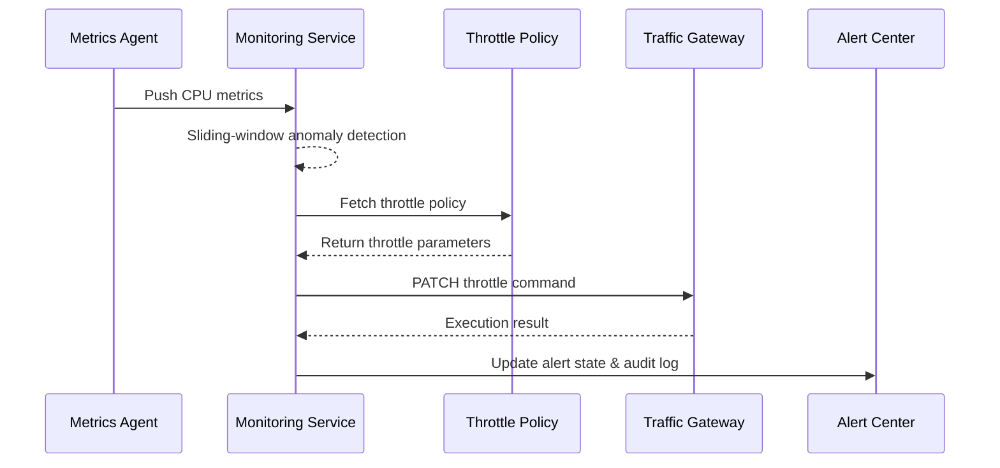

# Executive Summary

When a plugin instance’s CPU keeps spiking, the platform must trigger auto-throttling within 30 seconds to keep concurrency under control and prevent tenant-wide impact. This child scenario covers metric collection, policy evaluation, throttle execution, and alert updates, ensuring automated remediation remains auditable and reversible while giving Ops a clear path to release or escalate the action.

# Scope & Guardrails

- **In Scope**: CPU metric aggregation, sliding-window anomaly detection, tenant/plugin throttle policies, traffic gateway throttle APIs, alert state synchronization and audit logging.
- **Out of Scope**: Adaptive or ML-based threshold training, plugin-defined CPU monitoring inside the runtime, network-level or CDN throttling.
- **Environment & Flags**: `monitoring-service`, `ops-throttle-automation`, `alert-gateway-v2`; depends on metric agents, policy storage, the traffic gateway, and the alert center.

# Participants & Responsibilities

| Scope | Repository | Layer | Responsibilities | Owners |
|-------|------------|-------|------------------|--------|
| core-platform | powerx | service | Metric ingestion, anomaly detection, throttling dispatch, execution state updates | Matrix Ops (Platform Ops Lead / ops@artisan-cloud.com) |
| ops-tooling | powerx | ops | Policy configuration governance, alert templates, console release & false-positive feedback | Iris Chen (Observability Steward / observability@artisan-cloud.com) |

# End-to-End Flow

1. **Stage 1 – Metric Ingestion**: Metric agents push CPU and call-volume samples every 10 seconds into the monitoring service.
2. **Stage 2 – Anomaly Decision**: The monitoring service uses a sliding window to confirm three consecutive threshold breaches and evaluates tenant policies to decide whether to throttle.
3. **Stage 3 – Throttle Execution**: The dispatcher calls the traffic gateway to set a new concurrency cap, enforcing idempotency and capturing execution feedback.
4. **Stage 4 – Status Broadcast**: The alert center switches the incident to “Auto Remediation” and shares the rationale, recommendations, and next steps with Ops and plugin owners.
5. **Stage 5 – Recovery or Escalation**: Once CPU recovers, the policy automatically lifts the throttle; failed or false-positive actions can be released manually and escalated.

# Key Interactions & Contracts

- **APIs / Events**: `STREAM monitoring.cpu.sampled`, `GET /internal/monitoring/policy/throttle`, `PATCH /internal/gateway/throttle`, `EVENT monitoring.alert.updated`.
- **Configs / Schemas**: `config/monitoring/thresholds.yaml`, `docs/standards/powerx/backend/integration/06_gateway/EventBus_and_Message_Fabric.md`.
- **Security / Compliance**: Throttle actions must include tenant metadata and write to audit logs; policy changes require dual approval; alerts follow RBAC rules.

# Usecase Links

- `UC-OPS-MONITORING-THROTTLE-001` — CPU anomaly auto-throttling.

# Acceptance Criteria

1. Throttling starts within 30 seconds after a CPU breach is confirmed; execution latency ≤ 30 seconds; success rate ≥ 95%.
2. Throttle actions are recorded in audit trails and synchronized to the alert center so Ops can review reasons and releases.
3. Failed throttles trigger a secondary alert and escalate to P1, with a manual rollback path available.

# Telemetry & Ops

- Metrics: `monitoring.throttle.trigger_total`, `monitoring.throttle.success_total`, `monitoring.throttle.failure_total`, `monitoring.throttle.mttr`.
- Alert thresholds: Throttle failure rate >5% within 5 minutes raises P1; >3 false-positive feedback items per day trigger governance review.
- Observability sources: Grafana “Runtime Ops / Auto Throttle”, alert center throttle board, audit logs.

# Open Issues & Follow-ups

| Risk / Item | Impact | Owner | ETA |
|-------------|--------|-------|-----|
| Threshold sensitivity requires A/B tuning | False positives cause business jitter | Matrix Ops | 2025-11-12 |
| Traffic gateway throttling API lacks load testing | Peak-hour latency may exceed budget | Iris Chen | 2025-11-18 |

# Appendix

- `docs/meta/scenarios/powerx/core-platform/runtime-ops/system-monitoring-and-alerting/primary.md`
- `docs/usecases-seeds/SCN-OPS-SYSTEM-MONITORING-001/UC-OPS-MONITORING-THROTTLE-001.md`
