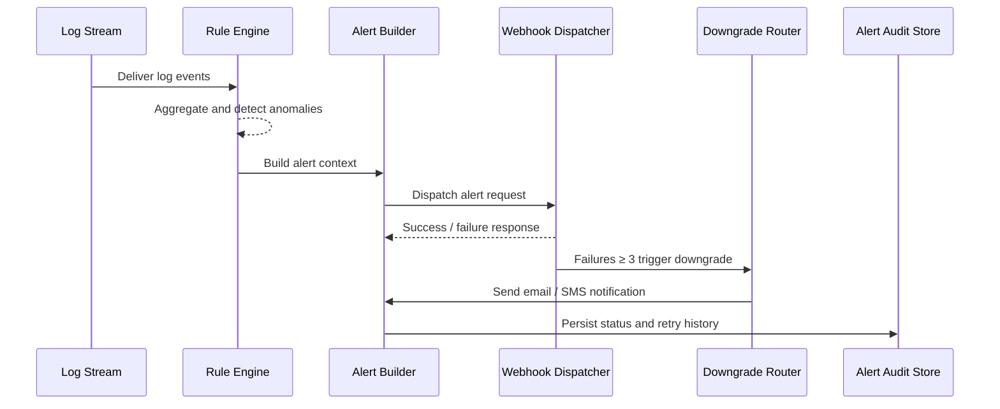

# Executive Summary

The monitoring service must raise an alert within one minute when plugin logs show consecutive errors or security events, then deliver it to external incident platforms via webhook with retries and downgrade channels. This child scenario focuses on rule parsing, alert composition, webhook delivery, downgrade notifications, and audit reporting to ensure alerts are timely and traceable.

# Scope & Guardrails

- **In Scope**: Log rule management, sliding-window detection, webhook delivery, retries and downgrades, alert auditing.
- **Out of Scope**: Rule configuration UI, downstream ticket workflows inside third-party platforms, offline log replay batches.
- **Environment & Flags**: `monitoring-service`, `alert-gateway-v2`, `webhook-delivery-fallback`; depends on log shippers, the alert center, and email/SMS channels.

# Participants & Responsibilities

| Scope | Repository | Layer | Responsibilities | Owners |
|-------|------------|-------|------------------|--------|
| core-platform | powerx | service | Log rule evaluation, alert construction, webhook dispatch and retries | Matrix Ops (Platform Ops Lead / ops@artisan-cloud.com) |
| ops-tooling | powerx | ops | Downgrade channel governance, alert center states, audit reporting | Iris Chen (Observability Steward / observability@artisan-cloud.com) |

# End-to-End Flow

1. **Stage 1 – Log Ingestion**: Log agents stream structured plugin logs into the centralized service.
2. **Stage 2 – Rule Detection**: The rule engine aggregates by tenant and detects spikes of errors/security keywords within five minutes.
3. **Stage 3 – Alert Construction**: An alert payload is created with tenant, plugin, summary, recommended actions, and trace references.
4. **Stage 4 – Webhook Delivery**: The webhook dispatcher signs requests, handles retries and backoff, and records delivery status.
5. **Stage 5 – Downgrade & Audit**: Three consecutive failures trigger downgrade channels (email/SMS); all outcomes feed into the audit store and alert center.

# Key Interactions & Contracts

- **APIs / Events**: `STREAM logs.plugin.*`, `POST /alerts/webhook`, `EVENT monitoring.alert.updated`, `POST /alerts/fallback/email`.
- **Configs / Schemas**: `config/log_rules/*.yaml`, `docs/standards/powerx/backend/integration/06_gateway/EventBus_and_Message_Fabric.md`.
- **Security / Compliance**: Webhooks require HMAC signatures and replay protection; downgrade notifications must be audited; sensitive log fields are tenant-isolated.

# Usecase Links

- `UC-OPS-MONITORING-WEBHOOK-001` — Log anomalies triggering webhook alerts.

# Acceptance Criteria

1. Alerts are generated and delivered within one minute after a rule match; initial success rate ≥ 97%, cumulative ≥ 99%.
2. Three consecutive webhook failures automatically downgrade to email/SMS; downgrade success rate ≥ 99% and status is visible in the alert center.
3. Audit storage keeps the full retry history to support traceability and reporting.

# Telemetry & Ops

- Metrics: `monitoring.webhook.delivery_success_rate`, `monitoring.webhook.retry_total`, `monitoring.alert.downgrade_total`.
- Alert thresholds: Webhook success rate <95% across 15 minutes raises P1; >20 downgrades per day trigger governance review.
- Observability sources: Grafana “Alert Delivery”, Ops alert center, `reports/_state/ops/monitoring/*.json`.

# Open Issues & Follow-ups

| Risk / Item | Impact | Owner | ETA |
|-------------|--------|-------|-----|
| Rule noise causing alert storms | Increased on-call load | Matrix Ops | 2025-11-16 |
| Missing webhook self-check tooling | Alert delivery failures | Iris Chen | 2025-11-18 |

# Appendix

- `docs/meta/scenarios/powerx/core-platform/runtime-ops/system-monitoring-and-alerting/primary.md`
- `docs/usecases-seeds/SCN-OPS-SYSTEM-MONITORING-001/UC-OPS-MONITORING-WEBHOOK-001.md`
